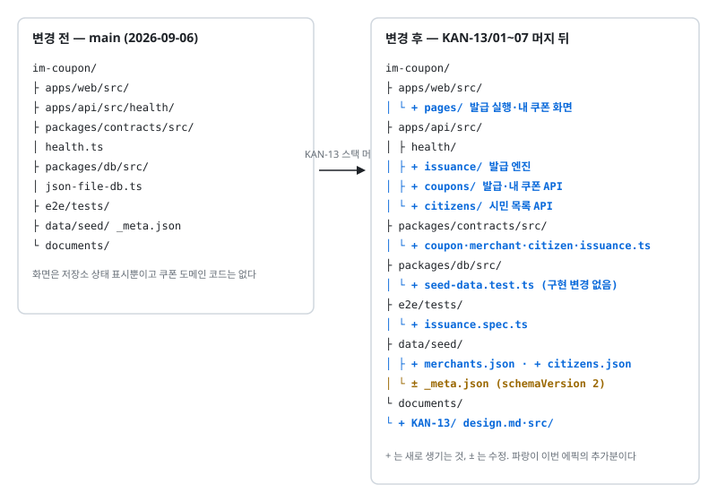
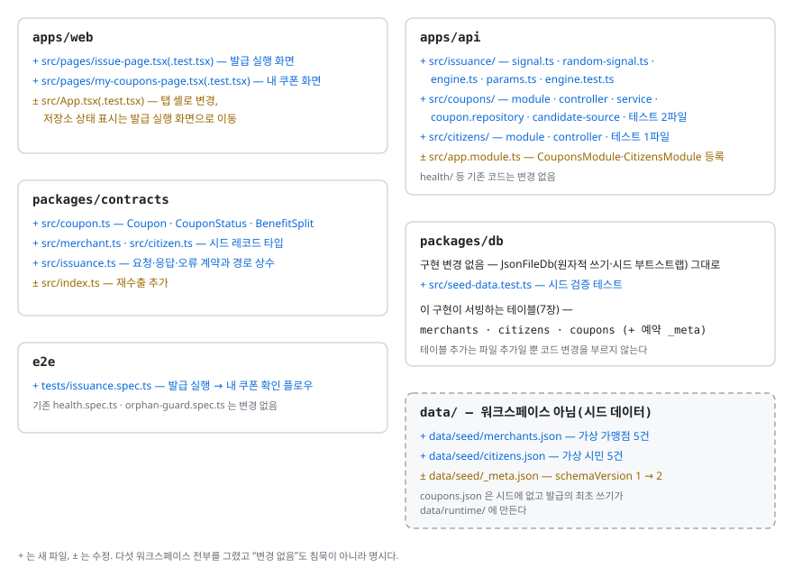
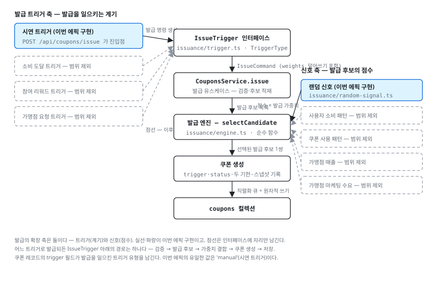
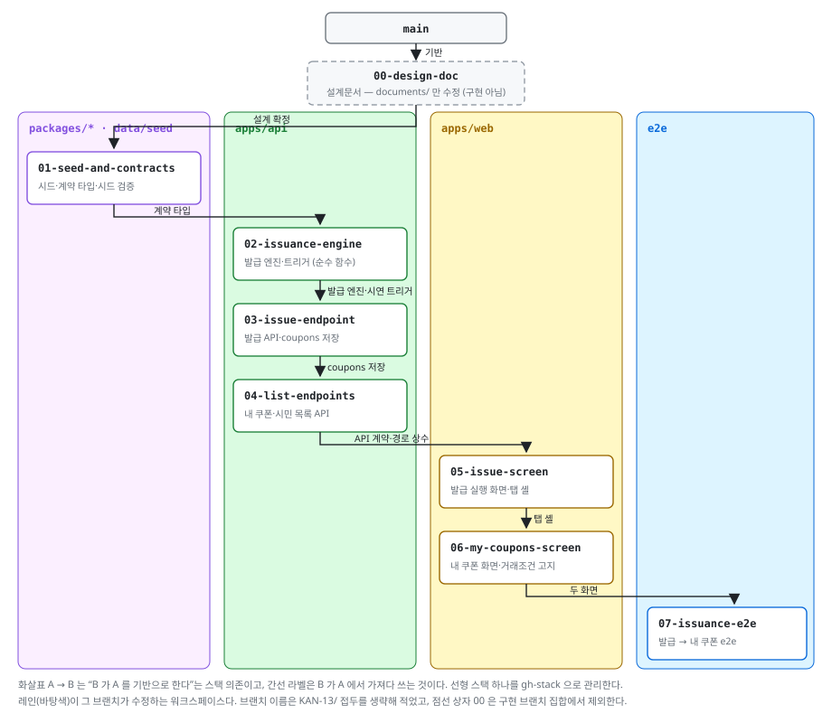
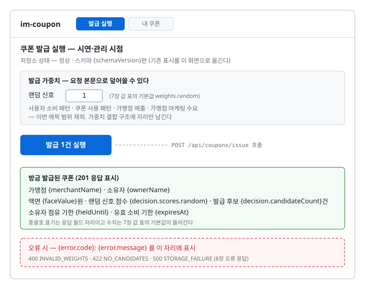
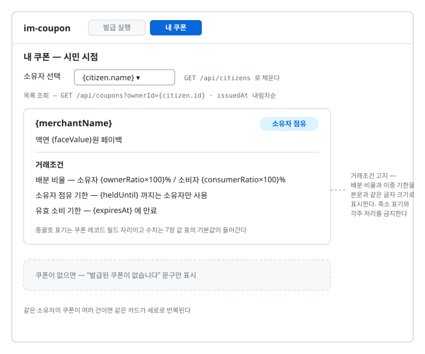
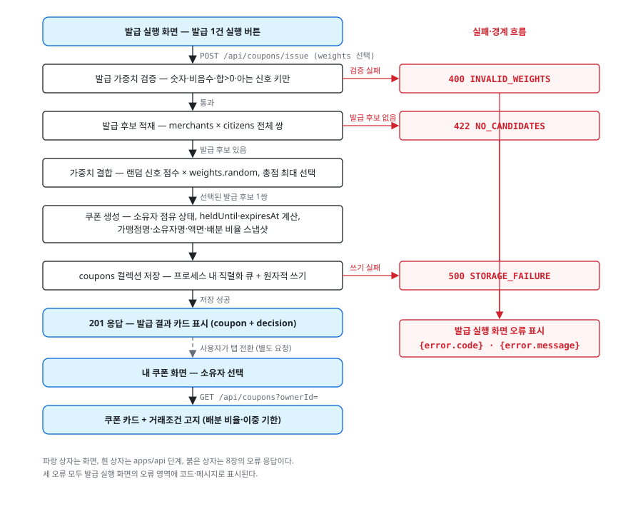

# KAN-13 프로토타입 쿠폰 발급 구현 — 설계문서

> 웹 발급 실행 화면의 버튼 한 번으로 쿠폰 1건을 발급해 JSON 파일 DB 에 저장하고, 내 쿠폰 화면에서 거래조건(배분 비율·이중 기한)과 함께 보여주는 것까지를 구현한다.
> 발급 대상은 가중치 결합 구조로 정하되, 이번 에픽에서 결합에 참여하는 신호는 랜덤 신호 하나다.
> 에픽 [KAN-13](https://ssong9520.atlassian.net/browse/KAN-13) 의 구현 착수 전 설계이며, 발급 이후의 라이프사이클은 기획 노선 미결이라 범위에서 제외한다.

## 1. 구현의 목표, 전제, 범위

### 목표

구현 완료 후 아래 문장이 전부 참이면 이 에픽은 끝난 것이다.

- 발급 실행 화면에서 발급 1건 실행 버튼을 누르면 쿠폰 1건이 생성되어 `data/runtime/coupons.json` 에 저장된다.
- 발급 대상(가맹점×시민)은 가중치 결합으로 정해지고, 결합에 참여하는 신호는 랜덤 신호 하나다.
- 발급 가중치를 요청 본문으로 바꿔 보낼 수 있다 — 가중치 외부 조절 노출이 구조로 서 있다.
- 내 쿠폰 화면에서 소유자로 선택한 시민의 쿠폰이 보이고, 카드에 액면·배분 비율·소유자 점유 기한·유효 소비 기한이 본문 크기로 표시된다.
- `pnpm build && pnpm e2e` 가 위 흐름을 브라우저에서 검증하고 통과한다.

### 전제

착수 전에 확인할 항목과 확인 방법·결과다. 전부 2026-09-06 에 확인되었다.

- 다섯 워크스페이스 모노레포가 서 있다 — `pnpm-workspace.yaml` 과 [저장소 구조와 기술 스택](../저장소-구조와-기술-스택.md) 대조 — 확인됨.
- 기존 단위 테스트가 통과한다 — `pnpm test` — 확인됨 (13건 통과).
- 기존 e2e 가 통과한다 — `pnpm build && pnpm e2e` — 확인됨 (3건 통과).
- `JsonFileDb` 가 원자적 쓰기와 시드 부트스트랩을 제공한다 — `packages/db/src/json-file-db.ts` — 확인됨.
- 에픽 티켓이 존재한다 — [KAN-13](https://ssong9520.atlassian.net/browse/KAN-13) — 확인됨. 본문 없이 제목뿐이므로 설계 근거는 이 문서와 `documents/` 가 진다.
- 발급 이후 라이프사이클(공개 풀·단독 점유·페이백)은 노선 미결이다 — [쿠폰 도메인 규칙](../쿠폰-도메인-규칙.md) 의 미결 절 — 확인됨. 그래서 이번 범위는 발급까지다.

### 범위 — 포함

- 정적 시드 — 가상 가맹점 5건·가상 시민 5건을 `data/seed/` 에 JSON 으로 커밋한다.
- 발급 엔진 — 신호 인터페이스 + 발급 가중치 결합. 구현하는 신호는 랜덤 신호 하나다.
- 발급 트리거 인터페이스 — 발급을 일으키는 계기의 추상화. 구현하는 발급 트리거는 시연 트리거 하나다.
- API 3개 — 발급 1개(`POST /api/coupons/issue`), 조회 2개(내 쿠폰·시민 목록). 오류 응답 포함 계약은 8장이다.
- 웹 화면 2개 — 발급 실행 화면(시연·관리 시점), 내 쿠폰 화면(시민 시점, 거래조건 고지 포함).
- 발급 e2e 1케이스 — 발급 실행부터 내 쿠폰 확인까지.

### 범위 — 제외

아래는 이번 에픽에서 만들지 않는다. [프로토타입 범위](../프로토타입-범위.md) 의 전체 범위에는 남아 있는 항목도 있고, 그 경우 이후 에픽의 몫이다.

- 랜덤 외 네 신호(사용자 소비 패턴·쿠폰 사용 패턴·가맹점 매출·가맹점 마케팅 수요) — 가중치 결합 구조에 자리만 남긴다.
- 소비 도달·참여 리워드·가맹점 요청 트리거 — 발급 트리거 인터페이스에 자리만 남기고, 이번 에픽의 발급은 시연 트리거로만 일으킨다.
- 발급 이후의 라이프사이클 전이(공개 풀·단독 점유·사용·페이백 지급·만료) — 기획 노선 미결. 발급은 쿠폰 레코드를 소유자 점유 상태와 두 기한으로 만들어 저장하는 데까지다.
- 모의 데이터 생성기 — 정적 시드로 대체한다.
- 어뷰징 방지 룰, 이력의 해시 체인 로그, 시뮬레이션 대시보드.
- JSON 파일의 파일 락 — 근거는 4장 결정 6.
- 지라 티켓 생성 — 13장은 계획만 적는다.

## 2. 용어 사전

- 본문·그림·코드 식별자 전체에서 아래 표기를 글자 단위로 동일하게 쓴다.
- 에픽 KAN-13 제목의 "티켓"은 이 저장소 SSOT 용어인 **쿠폰**을 가리킨다. 이 문서에서 "티켓"은 지라 이슈를 가리킬 때만 쓴다.

| 용어 | 정의 | 코드 식별자 |
| --- | --- | --- |
| 쿠폰 | 결제 이후의 페이백 권리를 나타내는 발급 단위 | `Coupon` (`packages/contracts/src/coupon.ts`) |
| 가맹점 | 쿠폰이 걸리는 가상 상점 | `Merchant` (`packages/contracts/src/merchant.ts`) |
| 시민 | 쿠폰을 발급받을 수 있는 가상 사용자 | `Citizen` (`packages/contracts/src/citizen.ts`) |
| 소유자 | 쿠폰을 발급받은 시민 | `Coupon.ownerId` · `Coupon.ownerName` |
| 발급 | 발급 후보 하나를 골라 쿠폰 레코드를 만들어 저장하는 것 | `POST /api/coupons/issue` · `CouponsService.issue` |
| 발급 트리거 | 발급을 일으키는 계기의 추상화. 발급 명령을 만들어 발급 유스케이스에 넘긴다 | `IssueTrigger` · `IssueCommand` (`apps/api/src/issuance/domain/triggers/issue-trigger.ts`) |
| 시연 트리거 | 발급 실행 화면의 버튼이 일으키는, 이번 에픽에서 구현하는 유일한 발급 트리거 | `manualTrigger` (`apps/api/src/issuance/domain/triggers/implementations/manual-trigger.ts`) · `TriggerType` 의 `'manual'` |
| 발급 명령 | 발급 트리거가 만들어 넘기는 발급 1건의 입력 — 트리거 유형과 발급 가중치 덮어쓰기 | `IssueCommand` (`apps/api/src/issuance/domain/triggers/issue-trigger.ts`) |
| 발급 후보 | 발급 대상이 될 수 있는 가맹점×시민 쌍 | `Candidate` (`apps/api/src/issuance/domain/signals/signal.ts`) |
| 신호 | 발급 후보 하나에 0 이상 점수를 주는 단위 함수 | `Signal` (`apps/api/src/issuance/domain/signals/signal.ts`) |
| 랜덤 신호 | 이력 없이 작동하는 탐색용 신호. 이번 에픽에서 구현하는 유일한 신호 | `randomSignal` (`apps/api/src/issuance/domain/signals/implementations/random-signal.ts`) |
| 발급 가중치 | 신호별 결합 비중 | `SignalWeights` (`packages/contracts/src/issuance.ts`) |
| 가중치 결합 | 신호 점수 × 발급 가중치의 합으로 총점 최대 발급 후보를 고르는 것 | `selectCandidate` (`apps/api/src/issuance/domain/services/engine.ts`) |
| 소유자 점유 상태 | 발급 직후의 쿠폰 상태. 이번 에픽의 유일한 상태 값 | `CouponStatus` 의 `'held'` |
| 소유자 점유 기한 | 소유자만 쿠폰을 온전히 쓸 수 있는 기간의 끝 시각 | `Coupon.heldUntil` · 파라미터 `ownerHoldDays` |
| 유효 소비 기한 | 쿠폰이 만료되는 시각 | `Coupon.expiresAt` · 파라미터 `openValidDays` |
| 액면 | 쿠폰 한 장의 혜택 금액 | `Coupon.faceValue` |
| 배분 비율 | 소유자와 소비자가 나눠 갖는 혜택 비율 | `Coupon.benefitSplit` (`ownerRatio`·`consumerRatio`) |
| 거래조건 고지 | 배분 비율과 이중 기한을 화면 본문 크기로 노출하는 것 | `MyCouponsPage` 의 렌더 규칙 |
| 발급 엔진 | 신호·가중치 결합을 묶은, NestJS 비의존 순수 함수 모듈 | `apps/api/src/issuance/` |
| 발급 실행 화면 | 발급을 일으키는 시연·관리 시점 화면 | `IssuePage` (`apps/web/src/pages/IssuePage/IssuePage.tsx`) |
| 발급 결과 카드 | 발급 실행 화면에서 `201` 응답의 쿠폰·선택 근거를 보여주는 영역 | `IssuePage` 의 결과 표시 영역 |
| 내 쿠폰 화면 | 시민이 소유한 쿠폰 목록 화면 | `MyCouponsPage` (`apps/web/src/pages/MyCouponsPage/MyCouponsPage.tsx`) |
| 앱 셸 | 두 화면을 전환하는 상단 탭 구조 | `app/App/App.tsx` (`apps/web/src/app/App/App.tsx`) |
| UI 전용 컴포넌트 | props 만 받아 그리며 fetch·상태 로직이 없는 컴포넌트 | `apps/web/src/features/<기능>/components/`와 `apps/web/src/shared/components/` |
| 로직 훅 | 화면의 fetch·상태 로직을 지는 훅 | `apps/web/src/features/<기능>/hooks/` |
| 테스트 코드 번호 | 테스트 케이스에 부여하는 식별자. 케이스 이름이 이 번호로 시작한다 | `TC-<브랜치 번호>-<일련번호>` (12장) |
| 컴포넌트 코드 번호 | `apps/web` 구현 컴포넌트에 부여하는 식별자. 컴포넌트당 커밋 1건의 단위다 | `CP-<브랜치 번호>-<일련번호>` (10장) |
| 시드 | 커밋되는 초기 데이터 | `data/seed/` |

- "이중 기한"은 소유자 점유 기한과 유효 소비 기한 둘을 묶어 부르는 말로만 쓴다. 개별 기한을 가리킬 때는 각 용어를 쓴다.

## 3. 핵심 구현 내용 요약

이번 에픽으로 추가·변경되는 것의 전체 목록이다. 항목마다 9장의 구현 브랜치가 붙는다.

- 가상 가맹점·시민 시드 데이터 — `KAN-13/01-seed-and-contracts`
- 쿠폰·발급 계약 타입과 경로·오류 상수 — `KAN-13/01-seed-and-contracts` (개정은 `KAN-13/02-issuance-engine`)
- 랜덤 신호와 가중치 결합 발급 엔진, 발급 트리거 인터페이스와 시연 트리거 — `KAN-13/02-issuance-engine`
- 발급 API 와 coupons 컬렉션 저장 — `KAN-13/03-issue-endpoint`
- 내 쿠폰 조회 API 와 시민 목록 API — `KAN-13/04-list-endpoints`
- 발급 실행 화면과 앱 셸 — `KAN-13/05-issue-screen`
- 내 쿠폰 화면과 거래조건 고지 — `KAN-13/06-my-coupons-screen`
- 발급 → 내 쿠폰 확인 e2e — `KAN-13/07-issuance-e2e`

## 4. 아키텍처 결정표

| # | 결정 사항 | 검토한 선택지 | 채택안 | 근거 | 영향 범위 |
| --- | --- | --- | --- | --- | --- |
| 1 | 발급 엔진의 위치 | 새 워크스페이스 `packages/issuance` / `apps/api` 내부 모듈 | `apps/api/src/issuance/` | 워크스페이스 다섯을 유지. 이식성은 순수 함수 경계로 확보 | `apps/api` |
| 2 | 신호 확장 구조 | 단일 함수에 하드코딩 / `Signal` 인터페이스 + 발급 가중치 맵 | 인터페이스 + 맵 | 제외된 네 신호를 나중에 같은 틀로 추가 | `apps/api` · `packages/contracts` |
| 3 | 난수·현재 시각 공급 | 전역(`Math.random`·`Date.now`) 직접 호출 / 주입 | RNG 와 시계를 인자로 주입 | 테스트가 고정 값으로 결정적으로 판정 | `apps/api` |
| 4 | 파라미터 기본값 위치 | 환경변수 / 시드 파일 / 코드 상수 | `apps/api/src/issuance/domain/params.ts` 상수 한 곳 | 7장 값 표와 1:1 대응. 발급 가중치만 요청 본문으로 덮어쓸 수 있다 | `apps/api` |
| 5 | 쿠폰 레코드의 자기완결 | 조회 시 조인 / 발급 시 스냅샷 | 가맹점명·소유자명·액면·배분 비율·두 기한을 레코드에 스냅샷 | 아래 문장 참조 | `packages/contracts` · `apps/api` |
| 6 | coupons 동시 쓰기 보호 | 파일 락 / 프로세스 내 직렬화 / 보호 없음 | 프로세스 내 직렬화 + 기존 원자적 쓰기 | 아래 문장 참조 | `apps/api` |
| 7 | 두 기한의 저장 형태 | 파라미터(일수)만 저장 / 발급 시 절대 시각을 계산해 저장 | ISO 8601 절대 시각 `heldUntil`·`expiresAt` 저장 | 화면·테스트가 계산 없이 판정. 파라미터 변경의 소급 영향 차단 | `packages/contracts` · `apps/api` |
| 8 | 화면 전환 방식 | React Router / 탭 상태 전환 | React Router의 BrowserRouter·Routes·NavLink | URL 직접 진입·새로고침·브라우저 이력을 지원한다 | `apps/web` |
| 9 | 발급 트리거 확장 구조 | 컨트롤러가 발급 유스케이스를 직접 호출 / `IssueTrigger` 인터페이스 + 트리거 구현 | 인터페이스 + 시연 트리거 구현 | 아래 문장 참조 | `apps/api` · `packages/contracts` |
| 10 | 화면 컴포넌트 구조 | 화면당 단일 컴포넌트 / UI 전용 컴포넌트·로직 훅 분리 + 화면 컴포넌트 조립 | 분리 + 조립 | 아래 문장 참조 | `apps/web` |
| 11 | 발급 거부의 표현 | 성공·실패 결과 타입 반환 / 예외 | 계약의 `ApiErrorCode` 를 `code` 로 드는 `IssuanceError` 예외 | 아래 문장 참조 | `apps/api` |
| 12 | 앱 셸의 자리 | 화면마다 각자 조회 / 앱 셸이 공유 상태를 들고 props 로 내림 | 앱 셸이 공유 상태를 들고 props 로 내림 | 아래 문장 참조 | `apps/web` |

표 셀에 압축되지 않은 근거를 문장으로 푼다.

- 결정 2 — "키만 더해 확장한다"는 응답·엔진뿐 아니라 **요청 계약에 대해서도 참이다.** 발급 요청의 `weights` 는 `SignalWeights` 전체 교체가 아니라 부분 덮어쓰기(`Partial<SignalWeights>`)이므로, 이후 에픽이 신호 키를 더해도 그 키를 모르는 기존 호출자의 요청 본문이 그대로 유효하다. 지정하지 않은 신호는 발급 파라미터 기본값(결정 4)을 쓴다.
- 결정 2 — 신호 키 집합의 강제는 두 자리로 나뉜다. 신호가 자기 `key` 를 `keyof SignalWeights` 로 선언해 가중치에 없는 키를 쓰지 못하게 하고, 엔진이 신호를 `Record<keyof SignalWeights, Signal>` 맵으로 받아 그 반대 방향 — 가중치에 키를 더하고 신호 구현을 빠뜨리는 것 — 을 막는다. 두 자리가 어긋날 수 있으므로 **엔진은 맵의 키만 신뢰하고 `Signal.key` 를 조회에 쓰지 않는다.** 어긋나도 엔진은 맵 키대로 동작하며, 런타임 일치 검사는 넣지 않는다 — 키 집합을 타입이 이미 강제하는데 조회를 런타임 값에 매달면 그 강제가 도로 풀린다.
- 결정 5 — 배분 비율과 두 기한은 거래조건 고지 대상이다. 발급 뒤에 파라미터 기본값을 바꿔도 이미 발급된 쿠폰의 고지 내용이 바뀌면 안 되므로, 고지에 필요한 값 전부를 발급 시점에 레코드로 굳힌다. 부수 효과로 내 쿠폰 조회가 `coupons` 컬렉션 하나로 닫혀 조인이 없어진다.
- 결정 6 — `JsonFileDb` 의 쓰기는 이미 원자적(임시 파일 후 rename)이라 파일이 깨지지는 않지만, 읽고-더하고-쓰는 발급이 겹치면 나중 쓰기가 앞 쓰기를 덮어 레코드가 유실될 수 있다. API 는 단일 프로세스이므로 발급 쓰기를 프로세스 안에서 한 줄로 직렬화하면 충분하다. 프로세스 밖까지 막는 파일 락은 단독 점유(찜하기) 기획이 확정될 때의 몫이며, [저장소 구조와 기술 스택](../저장소-구조와-기술-스택.md) 의 미결로 이미 걸려 있다.
- 결정 9 — 소비 도달·참여 리워드·가맹점 요청 트리거는 각자 다른 계기에서 발급을 일으키지만, 트리거가 하는 일은 발급 명령(`IssueCommand` — 발급 가중치 덮어쓰기 등)을 만들어 `CouponsService.issue` 에 넘기는 것으로 같다. 신호 확장 구조(결정 2)와 대칭으로 인터페이스에 자리만 남기면 이후 에픽이 같은 틀로 트리거를 추가한다. 쿠폰 레코드에는 발급을 일으킨 발급 트리거 유형을 `trigger` 필드로 남긴다. 트리거가 선언하는 유형과 그 트리거가 만드는 명령의 `trigger` 는 타입 매개변수로 묶어, 어느 쪽을 기준으로 삼을지 정할 필요 없이 어긋난 트리거가 컴파일되지 않게 한다. 그 매개변수에 기본값을 두지 않아 묶음이 생략만으로 풀리지도 않는다 — 신호의 `key` 와 엔진의 신호 맵 키처럼 규칙으로 한쪽을 정하는 대신(결정 2) 타입이 드는 자리다. 구성도는 6장에 있다.
- 결정 10 — 화면 안의 컴포넌트는 최소단위로 나눈다. UI 전용 컴포넌트(`apps/web/src/features/<기능>/components/`와 `apps/web/src/shared/components/`)는 props 만 받아 그리고 fetch·상태 로직을 갖지 않는다. 로직은 훅(`apps/web/src/features/<기능>/hooks/`)이 진다. 화면 컴포넌트(`apps/web/src/pages/`)는 훅과 UI 전용 컴포넌트를 조립만 한다. 이렇게 나누면 단위 테스트가 fetch 스텁 없이 UI 를, 렌더 없이 로직을 각각 검증할 수 있고, 커밋도 단위별로 쪼개진다 (13장). 화면 조립 층은 `fetch`·업무 로직을 갖지 않지만, **UI 전용 컴포넌트와 훅을 잇는 폼 상태는 조립의 일부로 본다** — `IssuePage` 가 가중치 입력 초안(`draft`)을 드는 것이 그 예다. 훅은 그 초안을 `issue(draft)` 인자로만 받으므로 초안을 훅으로 밀어 넣으면 훅이 입력 원문의 모양까지 알게 되고, UI 전용 컴포넌트에 두면 그 컴포넌트가 상태를 갖게 되어 양쪽 층의 경계가 함께 흐려진다. 초안이 앉을 자리는 둘을 잇는 조립 층뿐이다.
- 결정 10 — 조립 층에는 훅의 실패를 어느 범위로 막을지 정하는 따름 규칙이 하나 붙는다. **다른 훅의 입력을 만드는 훅이 실패하면 화면 전체를 막고, 잎 데이터를 가져오는 훅이 실패하면 그 자리만 막는다.** 앞의 실패는 뒤따르는 조회의 인자가 없다는 뜻이라 그 아래를 그려 봐야 사용자가 할 수 있는 일이 없고, 실패한 상위 옆에 하위의 실패까지 나란히 서면 오류 둘이 겹쳐 무엇을 고쳐야 하는지가 흐려진다. 뒤의 실패는 화면의 나머지 조작을 여전히 쓸 수 있게 두는 것이 사용자가 스스로 회복하는 길이다 — 내 쿠폰 화면에서 시민 목록 실패가 소유자 선택 아래를 통째로 덮고, 쿠폰 목록 실패는 목록 자리에만 서며 소유자 선택을 살려 두는 것이 이 규칙의 적용이다. 조립 층은 이 범위를 판단할 뿐 실패 자체를 만들지 않는다. 결정 12(앱 셸)는 층이 다르므로 여기 들지 않는다 — 이것은 화면 하나 안에서 훅들 사이의 의존을 읽는 규칙이다.
- 결정 11 — 엔진의 거부는 결과 타입이 아니라 예외로 표현한다. `selectCandidate` 는 계약의 `ApiErrorCode` 를 `code` 로 드는 `IssuanceError` 를 던지고, 그 `code` 를 HTTP 상태로 옮기는 것은 발급 엔드포인트를 만드는 `KAN-13/03-issue-endpoint` 의 몫이다 (10장). 근거는 컨트롤러가 다룰 실패가 `INVALID_WEIGHTS` 하나가 아니라는 것이다 — `STORAGE_FAILURE` 는 파일 IO 에서 예외로 올라오므로, 엔진만 결과 타입을 쓰면 컨트롤러가 실패를 받는 채널이 반환값과 예외 둘로 갈린다. 한 채널로 모으면 그 층이 `IssuanceError` 하나만 잡아 오류 응답으로 옮기면 된다. 그러려면 엔진 밖에서 나는 파일 IO 실패도 같은 예외로 감싸 올려야 한다 — 감싸는 자리는 `KAN-13/03-issue-endpoint` 의 쿠폰 저장 리포지터리와 발급 후보 적재다 (10장). 엔진은 NestJS 에 의존하지 않으므로(결정 1) 상태 번호는 여기서 알지 않는다.
- 결정 12 — 결정 10 의 세 층(UI 전용 컴포넌트 · 로직 훅 · 화면 조립) 위에 **앱 셸**이 있다. 앱 셸은 **탭을 가로질러 공유되는 상태**를 들고 화면에 props 로 내린다 — 저장소 상태가 그 예다. 화면이 각자 조회하면 탭을 오갈 때마다 같은 요청이 되풀이되고, 탭을 떠나며 언마운트된 화면이 든 결과도 함께 버려진다. **다만 `fetch` 자체는 앱 셸이 지지 않는다** — 결정 10 의 "로직은 훅이 진다"가 앱 셸에도 그대로 적용되어, 앱 셸도 조회를 훅(`features/storage/hooks/use-storage-health.ts`)에 맡기고 그 상태를 받아 내리기만 한다. 앱 셸이 드는 것은 상태의 **자리**이지 상태를 만드는 로직이 아니다.
- 이 장의 결정 중 구현 완료 시 `documents/` 주제 문서에 반영할 것 — 결정 6 은 [저장소 구조와 기술 스택](../저장소-구조와-기술-스택.md) 에, 결정 5·7·9 는 [쿠폰 도메인 규칙](../쿠폰-도메인-규칙.md) 에, 결정 10 은 [저장소 구조와 기술 스택](../저장소-구조와-기술-스택.md) 에 `- YYYY-MM-DD — <결정>` 으로 적는다.

## 5. 프로젝트 구조도



- 왼쪽이 2026-09-06 의 `main`, 오른쪽이 KAN-13 스택이 전부 머지된 뒤다. 파란 항목이 새로 생기는 것이다.
- 기존 파일 중 수정되는 것은 `apps/web/src/app/App/App.tsx`, `apps/api/src/app.module.ts`, `packages/contracts/src/index.ts`, `data/seed/_meta.json`, `e2e/tests/health.spec.ts` 다섯뿐이다.
- 워크스페이스 경계와 의존 방향은 바꾸지 않는다 — [저장소 구조와 기술 스택](../저장소-구조와-기술-스택.md) 의 의존 규칙이 그대로 유지된다.

## 6. app 및 패키지 내부 구조도

2026-09-07 구조 피드백을 반영했다. 아래 그림은 최초 설계 시점의 구성이며, 현재 파일 배치와 import·DI 규칙은 [서버 코드 배치](../../apps/api/src/README.md)와 [클라이언트 코드 배치](../../apps/web/src/README.md)를 따른다.



- `apps/web` — `app/`(라우팅·앱 셸), `pages/<PageName>/`(화면 조립), `features/<기능>/components/<ComponentName>/`(기능 전용 UI), `features/<기능>/hooks/`(로직), `features/<기능>/model/`(공유 모델), `shared/components/<ComponentName>/`(범용 UI)로 나눈다. 모든 컴포넌트는 자기 폴더에 구현·테스트를 함께 둔다.
- `apps/api` — `issuance`, `coupons`, `citizens`, `health` 도메인 안에 필요한 `presentation`, `application`, `domain`, `infrastructure` 계층을 둔다. 저장소 인터페이스와 토큰은 `application/ports`, JSON 구현체는 `infrastructure`에 두고 도메인 루트 모듈에서 연결한다. 신호와 트리거는 `issuance/domain/signals`, `issuance/domain/triggers`에 대칭으로 배치한다. 각 폴더 루트에 인터페이스, `implementations/`에 구현체와 테스트를 둔다.
- `packages/contracts` — 계약 파일 4개(`coupon.ts`·`merchant.ts`·`citizen.ts`·`issuance.ts`)가 생긴다.
- `packages/db` — 구현 변경 없음. `JsonFileDb` 가 그대로 7장의 세 테이블(`merchants`·`citizens`·`coupons`)을 서빙하고, 시드 검증 테스트 1파일만 추가된다.
- `e2e` — 발급 플로우(`issuance.spec.ts`)와 URL 직접 진입·새로고침·이력 이동·없는 경로 안내(`routing.spec.ts`)를 검증한다.
- `data/` 는 워크스페이스가 아니지만 시드 2파일 추가와 `_meta.json` 수정이 있어 그림에 함께 그렸다.

발급의 인터페이스 구성이다 — 확장 축이 트리거와 신호 둘이라는 것이 이 그림의 주장이다.



- 발급 트리거는 발급을 일으키는 계기이고, 신호는 발급 후보의 점수다. 이번 에픽은 각 축에서 시연 트리거와 랜덤 신호 하나씩만 구현한다 (4장 결정 2·9).
- 어느 발급 트리거로 발급되든 `IssueTrigger` 아래의 경로는 하나다. 트리거는 발급 명령을 만들 뿐, 발급 후보 선택과 쿠폰 생성 규칙에는 관여하지 않는다.
- 점선 상자는 이후 에픽이 같은 인터페이스를 구현해 채우는 자리다. 이번 에픽에서 미리 만들지 않는다.

## 7. 구현에 포함되는 도메인, 테이블

이 저장소의 "테이블"은 JSON 파일이며 컬렉션 하나 = 파일 하나다. 도메인은 쿠폰 발급 하나이고 테이블은 셋이다.

### `merchants` — 가상 가맹점

- 경로 — `data/seed/merchants.json` 에 5건 커밋. API 기동 시 `data/runtime/` 으로 복사된다.
- 동시 쓰기 보호 — 불필요. 이번 에픽에서 읽기 전용이다.

| 필드 | 타입 | 제약 |
| --- | --- | --- |
| `id` | `string` | 컬렉션 안 유일. `mer-` 접두 |
| `name` | `string` | 비어 있지 않음 |
| `category` | `string` | 비어 있지 않음. 업종 표시용 자유 문자열 |

```json
{ "id": "mer-001", "name": "달성책방", "category": "서점" }
```

### `citizens` — 가상 시민

- 경로 — `data/seed/citizens.json` 에 5건 커밋. API 기동 시 `data/runtime/` 으로 복사된다.
- 동시 쓰기 보호 — 불필요. 이번 에픽에서 읽기 전용이다.

| 필드 | 타입 | 제약 |
| --- | --- | --- |
| `id` | `string` | 컬렉션 안 유일. `cit-` 접두 |
| `name` | `string` | 비어 있지 않음 |

```json
{ "id": "cit-001", "name": "김시민" }
```

### `coupons` — 발급된 쿠폰

- 경로 — `data/runtime/coupons.json`. 시드에 두지 않고 발급의 최초 쓰기가 만든다. `JsonFileDb` 는 없는 컬렉션을 빈 배열로 읽으므로 파일 부재가 오류가 아니다.
- 동시 쓰기 보호 — 필요. 프로세스 내 직렬화 큐 + 원자적 쓰기로 보호한다 (4장 결정 6).

| 필드 | 타입 | 제약 |
| --- | --- | --- |
| `id` | `string` | 컬렉션 안 유일. `cpn-` 접두 + `crypto.randomUUID()` |
| `status` | `'held'` | 이번 에픽의 유일한 상태 값 |
| `trigger` | `'manual'` | 발급을 일으킨 발급 트리거 유형. 이번 에픽의 유일한 값 |
| `ownerId` | `string` | `citizens.id` 참조 |
| `ownerName` | `string` | 발급 시점 스냅샷 |
| `merchantId` | `string` | `merchants.id` 참조 |
| `merchantName` | `string` | 발급 시점 스냅샷 |
| `faceValue` | `number` | 양의 정수(원) |
| `benefitSplit` | `{ ownerRatio, consumerRatio }` | 각 `0..1`, 합 `1` |
| `issuedAt` | `string` | ISO 8601, UTC(`Z`) |
| `heldUntil` | `string` | ISO 8601, UTC(`Z`). `issuedAt` 이후 |
| `expiresAt` | `string` | ISO 8601, UTC(`Z`). `heldUntil` 이후 |

```json
{
  "id": "cpn-9b1c6a2e-3f47-4a6b-8f0e-2d5c7e1a4b93",
  "status": "held",
  "trigger": "manual",
  "ownerId": "cit-001",
  "ownerName": "김시민",
  "merchantId": "mer-001",
  "merchantName": "달성책방",
  "faceValue": 5000,
  "benefitSplit": { "ownerRatio": 0.2, "consumerRatio": 0.8 },
  "issuedAt": "2026-09-10T05:00:00.000Z",
  "heldUntil": "2026-09-13T05:00:00.000Z",
  "expiresAt": "2026-09-15T05:00:00.000Z"
}
```

기한 필드는 조건·인과가 있으므로 문장으로 푼다.

- `heldUntil` 은 발급 시각에 소유자 점유 기한 파라미터를 더해 계산한다 — `issuedAt + ownerHoldDays` 일.
- `expiresAt` 은 소유자 점유 기한 끝에 유효 소비 기한 파라미터를 더해 계산한다 — `heldUntil + openValidDays` 일.
- 이번 에픽에는 기한이 만료를 일으키는 전이가 없다. 두 값은 저장·고지까지만 쓰이고, 전이는 라이프사이클 에픽의 몫이다.
- `status` 에 `'held'` 외 값을 미리 만들지 않는다. 발급 이후 상태의 이름과 수는 기획 노선 미결이므로, 지금 추측해 넣은 값은 결정을 조용히 닫는 셈이 된다.
- `trigger` 도 같은 이유로 `'manual'` 외 값을 미리 만들지 않는다. 소비 도달·참여 리워드·가맹점 요청의 유형 값은 각 트리거를 구현하는 에픽에서 `TriggerType` 에 추가한다.
- 세 시각은 UTC 로 굳힌다 — 오프셋 표기를 허용하지 않고 `Z` 로만 적는다. 저장하는 자리가 `Date.prototype.toISOString()` 하나라 실제로 나오는 값이 늘 `Z` 인 것이 첫째 이유이고, 둘째는 이 형태가 문자열 비교를 시각 비교와 같게 만든다는 것이다 — 오프셋이 섞이면 같은 순간을 가리키는 두 문자열이 다르게 정렬되어, 내 쿠폰 조회의 `issuedAt` 내림차순(8장)을 문자열 정렬로 구현할 수 없다.
- 예시 레코드의 수치는 아래 값 표의 시연 기본값을 대입한 것이고, 세 시각도 실제 저장 형태 그대로 `Z` 로 적는다 — 화면·테스트가 이 레코드를 픽스처의 본으로 삼기 때문이다.

### `_meta` — 예약 컬렉션

- `data/seed/_meta.json` 의 `schemaVersion` 을 `1` 에서 `2` 로 올린다. 시드에 `merchants`·`citizens` 컬렉션이 추가되기 때문이다.

### 파라미터 값 표

- 수치는 본문·코드에 박지 않고 파라미터로 둔다. 시연용 기본값은 이 표가 유일한 원본이고, 코드에서는 `apps/api/src/issuance/domain/params.ts` 한 곳이 이 표를 든다 (4장 결정 4).
- 파라미터 이름과 후보값은 [프로토타입 범위](../프로토타입-범위.md) 의 파라미터 표와 대응한다. 표가 어긋나면 그쪽을 먼저 갱신한다.
- `ownerHoldDays` 와 `openValidDays` 는 둘 다 **1 이상의 정수**다. 근거는 둘로 나뉜다 — 0 과 음수는 두 기한이 등호 없는 "이후"라는 조건(위 `coupons` 테이블)에서 배제되고, 소수는 그 조건이 아니라 두 기한을 **일 단위 파라미터로 두기로 한 결정**(아래 값 표의 단위)에서 배제된다. 다만 이 둘은 요청 본문으로 들어오지 않고 `params.ts` 상수로만 오므로 런타임 검증은 두지 않는다 — 범위를 지키는 것은 상수를 고치는 쪽의 몫이다.

| 파라미터 | 코드 식별자 | 시연 기본값 |
| --- | --- | --- |
| 액면(발급 금액) | `faceValue` | `5000` (원) |
| 배분 비율 — 소유자 몫 | `benefitSplit.ownerRatio` | `0.2` |
| 배분 비율 — 소비자 몫 | `benefitSplit.consumerRatio` | `0.8` |
| 소유자 점유 기한 | `ownerHoldDays` | `3` (일, 1 이상의 정수) |
| 유효 소비 기한 | `openValidDays` | `2` (일, 1 이상의 정수) |
| 발급 가중치 — 랜덤 신호 | `weights.random` | `1` |

## 8. API 계약 정의

- 설계 시점의 기준은 이 장이다. 구현 후에는 `packages/contracts` 코드가 SSOT 이고, 구현 중 계약이 바뀌면 이 장을 고치고 14장에 남긴다.
- 경로 상수·쿼리 키 상수·요청·응답·오류 타입은 전부 `packages/contracts/src/issuance.ts` 에 둔다.

| 상수 | 값 | 쓰는 곳 |
| --- | --- | --- |
| `ISSUE_COUPON_PATH` | `/api/coupons/issue` | 발급 |
| `COUPONS_PATH` | `/api/coupons` | 내 쿠폰 조회 |
| `OWNER_ID_QUERY` | `ownerId` | 내 쿠폰 조회의 소유자 쿼리 키 |
| `CITIZENS_PATH` | `/api/citizens` | 시민 목록 |

- 오류 응답 본문은 세 엔드포인트 공통으로 다음 형태다.

```ts
interface ApiErrorResponse {
  error: { code: ApiErrorCode; message: string };
}
type ApiErrorCode =
  | 'INVALID_BODY'      // 요청 본문이 JSON 으로 파싱되지 않거나 weights 가 객체가 아님
  | 'INVALID_WEIGHTS'   // 병합된 발급 가중치의 값이 숫자가 아님·음수·합이 0, 또는 요청에 모르는 신호 키
  | 'NO_CANDIDATES'     // merchants 또는 citizens 가 비어 발급 후보가 없음
  | 'MISSING_OWNER_ID'  // OWNER_ID_QUERY 쿼리가 없거나 빈 문자열
  | 'UNKNOWN_OWNER'     // citizens 에 없는 OWNER_ID_QUERY 값
  | 'STORAGE_FAILURE';  // JSON 파일 읽기·쓰기 실패
```

- `INVALID_BODY` 와 `INVALID_WEIGHTS` 는 둘 다 `400` 이고 층이 다르다. 본문 자체의 모양이 틀리면(파싱 실패, `weights` 가 객체가 아님) `INVALID_BODY`, 본문은 객체로 읽히는데 가중치 **값**이 규칙을 어기면 `INVALID_WEIGHTS` 다.
- "JSON 으로 파싱되지 않는 본문"에는 **JSON 이 아닌 형식으로 선언된 본문도 든다.** 파서는 선언된 형식이 JSON 이 아니면 파싱을 시도하지 않고 건너뛰므로, 그 요청은 본문을 아예 싣지 않은 요청과 구별되지 않은 채 서버에 도달한다. 그대로 통과시키면 요청이 실은 발급 가중치가 소리 없이 버려지고 기본값으로 발급된 `201` 이 나가, 호출자는 자기가 지정한 값이 사라진 것을 모른다. 본문을 싣는 호출자는 형식을 JSON 으로 선언한다.
- `weights` 를 **생략한 본문과 `weights` 가 객체인 본문만** 이 검사를 지난다. `null`·배열·숫자·불리언·문자열은 전부 객체가 아니므로 `INVALID_BODY` 다 — `null` 과 배열이 여기 드는 것을 따로 적는 것은 타입 검사 하나로는 이 셋이 객체와 갈리지 않아서다.
- `INVALID_WEIGHTS` 의 조건은 넷이다 — 병합된 가중치의 값이 숫자가 아님 · 음수 · 합이 0, 그리고 요청에 모르는 신호 키가 있음.
- **가중치 검증은 병합 후 값에 건다.** 순서는 셋이다.
  1. 컨트롤러가 본문의 모양만 본다 — 파싱 실패·`weights` 비객체는 `INVALID_BODY`.
  2. 요청에 없는 신호 키는 `params.ts` 기본값으로 채운다. 따라서 `weights` 를 생략하거나 `{}` 로 보내면 전부 기본값으로 발급된다. 알려진 신호 키를 값 `undefined` 로 든 것도 **"지정하지 않음"으로 걷어내** 같은 기본값으로 채운다 — `Partial<SignalWeights>` 에서 `undefined` 가 지정하지 않음이므로, 키를 생략한 요청과 결과가 갈리면 안 된다. 반면 **`null` 은 걷어내지 않는다** — JSON 본문이 실어 보낼 수 있는 값이고 "숫자가 아님"에 해당하므로 3단계가 `INVALID_WEIGHTS` 로 거부한다.
  3. 병합된 `SignalWeights` 에 값 규칙 셋(숫자가 아님·음수·합이 0)을 적용한다. 이 중 음수·합이 0 은 `TC-02-02` 가 든다 (12장). "숫자가 아님"은 `!Number.isFinite` 로 판정하므로 숫자 아닌 값과 `NaN` 뿐 아니라 `±Infinity` 도 함께 거부한다. 조건을 넷으로 늘리는 것이 아니라 이 한 조건의 판정 범위다 — `Infinity` 가중치는 점수가 `0` 인 발급 후보의 총점을 `NaN` 으로 만들고, `NaN` 과의 비교가 늘 거짓이라 그 후보가 최고점 자리에 눌러앉는다.
- 예외는 **모르는 신호 키** 하나다. 병합하면 그 키가 사라지므로 이 조건만 병합 전 요청 본문에서 검사한다. 병합과 검증은 둘 다 엔진(`apps/api/src/issuance/`)이 맡으므로 이 검사도 엔진의 몫이다 (`TC-02-02`).
- 병합 후에도 키가 비는 상황은 `params.ts` 결손이며 요청 오류가 아니다. 요청이 만들 수 없는 상태이므로 `INVALID_WEIGHTS` 의 조건에 두지 않는다.

### `POST /api/coupons/issue` — 발급

- 경로 상수 — `ISSUE_COUPON_PATH`. 구현 브랜치 — `KAN-13/03-issue-endpoint` (10장).
- 이 엔드포인트가 시연 트리거의 진입점이다. 컨트롤러는 요청 본문을 시연 트리거의 발급 명령으로 옮겨 `CouponsService.issue` 에 넘긴다 (4장 결정 9).
- 요청 본문 — 생략 가능하며, 생략하면 7장 값 표의 기본값으로 발급한다.

```ts
interface IssueCouponRequest {
  weights?: Partial<SignalWeights>; // 발급 가중치 부분 덮어쓰기
}
interface SignalWeights {
  random: number; // 제외된 네 신호의 키는 해당 신호를 구현하는 에픽에서 추가한다
}
```

- `weights` 는 **부분 덮어쓰기**다. 지정한 신호만 덮어쓰고, **지정하지 않은 신호는 `apps/api/src/issuance/domain/params.ts` 의 기본값**(7장 값 표)을 쓴다. 신호 키가 늘어도 기존 호출자의 요청 본문이 그대로 유효하다 (4장 결정 2).

- `201` — 발급 성공.

```ts
interface IssueCouponResponse {
  coupon: Coupon;          // 7장 coupons 테이블과 같은 모양
  decision: IssueDecision; // 시연에서 "왜 이 후보인가"를 보여주는 부속 정보
}
interface IssueDecision {
  candidateCount: number;             // 점수를 매긴 발급 후보 수
  scores: { random: number };         // 선택된 발급 후보의 신호별 점수
  total: number;                      // 발급 가중치를 곱해 합산한 총점
}
```

- 총점이 가장 높은 발급 후보 하나를 발급한다. **최고점이 여럿이면 발급 후보 목록에서 먼저 온 쪽을 고른다.** 동점은 실제로 일어난다 — 랜덤 신호가 같은 값을 두 번 낼 수 있고, `TC-02-02` 가 막지 않는 가중치 조합(예: 어떤 신호의 가중치가 `0`)에서도 총점이 겹친다. 규칙을 적어 두지 않으면 어느 발급 후보가 나오는지가 목록 순서와 구현 세부에 조용히 매달린다. `decision` 은 그렇게 고른 발급 후보의 점수를 싣는다.
- 그 "먼저"가 무엇인지는 발급 후보 목록의 만드는 순서가 정한다 — `merchants` 를 바깥, `citizens` 를 안쪽 순회로 두어 가맹점×시민 쌍을 만들고, 각 컬렉션 안은 시드 파일에 든 순서 그대로 쓴다(정렬하지 않는다). 순회 방향을 이렇게 정한 것은 발급 후보를 가리키는 표기가 이미 가맹점을 앞에 두기 때문이다(2장 용어, 11장 그림 라벨). 동점 규칙만 적고 이 순서를 비워 두면 어느 쿠폰이 발급되는지가 위 문장이 경고한 대로 구현 세부에 매달린다.
- `400 INVALID_BODY` — 요청 본문이 JSON 으로 파싱되지 않거나 `weights` 가 객체가 아님.
- `400 INVALID_WEIGHTS` — 병합된 가중치의 값이 숫자가 아니거나 음수이거나 합이 0, 또는 요청 `weights` 에 모르는 신호 키가 있음.
- `422 NO_CANDIDATES` — `merchants` 또는 `citizens` 컬렉션이 비어 있어 발급 후보를 만들 수 없음.
- `500 STORAGE_FAILURE` — 발급 후보를 만들 `merchants`·`citizens` 읽기 또는 `coupons` 쓰기 실패. 계약의 `ApiErrorCode` 가 이 코드를 "JSON 파일 읽기·쓰기 실패"로 두는 것과 같은 범위다.

### `GET /api/coupons?ownerId=<시민 id>` — 내 쿠폰 조회

- 경로 상수 — `COUPONS_PATH`. 쿼리 키 상수 — `OWNER_ID_QUERY`. 구현 브랜치 — `KAN-13/04-list-endpoints` (10장).
- `200` — `{ coupons: Coupon[] }`. `issuedAt` 내림차순이고, 소유한 쿠폰이 없으면 빈 배열이다.
- `400 MISSING_OWNER_ID` — `OWNER_ID_QUERY` 쿼리가 없거나 빈 문자열.
- `404 UNKNOWN_OWNER` — `citizens` 에 없는 `OWNER_ID_QUERY` 값.
- `500 STORAGE_FAILURE` — 컬렉션 읽기 실패.

위 두 코드는 실제 쿼리 입력의 나머지를 비워 둔 채 조건만 적고 있어, 그 나머지를 문장으로 닫는다. 상태 번호와 조건을 바꾸는 것이 아니라 비어 있던 자리를 채우는 것이다 — 적어 두지 않으면 다음 사람이 트림을 넣어 계약에 없는 관대함을 들인다.

- **쿼리가 소유자 id 하나로 읽히지 않으면 `MISSING_OWNER_ID`** 다. 부재·빈 문자열·배열(`?ownerId=a&ownerId=b`) 셋이 같은 코드로 가며, 셋 다 "이 요청에서 소유자를 하나로 정할 수 없다"로 같다. 배열은 키를 두 번 실은 요청에서 온다. 첫 값을 골라 진행하면 호출자가 지정한 나머지가 소리 없이 버려진 채 `200` 이 나가, 부르지 않은 시민의 쿠폰을 자기 것으로 읽는다 — 발급의 `INVALID_BODY` 가 막은 것과 같은 종류의 실수다.
- **공백만 든 값은 트림하지 않는다.** `?ownerId=%20` 은 빈 문자열이 아니므로 위 판정을 지나 `UNKNOWN_OWNER` 로 떨어진다. 트림을 넣으면 이 값이 `400` 으로 옮겨 갈 뿐 아니라 `' cit-001 '` 까지 조용히 유효해지는데, 시민 id 는 정확 일치로 다루는 값이다.

### `GET /api/citizens` — 시민 목록

- 경로 상수 — `CITIZENS_PATH`. 구현 브랜치 — `KAN-13/04-list-endpoints` (10장).
- 내 쿠폰 화면의 소유자 선택을 채우는 용도다. 프로토타입에는 로그인이 없으므로 시민 선택이 로그인을 대신한다.
- `200` — `{ citizens: Citizen[] }`. 시드에 든 순서 그대로다.
- `500 STORAGE_FAILURE` — 컬렉션 읽기 실패.

## 9. 브랜치 위상정렬 그래프 및 개요



- 스택은 이 문서당 1개이고 **gh-stack 으로 생성·관리한다.** 브랜치 이름은 `KAN-13/{number}-{detail}` 형식이다.
- `KAN-13/00-design-doc` 은 이 설계문서 브랜치다. 구현 브랜치가 아니므로 10·12·13장의 브랜치 집합에서 제외한다.
- 구현 브랜치는 01 부터 07 까지 일곱이고 선형이다. 각 브랜치가 앞 브랜치의 산출물(계약 타입 → 엔진 → API → 화면)을 바로 쓰므로 병렬 분기가 생기지 않는다.
- 각 브랜치는 단독으로 리뷰·머지할 수 있고, 머지 후에도 `pnpm test`·`pnpm typecheck` 전체가 통과해야 한다.
- 위 그래프의 레인 표기는 원 계획 기준이라 브랜치 02 를 `apps/api` 로만 둔다. 아래 목록이 기준이고, 그림은 다시 그리지 않는다.

그래프 읽는 법이다.

- 레인(바탕색)이 그 브랜치가 수정하는 워크스페이스다 — `packages/*`·`data/seed` / `apps/api` / `apps/web` / `e2e` 네 레인.
- 화살표 A → B 는 "B 가 A 를 기반으로 한다"는 스택 의존이고, 간선 라벨은 B 가 A 에서 가져다 쓰는 것이다.

브랜치별 개요 한 줄과 수정하는 워크스페이스다.

- `KAN-13/01-seed-and-contracts` — 시드 데이터(가맹점·시민)와 쿠폰·발급 계약 타입, 시드 검증 테스트를 넣는 브랜치. 수정 — `packages/contracts` · `packages/db`(테스트만) · `data/seed`.
- `KAN-13/02-issuance-engine` — 랜덤 신호와 가중치 결합 엔진, 발급 트리거 인터페이스와 시연 트리거(전부 순수 함수)를 넣는 브랜치. 수정 — `apps/api` · `packages/contracts`(계약 개정, 14장) · `documents/`.
- `KAN-13/03-issue-endpoint` — 발급 API 와 coupons 컬렉션 저장(직렬화 큐)을 넣는 브랜치. 수정 — `apps/api` · `documents/`(8장 발급 후보 목록 순서, 14장).
- `KAN-13/04-list-endpoints` — 내 쿠폰 조회 API 와 시민 목록 API 를 넣는 브랜치. 수정 — `apps/api` · `documents/`(소유자 쿼리 판단 — 8장, 14장).
- `KAN-13/05-issue-screen` — 발급 실행 화면과 앱 셸을 넣는 브랜치. 수정 — `apps/web` · `documents/`(발급 실행 화면 와이어프레임의 오류 영역 — 11장, 14장).
- `KAN-13/06-my-coupons-screen` — 내 쿠폰 화면과 거래조건 고지를 넣는 브랜치. 수정 — `apps/web` · `documents/`(결정 12·헤딩 레벨 규칙·`t-note` 규칙 — 4·10·11장, 14장).
- `KAN-13/07-issuance-e2e` — 발급부터 내 쿠폰 확인까지의 e2e 를 넣는 브랜치. 수정 — `e2e` · `apps/web`(`OwnerSelect` 미사용 prop 정리) · `documents/`(쿠폰 목록 배치·조회 중 표시 관례·결정 10 의 실패 층위 규칙 — 4·9~11·13·14장, 그리고 구현 완료에 따른 주제 문서 반영).

## 10. 브랜치 별 구현 상세 내용

브랜치마다 첫 커밋 전에 여기 정의된 실패하는 테스트(RED)부터 작성한다. 구현 규율은 저장소의 테스트 우선 원칙을 따른다.

- 화면 브랜치의 RED 는 화면(조립) 수준에 둔다 — RED 를 먼저 쓰고, 그것을 통과시키는 과정에서 훅과 UI 전용 컴포넌트를 각자의 테스트와 함께 만든다 (4장 결정 10).
- 커밋은 13장의 커밋 계획대로 단위별로 쪼갠다 — 화면 브랜치는 컴포넌트당 1커밋이다. 각 커밋은 자기 테스트와 함께 초록인 상태로 닫는다. 실패하는 테스트만 든 커밋을 남기지 않는다.

### 구현 컴포넌트 목록

- `apps/web` 의 구현 컴포넌트에 컴포넌트 코드 번호 `CP-<브랜치 번호>-<일련번호>` 를 부여한다. 아래 브랜치 상세와 13장 커밋 계획은 이 번호로 컴포넌트를 가리킨다.
- 층 구분은 4장 결정 10 을 따른다 — UI 전용 컴포넌트 · 로직 훅 · 화면 조립(그리고 앱 셸).

| 번호 | 컴포넌트 | 층 | 파일 (`apps/web/src/` 기준) | 브랜치 |
| --- | --- | --- | --- | --- |
| `CP-05-01` | `App` — 앱 셸 | 앱 셸 | `app/App/App.tsx` (수정) | `KAN-13/05-issue-screen` |
| `CP-05-02` | `StorageStatus` — 저장소 상태 | UI 전용 컴포넌트 | `features/storage/components/StorageStatus/StorageStatus.tsx` | `KAN-13/05-issue-screen` |
| `CP-05-03` | `WeightsEditor` — 발급 가중치 입력 | UI 전용 컴포넌트 | `features/issuance/components/WeightsEditor/WeightsEditor.tsx` | `KAN-13/05-issue-screen` |
| `CP-05-04` | `IssuedCouponCard` — 발급 결과 카드 | UI 전용 컴포넌트 | `features/issuance/components/IssuedCouponCard/IssuedCouponCard.tsx` | `KAN-13/05-issue-screen` |
| `CP-05-05` | `ErrorNotice` — 오류 영역 | UI 전용 컴포넌트 | `shared/components/ErrorNotice/ErrorNotice.tsx` | `KAN-13/05-issue-screen` |
| `CP-05-06` | `useIssueCoupon` — 발급 호출 | 로직 훅 | `features/issuance/hooks/use-issue-coupon.ts` | `KAN-13/05-issue-screen` |
| `CP-05-07` | `IssuePage` — 발급 실행 화면 | 화면 조립 | `pages/IssuePage/IssuePage.tsx` | `KAN-13/05-issue-screen` |
| `CP-06-01` | `OwnerSelect` — 소유자 선택 | UI 전용 컴포넌트 | `features/my-coupons/components/OwnerSelect/OwnerSelect.tsx` | `KAN-13/06-my-coupons-screen` |
| `CP-06-02` | `CouponCard` — 쿠폰 카드와 거래조건 고지 | UI 전용 컴포넌트 | `features/my-coupons/components/CouponCard/CouponCard.tsx` | `KAN-13/06-my-coupons-screen` |
| `CP-06-03` | `useCitizens` — 시민 목록 조회 | 로직 훅 | `features/my-coupons/hooks/use-citizens.ts` | `KAN-13/06-my-coupons-screen` |
| `CP-06-04` | `useMyCoupons` — 내 쿠폰 조회 | 로직 훅 | `features/my-coupons/hooks/use-my-coupons.ts` | `KAN-13/06-my-coupons-screen` |
| `CP-06-05` | `MyCouponsPage` — 내 쿠폰 화면 | 화면 조립 | `pages/MyCouponsPage/MyCouponsPage.tsx` | `KAN-13/06-my-coupons-screen` |

- 테스트는 대상 컴포넌트 폴더의 `.test.tsx`(훅은 `.test.ts`) 파일에 둔다. 추가된 `AppLayout`과 `NotFoundPage`의 화면 연결은 `app/App/App.test.tsx`와 라우팅 e2e로 검증한다.
- 헤딩 레벨은 층을 따른다 — **앱 셸이 `h1`, 각 화면 조립이 `h2`, 컴포넌트는 `h3` 이하다.** 화면 하나가 문서 하나이므로 조립 층이 그 문서의 제목 자리를 갖고 앱 셸은 그 위 한 칸에 앉는다 — 스크린 리더가 읽는 문서 구조가 탭 구조와 어긋나지 않게 하는 것이 실익이다. `AppLayout`이 `h1`, `IssuePage`(`CP-05-07`)가 `h2` 로 이미 그렇고, `MyCouponsPage`(`CP-06-05`)가 `h2`, `OwnerSelect`(`CP-06-01`)·`CouponCard`(`CP-06-02`)가 `h3` 이하가 된다.

### `KAN-13/01-seed-and-contracts`

- 파일맵 — 생성: `data/seed/merchants.json`(가상 가맹점 5건), `data/seed/citizens.json`(가상 시민 5건), `packages/contracts/src/coupon.ts`, `packages/contracts/src/merchant.ts`, `packages/contracts/src/citizen.ts`, `packages/contracts/src/issuance.ts`, `packages/db/src/seed-data.test.ts`. 수정: `data/seed/_meta.json`(`schemaVersion` 1→2), `packages/contracts/src/index.ts`, `e2e/tests/health.spec.ts`(스키마 판 단언을 판 번호에 무관하도록 완화).
- 넣는 것 — 7장 테이블에 대응하는 계약 타입, 8장의 요청·응답·오류 계약과 경로 상수, 시드 데이터.
- RED `TC-01-01` — `packages/db/src/seed-data.test.ts`: "`data/seed` 를 `JsonFileDb` 로 열면 `merchants`·`citizens` 가 각 5건이고, 모든 레코드의 `id`·`name`(가맹점은 `category` 포함)이 비어 있지 않으며 `id` 가 컬렉션 안에서 유일하다". 시드 파일이 아직 없으므로 처음에는 실패한다.
- 완료 조건 — `TC-01-01` 이 GREEN 이 되고 `pnpm test`·`pnpm typecheck` 전체 통과. 시드의 상호·인명은 실존하지 않는 가상 표본이다.

### `KAN-13/02-issuance-engine`

- 파일맵 — 생성: `apps/api/src/issuance/domain/signals/signal.ts`(`Signal`·`Candidate`), `apps/api/src/issuance/domain/signals/implementations/random-signal.ts`(+`random-signal.test.ts`), `apps/api/src/issuance/domain/services/engine.ts`(`selectCandidate`), `apps/api/src/issuance/domain/triggers/issue-trigger.ts`(`IssueTrigger`·`IssueCommand`), `apps/api/src/issuance/domain/triggers/implementations/manual-trigger.ts`(+`manual-trigger.test.ts`), `apps/api/src/issuance/domain/params.ts`(7장 값 표의 기본값), `apps/api/src/issuance/domain/services/engine.test.ts`. 수정: `packages/contracts/src/issuance.ts`·`packages/contracts/src/coupon.ts`·`documents/KAN-13/design.md`(계약 미결 4건과 구현 중 굳은 결정 넷 반영 — 14장).
- 넣는 것 — 신호 인터페이스와 랜덤 신호, 발급 가중치 결합, 발급 트리거 인터페이스와 시연 트리거. NestJS 에 의존하지 않는 순수 함수로 두고 RNG 는 인자로 주입한다 (4장 결정 1·2·3·9·11).
- RED `TC-02-01` — `engine.test.ts`: "발급 가중치 `{ random: 1 }` 과 고정 수열을 반환하는 RNG 스텁으로 `selectCandidate` 를 두 번 호출하면 두 번 모두 같은 발급 후보가 선택되고, 반환된 `scores.random`·`total` 이 스텁 수열에서 계산한 기대값과 일치한다".
- 완료 조건 — `TC-02-01` 이 GREEN 이고 `TC-02-02`(가중치 거부)·`TC-02-03`(시연 트리거, 12장)을 포함. 기본값 수치가 `params.ts` 밖에 등장하지 않는다.

### `KAN-13/03-issue-endpoint`

- 파일맵 — 생성: `apps/api/src/coupons/coupons.module.ts`, `apps/api/src/coupons/presentation/coupons.controller.ts`, `apps/api/src/coupons/application/coupons.service.ts`, `apps/api/src/coupons/infrastructure/json-coupon.repository.ts`(`JsonFileDb` 래핑 + 직렬화 큐), `apps/api/src/coupons/infrastructure/json-candidate-source.ts`(`merchants`·`citizens` 를 읽어 발급 후보 생성), `apps/api/src/coupons/presentation/issuance-error.filter.ts`(`IssuanceError` 를 8장의 상태·오류 본문으로 옮기는 전역 필터), `apps/api/src/coupons/presentation/coupons.controller.test.ts`, `apps/api/src/coupons/infrastructure/json-coupon.repository.test.ts`, `apps/api/src/coupons/infrastructure/json-candidate-source.test.ts`. 수정: `apps/api/src/app.module.ts`(발급 모듈 등록과 오류 필터 전역 등록), `documents/KAN-13/design.md`(발급 후보 목록 순서 — 8장, 오류 4종 반영 — 7·8·10~14장).
- 넣는 것 — 8장의 `POST /api/coupons/issue`. 컨트롤러는 요청 본문을 시연 트리거로 옮겨 발급 명령을 만들고 발급 유스케이스에 넘긴다 (4장 결정 9). 쿠폰 생성 시 두 기한 계산과 `trigger`·스냅샷 기록 (4장 결정 5·7), coupons 쓰기의 프로세스 내 직렬화 (4장 결정 6). 발급의 실패는 전부 `IssuanceError` 로 올린다 — 엔진이 던지는 `INVALID_WEIGHTS`·`NO_CANDIDATES` 에 더해, 발급 후보 적재와 쿠폰 저장의 파일 IO 실패도 `candidate-source.ts`·`coupon.repository.ts` 가 `IssuanceError('STORAGE_FAILURE')` 로 감싸 올린다. 컨트롤러 층은 그래서 `IssuanceError` 하나만 잡아 `code` 를 8장의 HTTP 상태와 오류 응답 본문으로 옮긴다 (4장 결정 11).
- RED `TC-03-01` — `coupons.controller.test.ts`(supertest): "임시 데이터 디렉터리에 시드를 부트스트랩한 뒤 `POST /api/coupons/issue` 를 보내면 `201` 과 `IssueCouponResponse` 계약을 만족하는 본문이 오고, `coupons` 컬렉션 레코드가 0건에서 1건이 된다".
- 완료 조건 — `TC-03-01` 이 GREEN 이고 오류 4종 `TC-03-02`~`TC-03-04`·`TC-03-06` 과 동시 발급 유실 없음 `TC-03-05`(12장)를 포함.

### `KAN-13/04-list-endpoints`

- 파일맵 — 생성: `apps/api/src/shared/infrastructure/read-collection.ts`(컬렉션 하나를 읽어 파일 IO 실패를 `IssuanceError` 로 감싸는 공용 함수), `apps/api/src/coupons/infrastructure/json-owner-directory.ts`(소유자가 `citizens` 에 있는지 확인), `apps/api/src/coupons/presentation/list-coupons.test.ts`, `apps/api/src/citizens/infrastructure/json-citizen-directory.ts`(시민 목록 API 가 `citizens` 를 읽는 자리), `apps/api/src/citizens/presentation/citizens.controller.ts`, `apps/api/src/citizens/citizens.module.ts`, `apps/api/src/citizens/presentation/citizens.controller.test.ts`. 수정: `apps/api/src/coupons/presentation/coupons.controller.ts`·`coupons.service.ts`(내 쿠폰 조회 추가), `apps/api/src/coupons/infrastructure/json-coupon.repository.ts`·`candidate-source.ts`(각자 쓰던 읽기·배열 확인·감싸기를 `read-collection.ts` 한 곳으로 모음), `apps/api/src/coupons/coupons.module.ts`(소유자 확인 등록), `apps/api/src/app.module.ts`(시민 모듈 등록), `documents/KAN-13/design.md`(소유자 쿼리 판단 — 8장, 이 브랜치의 수정 범위 — 9·10·13장, 14장).
- 넣는 것 — 8장의 `GET /api/coupons?ownerId=` 와 `GET /api/citizens`.
- RED `TC-04-01` — `list-coupons.test.ts`: "`coupons` 컬렉션에 소유자 `cit-001` 의 쿠폰 1건을 미리 써 두면, `GET /api/coupons?ownerId=cit-001` 은 그 1건을 반환하고 `?ownerId=cit-002` 는 빈 배열을 반환한다".
- 완료 조건 — `TC-04-01` 이 GREEN 이고 오류 2종 `TC-04-02`·`TC-04-03` 과 시민 목록 `TC-04-04`(12장)를 포함.

### `KAN-13/05-issue-screen`

- 파일맵 — 생성: 컴포넌트 `CP-05-02`~`CP-05-07` 의 파일과 각 테스트 파일 (10장 구현 컴포넌트 목록). 수정: `CP-05-01`(`apps/web/src/app/App/App.tsx` — 앱 셸로 개편, 발급 실행·내 쿠폰 두 탭)과 `apps/web/src/app/App/App.test.tsx`, `documents/KAN-13/src/발급-실행-화면.svg`·`documents/KAN-13/design.md`(와이어프레임 오류 영역을 8장 오류 4종으로 재작성 — 9~11·13·14장).
- 넣는 것 — 발급 실행 화면. 기준은 [발급 실행 화면 와이어프레임](./src/발급-실행-화면.svg) (11장에 임베드) 이다. UI 전용 컴포넌트 넷(`CP-05-02`~`CP-05-05`)과 로직 훅 `CP-05-06`, 이를 조립만 하는 `CP-05-07`. 내 쿠폰 탭 자리는 만들되 내용은 `KAN-13/06-my-coupons-screen` 의 몫이다.
- RED `TC-05-01` — `issue-page.test.tsx`: "`fetch` 를 스텁한 상태에서 발급 1건 실행 버튼을 클릭하면 `POST /api/coupons/issue` 가 1회 호출되고, 스텁 응답의 `merchantName`·`ownerName` 이 발급 결과 카드에 나타난다".
- 완료 조건 — `TC-05-01` 이 GREEN 이고 `TC-05-02`(오류 표시, 12장)를 포함. UI 전용 컴포넌트가 `fetch`·전역 상태에 접근하지 않고, 훅과 UI 전용 컴포넌트가 각자의 테스트를 가진다.

### `KAN-13/06-my-coupons-screen`

- 파일맵 — 생성: 컴포넌트 `CP-06-01`~`CP-06-05` 의 파일과 각 테스트 파일 (10장 구현 컴포넌트 목록), `apps/web/src/features/storage/hooks/use-storage-health.ts`(+`use-storage-health.test.ts` — 앱 셸이 부르던 헬스 조회를 훅으로 추출). 수정: `CP-05-01`(`apps/web/src/app/App/App.tsx` — 헬스 조회를 그 훅으로 옮기고 내 쿠폰 탭 연결), `documents/KAN-13/design.md`(결정 12·결정 10 근거 보강·헤딩 레벨 규칙·`t-note` 규칙과 이 브랜치의 커밋 계획 — 4·9~11·13·14장).
- 헬스 조회 훅에는 `CP` 번호를 붙이지 않는다 — `CP` 번호는 컴포넌트당 커밋 1건(13장)의 단위인데, 이 훅은 그 단위의 커밋이 아니라 설계문서 반영과 함께 나가는 이 브랜치의 첫 커밋에 든다.
- 넣는 것 — 내 쿠폰 화면. 기준은 [내 쿠폰 화면 와이어프레임](./src/내-쿠폰-화면.svg) (11장에 임베드) 이다. UI 전용 컴포넌트 둘(`CP-06-01`·`CP-06-02`)과 로직 훅 둘(`CP-06-03`·`CP-06-04`), 이를 조립만 하는 `CP-06-05`. 거래조건 고지는 `CP-06-02` 쿠폰 카드가 지며, 배분 비율과 이중 기한을 본문과 같은 글자 크기로 표시하고 축소 표기·각주 처리를 하지 않는다.
- RED `TC-06-01` — `my-coupons-page.test.tsx`: "시민 목록과 쿠폰 1건 응답을 스텁하면 카드에 액면·배분 비율(소유자 20% / 소비자 80%)·소유자 점유 기한·유효 소비 기한 텍스트가 존재하고, 거래조건 텍스트가 `small` 요소나 축소 클래스 없이 본문 단락으로 렌더된다".
- 완료 조건 — `TC-06-01` 이 GREEN 이고 `TC-06-02`(빈 상태, 12장)를 포함. UI 전용 컴포넌트가 `fetch`·전역 상태에 접근하지 않고, 훅과 UI 전용 컴포넌트가 각자의 테스트를 가진다.

### `KAN-13/07-issuance-e2e`

- 파일맵 — 생성: `e2e/tests/issuance.spec.ts`. 수정: `apps/web/src/features/my-coupons/components/OwnerSelect/OwnerSelect.tsx`(+`owner-select.test.tsx` — 조립이 쓰지 않는 `disabled` prop 제거), `apps/web/src/pages/MyCouponsPage/MyCouponsPage.test.tsx`(조회 중에도 소유자 선택이 잠기지 않음을 화면 수준에서 고정), `documents/KAN-13/design.md`(4·9~11·13·14장), `documents/쿠폰-도메인-규칙.md`·`documents/저장소-구조와-기술-스택.md`·`documents/_index.md`(구현 완료에 따른 주제 문서 반영).
- 넣는 것 — 발급부터 내 쿠폰 확인까지의 브라우저 검증. 시작 상태 준비만 `packages/db` 로 직접 하고(저장소의 시드 예외 규칙), 그 뒤는 전부 화면과 HTTP 를 통한다.
- RED `TC-07-01` — `issuance.spec.ts`: "`coupons` 컬렉션을 빈 배열로 초기화한 뒤 — 발급 실행 화면에서 발급 1건 실행을 클릭하고, 발급 결과 카드에서 소유자명을 읽고, 내 쿠폰 화면에서 그 소유자를 선택하면 — 쿠폰 카드 1건과 거래조건(배분 비율·소유자 점유 기한·유효 소비 기한) 텍스트가 보인다".
- 완료 조건 — `TC-07-01` 이 GREEN 이고 `pnpm build && pnpm e2e` 전체 통과.

## 11. 플로우 다이어그램 / 유스케이스 다이어그램

두 화면의 와이어프레임이다. 그림의 라벨은 2장 용어 사전의 표기를 그대로 쓴다.



- 이 와이어프레임의 오류 영역은 8장 발급 엔드포인트의 오류 4종(`400 INVALID_BODY`·`400 INVALID_WEIGHTS`·`422 NO_CANDIDATES`·`500 STORAGE_FAILURE`)을 든다. 조회 전용 코드 둘(`MISSING_OWNER_ID`·`UNKNOWN_OWNER`)은 이 화면이 내지 않으므로 그리지 않는다 — 오류 영역을 그리는 `CP-05-05` 자체는 조회 화면도 쓸 자리라 계약의 여섯을 다 안다.



- 발급 실행 화면 — 발급 가중치를 보여주고 덮어쓸 수 있게 하며, 발급 1건 실행 버튼이 `POST /api/coupons/issue` 를 부른다. 결과 카드와 오류 영역이 같은 화면에 있다.
- 내 쿠폰 화면 — 소유자 선택이 로그인을 대신하고, 쿠폰 카드가 거래조건 고지(배분 비율·이중 기한, 본문 크기)를 진다.
- 쿠폰 카드(`CP-06-02`)의 이중 기한은 `YYYY-MM-DD HH:mm KST` 로 표기한다. 저장 값은 UTC(`Z`)이므로(7장) 고정 오프셋 `+09:00` 을 더하는 산술로만 옮기고 `Intl`·`toLocaleString` 같은 로케일 API 를 쓰지 않는다 — 한국 표준시는 서머타임이 없어 이 오프셋이 연중 언제나 맞고, 로케일 API 는 결과가 실행 환경의 로케일·ICU 데이터에 묶여 같은 커밋이 머신마다 다른 문자열을 내기 때문이다(12장의 재현성). 시간대를 표기에 밝히는 것은 고지의 목적이 읽히는 것이어서다 — 표시 없는 UTC 는 읽는 사람에게 아홉 시간 암산을 넘기고, 배분 비율을 본문 크기로 노출하라고 못박은 문서가 기한만 변환 숙제로 남기는 것은 앞뒤가 맞지 않는다.
- 반면 발급 결과 카드(`CP-05-04`)는 두 기한을 저장 원문인 ISO 8601 그대로 보인다. 두 화면의 표기가 다른 것은 보는 사람이 달라서다 — 발급 실행 화면은 시연·관리 시점이고(2장) 그 자리에서는 저장된 값과 글자 그대로 대조되는 원문이 더 정확하다. 내 쿠폰 화면은 시민이 자기 쿠폰의 거래조건을 읽는 자리다.
- 두 화면 모두 상대 표현("3일 뒤")을 쓰지 않는다. 7장이 두 기한을 일수 파라미터가 아니라 절대 시각으로 저장한 이유가 파라미터 변경의 소급 영향 차단이므로, 표기도 절대 시각이어야 그 의도가 화면까지 선다 — 상대 표현은 고지 내용을 레코드가 아니라 읽은 시점에 매단다.
- 와이어프레임 SVG 의 `t-note` 스타일 줄은 **그림에 대한 주석이지 화면에 렌더할 UI 카피가 아니다.** 와이어프레임을 구현할 때 그 줄을 텍스트로 옮기지 않는다. [내 쿠폰 화면 와이어프레임](./src/내-쿠폰-화면.svg) 의 "거래조건 고지 — …" 주석 블록과 "중괄호 표기는 …" 줄, "같은 소유자의 쿠폰이 여러 건이면 …" 줄이 그 예다 — 각각 카드가 지켜야 할 표시 규칙, 라벨 표기를 읽는 법, 카드가 여러 건일 때의 배치를 말하는 것이라 화면에 문장으로 나타날 것이 하나도 없다. 그림에서 화면 카피인 것은 라벨·값 자리와 버튼 문구뿐이다.
- 쿠폰 카드가 여러 건일 때의 배치는 `ul`/`li` 없이 카드(`article`) 반복이다. `CP-06-02` 가 이미 `article` 이고 가맹점명을 접근 가능한 이름으로 들어 항목의 경계와 정체를 스스로 지니므로, 목록 요소가 더하는 것은 항목 수 안내 하나다. 그 하나를 얻는 대가로 기본 목록 표식과 들여쓰기가 카드 옆에 붙는데, 이 저장소에는 그것을 지울 스타일시트가 없다 — 거래조건 고지를 장식 없는 본문으로 두라는 규칙(10장) 옆에 지우지 못하는 불릿을 세우게 된다.
- 조회 중임을 알리는 표시는 두 화면 공통으로 `<p role="status">` 한 줄이다. 진행 중이라는 사실은 화면을 보지 않는 사용자에게도 닿아야 하므로 라이브 리전으로 두고, 오류의 `role="alert"`(`CP-05-05`)와 갈라 방해 수위를 맞춘다.
- 내 쿠폰 화면의 **미선택**("소유자를 선택하면 그 시민의 쿠폰을 보여줍니다")과 **빈 상태**("발급된 쿠폰이 없습니다")는 서로 다른 상태이므로 문구를 가른다. 둘을 한 문구로 뭉치면 아직 아무것도 조회하지 않은 사용자가 "쿠폰이 없다"는 사실을 확인한 것으로 읽는다. 훅이 `'unselected'` 를 갈래로 세운 것이 같은 구분이다. 둘 다 `role="status"` 를 달지 않는다 — 미선택은 화면이 처음부터 든 안내라 알릴 변화가 없고, 빈 상태만 라이브 리전으로 두면 결과가 있을 때와 없을 때의 알림이 갈린다.

발급의 정상 흐름과 실패 흐름이다.



- 정상 흐름 — 버튼(시연 트리거) → 발급 후보 적재 → 발급 가중치 검증·결합 → 쿠폰 생성 → coupons 컬렉션 저장 → `201` → 발급 결과 카드. 이후 내 쿠폰 화면의 확인은 별도 `GET` 요청이다. 검증과 결합을 한 자리로 붙여 적는 것은 순수 함수 하나(`selectCandidate`)가 둘을 함께 맡고 이미 적재된 발급 후보를 인자로 받기 때문이다 — 그래서 가중치 오류와 읽기 실패가 겹치면 `STORAGE_FAILURE` 가 먼저 난다.
- 실패 흐름 — 요청 본문 모양 오류(`400 INVALID_BODY`), 발급 가중치 검증 실패(`400 INVALID_WEIGHTS`), 발급 후보 없음(`422 NO_CANDIDATES`), 발급 후보 읽기 또는 `coupons` 쓰기 실패(`500 STORAGE_FAILURE`) 넷이고, 전부 발급 실행 화면의 오류 영역에 코드·메시지로 표시된다.
- 이번 에픽에는 기한 만료로 일어나는 전이가 없으므로, 기한 초과 흐름은 그리지 않는다 — 두 기한은 저장·고지까지만 쓰인다 (7장).

## 12. 테스트 실행계획

### 테스트 코드 번호

- 케이스마다 테스트 코드 번호 `TC-<브랜치 번호>-<일련번호>` 를 부여한다. 테스트 코드의 케이스 이름은 이 번호로 시작한다 — 예: `test('TC-03-01 발급이 201 과 쿠폰 1건을 만든다')`.
- 각 브랜치의 첫 케이스(`TC-XX-01`)가 10장에 정의된 그 브랜치의 RED 테스트다. 나머지 번호는 10장 완료 조건이 요구하는 케이스다.
- 번호는 화면·API·엔진 수준 케이스에 붙인다. 훅·UI 전용 컴포넌트의 단위 테스트는 번호 케이스를 통과시키는 과정에서 커밋 단위로 함께 만들며 번호를 받지 않는다 (10장·13장).

### 브랜치별 테스트

브랜치별 실행 단위다.

| 브랜치 | 테스트 파일 | 실행 명령 |
| --- | --- | --- |
| `KAN-13/01-seed-and-contracts` | `packages/db/src/seed-data.test.ts` | `pnpm --filter @im-coupon/db test` |
| `KAN-13/02-issuance-engine` | `apps/api/src/issuance/domain/services/engine.test.ts` · `manual-trigger.test.ts` | `pnpm --filter @im-coupon/api test` |
| `KAN-13/03-issue-endpoint` | `apps/api/src/coupons/presentation/coupons.controller.test.ts` | `pnpm --filter @im-coupon/api test` |
| `KAN-13/04-list-endpoints` | `apps/api/src/coupons/presentation/list-coupons.test.ts` · `apps/api/src/citizens/presentation/citizens.controller.test.ts` | `pnpm --filter @im-coupon/api test` |
| `KAN-13/05-issue-screen` | `apps/web/src/pages/IssuePage/IssuePage.test.tsx` | `pnpm --filter @im-coupon/web test` |
| `KAN-13/06-my-coupons-screen` | `apps/web/src/pages/MyCouponsPage/MyCouponsPage.test.tsx` | `pnpm --filter @im-coupon/web test` |
| `KAN-13/07-issuance-e2e` | `e2e/tests/issuance.spec.ts` | `pnpm build && pnpm e2e` |

케이스 전체다. 구현 컴포넌트 목록(10장)과 같은 방식으로 적용 브랜치를 열로 적는다.

| 번호 | 브랜치 | RED | 입력 | 기대 결과 |
| --- | --- | --- | --- | --- |
| `TC-01-01` | `KAN-13/01-seed-and-contracts` | RED | `data/seed` 를 `JsonFileDb` 로 연다 | `merchants`·`citizens` 각 5건, `id`·`name`(가맹점은 `category` 포함) 비어 있지 않음, `id` 유일 |
| `TC-02-01` | `KAN-13/02-issuance-engine` | RED | 발급 후보 목록 + 발급 가중치 `{ random: 1 }` + 고정 수열 RNG 스텁 | 두 번 호출 모두 같은 발급 후보, `scores.random`·`total` 이 스텁 계산값과 일치 |
| `TC-02-02` | `KAN-13/02-issuance-engine` | — | 음수·전부 0·모르는 신호 키의 발급 가중치 각각 | 엔진이 각각을 거부 |
| `TC-02-03` | `KAN-13/02-issuance-engine` | — | 발급 가중치 덮어쓰기가 든 요청 본문 | 시연 트리거가 `'manual'` 과 그 가중치를 실은 발급 명령 생성 |
| `TC-03-01` | `KAN-13/03-issue-endpoint` | RED | 시드 부트스트랩 후 `POST /api/coupons/issue`(본문 없음) | `201`, `IssueCouponResponse` 계약 만족, `coupons` 0건 → 1건 |
| `TC-03-02` | `KAN-13/03-issue-endpoint` | — | `weights.random` 에 `-1` | `400` 과 `INVALID_WEIGHTS` |
| `TC-03-03` | `KAN-13/03-issue-endpoint` | — | `merchants` 가 빈 데이터 디렉터리 | `422` 와 `NO_CANDIDATES` |
| `TC-03-04` | `KAN-13/03-issue-endpoint` | — | 쓰기가 실패하도록 만든 데이터 디렉터리 | `500` 과 `STORAGE_FAILURE` |
| `TC-03-05` | `KAN-13/03-issue-endpoint` | — | 동시 `POST` 2건 | `coupons` 에 2건 모두 저장(유실 없음) |
| `TC-03-06` | `KAN-13/03-issue-endpoint` | — | `weights` 에 객체가 아닌 값(`1`), 그리고 JSON 으로 파싱되지 않는 본문 | 각각 `400` 과 `INVALID_BODY` |
| `TC-04-01` | `KAN-13/04-list-endpoints` | RED | `cit-001` 쿠폰 1건 기록 후 `?ownerId=cit-001`·`?ownerId=cit-002` 조회 | 앞은 그 1건, 뒤는 빈 배열 |
| `TC-04-02` | `KAN-13/04-list-endpoints` | — | `ownerId` 쿼리 없는 `GET /api/coupons` | `400` 과 `MISSING_OWNER_ID` |
| `TC-04-03` | `KAN-13/04-list-endpoints` | — | `?ownerId=cit-999`(시드에 없음) | `404` 와 `UNKNOWN_OWNER` |
| `TC-04-04` | `KAN-13/04-list-endpoints` | — | `GET /api/citizens` | 시드 순서 그대로 시민 5건 |
| `TC-05-01` | `KAN-13/05-issue-screen` | RED | `fetch` 스텁 상태에서 발급 1건 실행 버튼 클릭 | `POST /api/coupons/issue` 1회 호출, 응답의 `merchantName`·`ownerName` 이 발급 결과 카드에 표시 |
| `TC-05-02` | `KAN-13/05-issue-screen` | — | 오류 응답(`422 NO_CANDIDATES`) 스텁 | 오류 영역에 `error.code`·`error.message` 표시 |
| `TC-06-01` | `KAN-13/06-my-coupons-screen` | RED | 시민 목록과 쿠폰 1건 응답 스텁 | 액면·배분 비율(소유자 20% / 소비자 80%)·소유자 점유 기한·유효 소비 기한이 축소 표기 없이 본문 단락으로 표시 |
| `TC-06-02` | `KAN-13/06-my-coupons-screen` | — | 빈 쿠폰 목록 응답 스텁 | "발급된 쿠폰이 없습니다" 표시 |
| `TC-07-01` | `KAN-13/07-issuance-e2e` | RED | 아래 "구현 완료 후 E2E" 절의 절차 | 절차 3·5단계의 기대 충족 |

- 브랜치를 머지하기 전에는 워크스페이스 필터 없이 `pnpm test` 와 `pnpm typecheck` 전체를 돌린다.
- 단위 테스트는 환경변수를 갈아끼우지 않는다. 쓰기가 가는 데이터 디렉터리는 `DATA_DIR` 프로바이더를 임시 디렉터리로 덮어써 막고(NestJS 를 띄우지 않는 테스트는 대상 클래스의 생성자에 임시 디렉터리를 바로 넘긴다), 시드는 커밋된 `data/seed` 를 읽기만 한다. 그래서 실제 `data/runtime` 은 쓰이지도 읽히지도 않는다.
- 다만 시드 쪽에는 재현성 구멍이 하나 있다. 시드 위치를 정하는 `resolveSeedDir()` 이 `IM_COUPON_SEED_DIR` 를 우선하므로, 그 환경변수가 설정된 머신에서는 시드를 부트스트랩하는 테스트만 다른 시드를 읽어 같은 커밋이 다른 결과를 낸다. 지금은 닫지 않는다 — 그 환경변수는 앱을 다른 시드로 띄우려고 둔 것이고, 테스트에서만 무시하게 만들면 "앱과 같은 경로로 시드를 읽는다"는 성질을 잃는다. 대신 시드에 기대는 단언을 건수·`id` 접두 같은 시드 검증 테스트(`TC-01-01`)가 고정한 성질에만 걸어, 다른 시드를 읽어도 어긋나지 않게 한다.

### 구현 완료 후 E2E

- 실행 명령 — `pnpm build && pnpm e2e`. Playwright 의 `webServer` 가 빌드 산출물(`node dist/main.js`, `vite preview`)을 띄운다.
- 케이스 `TC-07-01` — `e2e/tests/issuance.spec.ts` 하나를 추가한다.
  1. 준비 — `packages/db` 의 `JsonFileDb` 로 `coupons` 컬렉션을 빈 배열로 초기화한다.
  2. 발급 실행 화면에서 발급 1건 실행을 클릭한다.
  3. 기대 — 발급 결과 카드에 가맹점명·소유자명·액면이 나타난다. 소유자명을 변수로 읽어 둔다.
  4. 내 쿠폰 화면으로 전환해 그 소유자를 선택한다.
  5. 기대 — 쿠폰 카드 1건이 보이고, 카드에 배분 비율(소유자 20% / 소비자 80%)·소유자 점유 기한·유효 소비 기한 텍스트가 있다.
- 기존 e2e(`health.spec.ts`·`orphan-guard.spec.ts`)가 함께 통과해야 한다.

## 13. 지라 티켓맵

- 티켓은 2026-09-06 에 생성했다. 유형은 작업(Task), 브랜치당 티켓 1건, 부모는 에픽 [KAN-13](https://ssong9520.atlassian.net/browse/KAN-13), 본문은 요약 한 문단 + 커밋당 체크박스 1건이다.
- 부모를 KAN-1 이 아니라 KAN-13 으로 두는 규칙 변경은 [지라 티켓 연결](../지라-티켓-연결.md) 의 결정에 반영되어 있다.
- `KAN-13/00-design-doc` 은 구현 브랜치가 아니므로 티켓이 없다.
- 판단·수치·결정은 티켓에 두지 않는다. 티켓 본문은 이 문서를 가리키고 실행 상태만 든다.

| 브랜치 | 티켓 번호 | 티켓 제목 |
| --- | --- | --- |
| `KAN-13/01-seed-and-contracts` | [KAN-14](https://ssong9520.atlassian.net/browse/KAN-14) | 시드 데이터와 쿠폰 계약 타입 |
| `KAN-13/02-issuance-engine` | [KAN-15](https://ssong9520.atlassian.net/browse/KAN-15) | 발급 엔진 — 랜덤 신호·가중치 결합·발급 트리거 |
| `KAN-13/03-issue-endpoint` | [KAN-16](https://ssong9520.atlassian.net/browse/KAN-16) | 발급 API 와 쿠폰 저장 |
| `KAN-13/04-list-endpoints` | [KAN-17](https://ssong9520.atlassian.net/browse/KAN-17) | 내 쿠폰·시민 목록 조회 API |
| `KAN-13/05-issue-screen` | [KAN-18](https://ssong9520.atlassian.net/browse/KAN-18) | 발급 실행 화면 |
| `KAN-13/06-my-coupons-screen` | [KAN-19](https://ssong9520.atlassian.net/browse/KAN-19) | 내 쿠폰 화면과 거래조건 고지 |
| `KAN-13/07-issuance-e2e` | [KAN-20](https://ssong9520.atlassian.net/browse/KAN-20) | 발급 e2e |

### 커밋 계획

- 티켓 체크박스는 아래 커밋당 1건씩 만든다. 각 커밋은 자기 테스트와 함께 초록인 상태로 닫는다 (10장).
- `KAN-13/01-seed-and-contracts`
  1. 쿠폰·발급 계약 타입과 경로·오류 상수 (`packages/contracts`)
  2. 시드 데이터(가맹점·시민)와 시드 검증 테스트, `_meta` 판 올림
- `KAN-13/02-issuance-engine`
  1. 설계문서 개정(3·4·7~14장)과 계약 타입 반영 — `packages/contracts` · `documents/`
  2. 신호 인터페이스와 랜덤 신호
  3. 가중치 결합 엔진과 파라미터 기본값
  4. 발급 트리거 인터페이스와 시연 트리거, 구현 중 굳은 결정의 설계문서 반영 — `apps/api` · `documents/`
- `KAN-13/03-issue-endpoint`
  1. 쿠폰 저장 리포지터리와 직렬화 큐
  2. 발급 후보 적재(`candidate-source`)와 발급 후보 목록 순서의 설계문서 반영 — `apps/api` · `documents/`
  3. 발급 유스케이스와 `POST /api/coupons/issue`
  4. 오류 응답 4종 처리와 11장 발급 흐름 그림 재작성 — `apps/api` · `documents/`
- `KAN-13/04-list-endpoints`
  1. 내 쿠폰 조회 API (`GET /api/coupons?ownerId=`)
  2. 시민 목록 API (`GET /api/citizens`)와 구현 중 굳은 판단의 설계문서 반영 — `apps/api` · `documents/`
- `KAN-13/05-issue-screen` — 컴포넌트당 1커밋 (10장 구현 컴포넌트 목록)
  1. `CP-05-01` — 앱 셸
  2. `CP-05-02` — 저장소 상태 컴포넌트 추출
  3. `CP-05-03` — 발급 가중치 입력
  4. `CP-05-04` — 발급 결과 카드
  5. `CP-05-05` — 오류 영역과 11장 발급 실행 화면 와이어프레임 재작성 — `apps/web` · `documents/`
  6. `CP-05-06` — `useIssueCoupon` 훅
  7. `CP-05-07` — 발급 실행 화면 조립
- `KAN-13/06-my-coupons-screen` — 첫 커밋을 뺀 나머지가 컴포넌트당 1커밋 (10장 구현 컴포넌트 목록)
  1. 설계문서 반영(4·9~11·13·14장)과 헬스 조회 훅 추출 — `apps/web` · `documents/`
  2. `CP-06-01` — 소유자 선택
  3. `CP-06-02` — 쿠폰 카드와 거래조건 고지, 이중 기한 표기 규칙의 설계문서 반영 — `apps/web` · `documents/`
  4. `CP-06-03` — `useCitizens` 훅
  5. `CP-06-04` — `useMyCoupons` 훅
  6. `CP-06-05` — 내 쿠폰 화면 조립
- `KAN-13/07-issuance-e2e`
  1. 설계문서 반영(4·9~11·13·14장)과 `OwnerSelect` 미사용 prop 정리 — `apps/web` · `documents/`
  2. 발급 e2e 스펙 (`TC-07-01`) — `e2e`
  3. `documents/` 주제 문서 반영 — 쿠폰 도메인 규칙·저장소 구조·`_index` 진행경과 — `documents/`

## 14. 설계 문서 변경 로그

- 2026-09-07 — 프로젝트 구조 피드백 반영. 서버 도메인별 계층과 저장소 포트·JSON 구현체 분리, 클라이언트 기능별 배치와 컴포넌트별 폴더 도입. 결정 8을 React Router로 변경하고 `/issue`, `/my-coupons`, 없는 경로 안내를 구현했다. 공유 헬스 상태는 앱 셸에서 유지한다. 기존 구현 브랜치 `02`~`06`에 변경을 반영하고 `07`에서 라우팅 e2e를 보강한다.

- 2026-09-06 — 최초 작성. 범위 축소 6건(랜덤 신호만 구현, 시연 버튼 트리거, 정적 시드, 티켓맵은 계획만, 화면 2개, 거래조건 본문 크기 고지)을 반영해 14장 전체를 작성했다.
- 2026-09-06 — 발급 트리거를 `IssueTrigger` 인터페이스로 추상화하고 시연 트리거를 유일 구현으로 정의했다 (4장 결정 9). 쿠폰 레코드에 `trigger` 필드를 더하고 인터페이스 구성도를 6장에 추가했다.
- 2026-09-06 — 화면 컴포넌트를 UI 전용 컴포넌트·로직 훅·화면 조립으로 나누는 결정을 더했다 (4장 결정 10). 이에 맞춰 10장 화면 브랜치의 파일맵을 다시 썼다.
- 2026-09-06 — 13장 커밋 계획을 브랜치당 1커밋에서 단위 커밋으로 세분화하고, 9장 그래프에 브랜치별 수정 워크스페이스를 표기하고, 12장에 테스트 코드 번호 `TC-<브랜치 번호>-<일련번호>` 를 도입했다.
- 2026-09-06 — 9장 그래프를 워크스페이스 레인(색 구분)과 의존 화살표·간선 라벨로 다시 그렸다. 12장 테스트 케이스를 표로 정리했다. 10장에 컴포넌트 코드 번호 `CP-<브랜치 번호>-<일련번호>` 를 단 구현 컴포넌트 목록 표를 더하고, 13장 화면 브랜치의 커밋을 컴포넌트당 1커밋으로 바꿨다.
- 2026-09-06 — 12장 케이스 표에 적용 브랜치 열을 더해 구현 컴포넌트 목록(10장)과 표기 방식을 맞췄다.
- 2026-09-06 — 13장 티켓맵대로 지라에 티켓 7건(KAN-14~KAN-20, 부모 에픽 KAN-13)을 생성하고 번호 칸을 채웠다. 에픽 KAN-13 본문에 이 문서의 요약을 반영했다.
- 2026-09-06 — 브랜치 01 이 `_meta` 판 올림으로 기존 e2e `health.spec.ts` 의 스키마 판 단언을 깨뜨려, 그 단언을 판 번호에 무관하도록 완화하는 한 줄을 브랜치 01 에 포함했다. 완화로 놓치는 판 번호 값은 `packages/db/src/seed-data.test.ts` 가 시드의 `schemaVersion` 이 2 임을 단언해 고정한다. 10장 브랜치 01 파일맵과 5장의 수정 파일 목록·구조 변화 그림을 그에 맞춰 고쳤다.
- 2026-09-06 — KAN-14 리뷰에서 이월된 계약 미결 4건을 닫았다. 8장에 INVALID_BODY 와 OWNER_ID_QUERY 를 더하고 INVALID_WEIGHTS 의 조건에 필수 키 누락을 포함했으며, 발급 가중치를 부분 덮어쓰기(Partial)로 바꿔 4장 결정 2 의 확장 서술을 요청 계약에도 참이 되게 했다. 7장 값 표에 두 기한 일수가 1 이상의 정수임을 적었다. 계약 파일을 고치면 그 위에 쌓이는 브랜치 전부가 영향을 받으므로, 이미 만들어진 브랜치 중 가장 위인 `KAN-13/02-issuance-engine` 에서 닫아 아래 브랜치 01 을 건드리지 않고 03~07 이 이 결과를 물려받게 했다. 그래서 이 커밋은 9장 레인 표기(`apps/api`)와 달리 `packages/contracts` 와 `documents/` 를 함께 건드린다 — 10장 브랜치 02 파일맵과 13장 커밋 계획에도 그렇게 적었다. 정정 — 확정 직후 `INVALID_WEIGHTS` 의 필수 키 누락 조항이 부분 덮어쓰기와 모순된다는 리뷰 지적이 나와, 검증을 병합 후 가중치에 걸고 그 조항을 조건에서 뺐다. 병합 후에도 키가 비는 경우는 `params.ts` 결손이라 요청 오류가 아니고, 죽은 조항을 계약에 남기면 다음 사람이 그것을 구현해 부분 덮어쓰기를 깨뜨린다. `INVALID_WEIGHTS` 의 조건은 넷이 되었고, 그중 '모르는 신호 키'만 병합 전 요청 본문에서 검사한다. 12장 `TC-02-02` 의 거부 3종은 그대로 둔다.
- 2026-09-06 — 위 줄들의 개정을 리뷰한 결과 하나를 더 닫았다. 발급 엔드포인트의 오류가 셋에서 넷이 된 것을 10장 브랜치 03 완료 조건·11장 실패 흐름·13장 커밋 계획에 반사하고 12장에 `TC-03-06`(INVALID_BODY)을 더했다. 11장 발급 흐름 그림은 실패 경로를 셋만 그린 상태이며, 다시 그리는 것은 `KAN-13/03-issue-endpoint` 의 몫으로 남겼다. 같은 이유로 11장 발급 실행 화면 와이어프레임의 오류 영역 예시도 3종 상태이고, 다시 그리는 것은 `KAN-13/05-issue-screen` 의 몫이다. 브랜치 02 의 수정 범위를 3·9장 본문에도 반사했고(9장 레인 그림은 다시 그리지 않는다), `coupon.ts` 의 `expiresAt` 주석이 두 일수 파라미터를 "양수"로 느슨하게 적던 것을 7장과 같은 "1 이상의 정수"로 좁혔다. 13장 브랜치 02 첫 커밋의 장 열거는 실제로 고친 장에 맞춰 `3·4·7~14장` 으로 적었다 — 대응하는 티켓 체크박스 본문은 처음 계획대로 `4·7·8·14장` 이라 이 괄호만 표기가 다르고, 가리키는 커밋은 같다.
- 2026-09-06 — 브랜치 02 의 구현에서 굳은 결정 넷을 반영했다. 엔진의 거부를 결과 타입이 아니라 `IssuanceError` 예외로 표현하고 `code` 를 HTTP 상태로 옮기는 것은 브랜치 03 의 몫으로 남기는 결정 11 을 4장에 더했다. 엔진이 신호 맵의 키만 신뢰하고 `Signal.key` 를 조회에 쓰지 않는다는 것은 4장 결정 2 의 근거에 붙였다. 8장 병합 단계에는 알려진 키의 `undefined` 를 걷어내 기본값으로 채우고 `null` 은 걷어내지 않아 값 규칙이 거부한다는 세부와, "숫자가 아님"을 `!Number.isFinite` 로 판정해 `NaN`·`±Infinity` 까지 거부한다는 것을 적었다. 최고점이 여럿일 때 발급 후보 목록에서 먼저 온 쪽을 고른다는 규칙은 8장에 없던 것이라 새 문장으로 더했다. 결정 11 이 가리키는 자리가 비지 않도록 10장 브랜치 03 "넣는 것"에 `IssuanceError` 를 잡아 HTTP 상태로 옮기는 절을 더했고, 10장 브랜치 02 파일맵·결정 열거(`1·2·3·9·11`)와 13장 커밋 4 제목에도 반사했다. 13장 커밋 4 문구는 KAN-15 체크박스 본문과 표기가 다르고 가리키는 커밋은 같다. 리뷰에서 트리거의 유형 선언과 명령의 `trigger` 가 서로 독립이라는 지적이 나와 둘을 타입 매개변수로 묶고 그 서술을 4장 결정 9 에 적었다 — `TriggerType` 이 아직 값 하나라 지금은 어긋난 값을 쓸 수 없지만, 이후 에픽이 값을 늘리는 순간 열리는 자리다. 이어 10장에 더한 그 절이 엔진 밖 파일 IO 실패를 누가 `IssuanceError('STORAGE_FAILURE')` 로 감싸는지 말하지 않아 결정 11 의 채널 통일이 절반만 서 있다는 지적이 나와, 감싸는 자리를 4장 결정 11 과 10장 브랜치 03 양쪽에 지목했다. 같은 그림을 8장도 말하도록 발급 엔드포인트의 `500 STORAGE_FAILURE` 를 쓰기 실패만이 아니라 발급 후보 읽기 실패까지로 넓혔다 — 계약의 `ApiErrorCode` 주석이 이미 두던 범위다. 감싸기의 구현은 브랜치 03 의 몫으로 남는다. 마지막으로 8장·결정 11 의 개정이 11장을 옛 서술로 남긴 것을 반사했다 — 실패 흐름의 `STORAGE_FAILURE` 를 8장과 같은 범위로 넓히고, 정상 흐름의 "가중치 검증 → 후보 적재" 순서를 코드가 강제하는 "후보 적재 → 검증·결합"으로 바로잡았다(검증과 결합을 `selectCandidate` 하나가 맡아 문서 순서를 구현할 진입점이 없다). 트리거 유형을 묶는 타입 매개변수에서는 기본값을 뺐다 — 기본값이 있으면 매개변수를 생략한 구현이 묶음 없이 통과해, 1라운드에 고른 "규칙 대신 타입이 든다"가 도로 규칙이 된다.
- 2026-09-06 — 브랜치 03 의 발급 후보 적재 구현에서 굳은 결정 하나를 8장에 반영했다. 8장의 동점 규칙이 "발급 후보 목록에서 먼저 온 쪽"을 말하면서 그 목록의 순서를 정하지 않아, 동점일 때 발급되는 쿠폰이 구현 세부에 매달려 있었다 — 8장 자신이 경고한 상태다. 순회 방향(가맹점 바깥·시민 안쪽)과 각 컬렉션이 시드 파일 순서를 그대로 쓴다는 것을 문장으로 적어 닫았다. 4장 결정표에 올리지 않은 것은 이 선택이 아키텍처가 아니라 8장 한 규칙의 세부이기 때문이다. 이 커밋도 9장 레인 표기(`apps/api`)와 달리 `documents/` 를 함께 건드리므로, 브랜치 02 가 같은 상황에 잡은 표기대로 9장 레인·10장 브랜치 03 파일맵·13장 커밋 계획에 그 사실을 반사했다.
- 2026-09-06 — 브랜치 03 의 오류 응답 4종 구현에서 굳은 것을 반영했다. 8장에 "JSON 으로 파싱되지 않는 본문"이 JSON 이 아닌 형식으로 선언된 본문까지 든다는 것을 적었다 — 파서가 그런 본문을 건너뛰어 본문 없는 요청과 구별되지 않게 되고, 그대로 두면 요청이 실은 발급 가중치가 조용히 버려진 채 기본값으로 발급된 `201` 이 나가기 때문이다. 같은 자리에 `null`·배열이 `weights` 의 비객체 판정에 든다는 것도 적었다 — 타입 검사 하나로는 이 둘이 객체와 갈리지 않아, 판정을 좁게 두면 `null`·`[]` 는 "가중치 없음"으로 읽혀 발급되고 원소가 든 배열은 인덱스가 모르는 신호 키 행세를 해 `INVALID_WEIGHTS` 로 갈려, 같은 종류의 잘못된 본문이 세 갈래로 흩어진다. 7장의 세 시각은 제약을 "ISO 8601, UTC(`Z`)"로 좁히고 예시 레코드의 `+09:00` 표기를 `Z` 로 바꿨다 — 저장하는 자리가 `toISOString()` 하나라 실제 값이 늘 `Z` 인데 예시만 오프셋을 달고 있었고, 이 예시를 본으로 픽스처를 만들 화면 브랜치와 `issuedAt` 내림차순을 문자열 정렬로 구현할 브랜치 04 가 그 차이에서 갈린다. 코드는 바꾸지 않았다. 12장의 격리 기법 문장은 실제 기법(`DATA_DIR` 프로바이더 덮어쓰기, 시드는 커밋된 `data/seed` 읽기)으로 고치고, `resolveSeedDir()` 이 `IM_COUPON_SEED_DIR` 를 우선해 그 환경변수가 설정된 머신에서만 다른 시드를 읽는 재현성 구멍을 닫지 않는 이유와 함께 적었다. 10장 브랜치 03 파일맵을 실제 파일 집합(테스트 파일 셋과 오류 필터)에 맞추고, 13장 커밋 4 줄에 수정 워크스페이스 표기를 넣었다. 11장 발급 흐름 그림은 실패 경로 넷과 `STORAGE_FAILURE` 가 나는 두 자리(발급 후보 읽기·쿠폰 쓰기)를 싣고 정상 흐름을 본문과 같은 "후보 적재 → 검증·결합" 순서로 다시 그렸다 — 캡션의 "세 가지"와, 다시 그리는 것을 브랜치 03 의 몫으로 남겨 두었던 줄도 함께 닫았다.
- 2026-09-06 — 브랜치 04 의 구현에서 굳은 판단을 반영하고, 이 브랜치의 실제 파일 집합을 파일맵에 맞췄다. 8장 내 쿠폰 조회 절이 `MISSING_OWNER_ID` 를 "없거나 빈 문자열"로만 정해 실제 쿼리 입력의 나머지를 비워 두고 있어 둘을 문장으로 닫았다 — 쿼리가 소유자 id 하나로 읽히지 않는 셋(부재·빈 문자열·배열)이 같은 코드로 가고, 공백만 든 값은 트림하지 않아 `UNKNOWN_OWNER` 로 떨어진다는 것이다. 배열의 첫 값을 고르면 호출자가 지정한 나머지가 소리 없이 버려진 채 `200` 이 나가고, 트림을 넣으면 `' cit-001 '` 까지 조용히 유효해지는데 시민 id 는 정확 일치로 다루는 값이다. 상태 번호와 조건은 그대로이고 비어 있던 자리를 채운 것이라, 브랜치 03 이 `INVALID_BODY` 에서 같은 자리를 닫은 것과 같은 방식이다. 10장 브랜치 04 파일맵에는 커밋 1 이 만든 `read-collection.ts`·`owner-directory.ts` 와 이번 커밋의 시민 쪽 파일 넷이 빠져 있어 실제 집합으로 다시 썼다 — 시민 컬렉션을 읽는 자리를 `citizens/` 하나로 모으지 않고 셋째 자리를 더한 것은 읽기·배열 확인·감싸기를 `read-collection.ts` 가 이미 한 곳에 두어 모아서 얻을 것이 컬렉션 이름 문자열뿐인데, 모으면 `coupons` 모듈이 시민 모듈에 매달리기 때문이다. 이 브랜치도 `documents/` 를 함께 건드리므로 9장 레인 표기와 13장 커밋 2 줄에 그 사실을 반사했다(9장 레인 그림은 다시 그리지 않는다) — 브랜치 02·03 이 같은 상황에 잡은 표기 그대로다.
- 2026-09-06 — 브랜치 05 의 오류 영역 구현에 맞춰 11장 발급 실행 화면 와이어프레임의 오류 영역을 8장 발급 엔드포인트의 오류 4종으로 다시 그렸다. 이 그림은 `INVALID_BODY` 가 8장에 들어오기 전에 그려져 3종만 들고 있었고, 다시 그리는 것을 이 브랜치의 몫으로 남겨 둔 줄도 함께 닫았다. 조회 전용 코드 둘(`MISSING_OWNER_ID`·`UNKNOWN_OWNER`)은 이 화면이 내지 않으므로 그림에 넣지 않았다 — 다만 오류 영역 컴포넌트(`CP-05-05`)의 코드별 안내 표는 `Record<ApiErrorCode, string>` 으로 선언해 계약의 여섯을 다 들었다. 브랜치 06 의 조회 화면이 같은 컴포넌트를 쓰고, 총합을 강제해 두면 계약에 코드가 늘 때 화면이 컴파일 오류로 그 사실을 알리기 때문이다. 그 표는 안내 줄만 내므로 표에 없는 코드가 와도 코드·메시지는 그대로 보인다 — 컴포넌트의 `code` props 를 `ApiErrorCode` 로 좁히지 않은 것과 같은 이유이고, 계약 밖 코드와 요청이 응답에 닿지 못한 네트워크 실패가 이 자리를 빈칸으로 만들면 안 된다. 이 커밋도 9장 레인 표기(`apps/web`)와 달리 `documents/` 를 함께 건드리므로, 브랜치 02·03·04 가 같은 상황에 잡은 표기대로 9장 레인·10장 브랜치 05 파일맵·13장 커밋 계획에 그 사실을 반사했다(9장 레인 그림은 다시 그리지 않는다). 4장 결정표와 8장 계약 본문은 고치지 않았다.
- 2026-09-06 — 브랜치 05 에서 상위로 이월된 설계 결정 4건을 확정해 반영하고, 앱 셸이 직접 부르던 헬스 조회를 훅으로 뽑았다. 4장에 결정 12(앱 셸의 자리)를 더했다 — 탭을 가로질러 공유되는 상태는 앱 셸이 들고 화면에 props 로 내리되, `fetch` 자체는 결정 10 대로 훅이 진다. 화면이 각자 조회하면 탭을 오갈 때마다 같은 요청이 되풀이되고 언마운트된 화면이 든 결과도 함께 버려지는 것이 근거다. 같은 4장에서 결정 10 의 근거를 한 문장 보강했다 — 조립 층이 `fetch`·업무 로직을 갖지 않는다는 것과 별개로, UI 전용 컴포넌트와 훅을 잇는 폼 상태(`IssuePage` 의 가중치 입력 초안)는 조립의 일부로 본다. 이미 그 코드 주석이 같은 취지를 말하고 있어 문서 쪽만 비어 있던 자리다. 10장 구현 컴포넌트 목록에는 헤딩 레벨 규칙을 적었다 — 앱 셸이 `h1`, 화면 조립이 `h2`, 컴포넌트는 `h3` 이하이고, 화면 하나가 문서 하나라 조립 층이 그 문서의 제목 자리를 갖고 앱 셸이 그 위 한 칸에 앉는다는 것이다. 다만 `apps/web/src/features/<기능>/components/`와 `apps/web/src/shared/components/` 의 UI 전용 컴포넌트 넷(`StorageStatus`·`WeightsEditor`·`ErrorNotice`·`IssuedCouponCard`)이 `h2` 를 써 이 규칙과 어긋나 있고, **그 정리는 이 티켓에서 하지 않는다** — 고치면 브랜치 05 가 이미 닫은 그 넷의 테스트를 함께 건드려 이 브랜치의 스코프를 넘는다. 11장에는 와이어프레임 SVG 의 `t-note` 줄이 그림에 대한 주석이지 화면에 렌더할 UI 카피가 아니라는 읽는 법을 적었다 — 내 쿠폰 화면 그림의 거래조건 고지 주석 블록과 중괄호 표기·반복 배치 두 줄이 그 예다. 동작 변경은 하나다. 앱 셸이 직접 부르던 `fetch(HEALTH_PATH)` 를 `apps/web/src/features/storage/hooks/use-storage-health.ts` 로 뽑아 결정 10 과 어긋나 있던 자리를 닫았고, 훅은 `StorageStatusState` 를 그대로 돌려주므로 화면에 내려가는 props 모양은 바뀌지 않았다. 이 훅에는 `CP` 번호를 붙이지 않았다 — `CP` 번호는 컴포넌트당 커밋 1건의 단위이고 이 커밋은 컴포넌트 커밋이 아니다. 13장 브랜치 06 커밋 계획은 다섯에서 여섯으로 늘어 이 커밋이 1번이 되고 기존 다섯이 2~6 으로 밀렸다. 이 브랜치도 9장 레인 표기(`apps/web`)와 달리 `documents/` 를 함께 건드리므로, 브랜치 02~05 가 같은 상황에 잡은 표기대로 9장 레인·10장 브랜치 06 파일맵에 그 사실을 반사했다(9장 레인 그림은 다시 그리지 않는다).
- 2026-09-07 — 브랜치 06 의 쿠폰 카드(`CP-06-02`) 구현에서 이중 기한의 표기 시간대를 정해 11장에 적었다. 그 자리는 비어 있었다 — 상위가 표기를 정할 때 형식과 시간대를 남겨 두어, 값이 UTC(`Z`)로 저장되는 것(7장)과 화면이 그것을 어떻게 읽히게 할지 사이가 열려 있었고 이 커밋이 그 공백을 메웠다. `YYYY-MM-DD HH:mm KST` 로 닫았고, 변환은 고정 오프셋 `+09:00` 덧셈과 `getUTC*` 뿐이다. `Intl`·`toLocaleString`·`timeZone: 'Asia/Seoul'` 을 쓰지 않은 이유는 결과가 로케일·ICU 데이터·실행 환경에 묶여 같은 커밋이 머신마다 다른 문자열을 내고, 12장이 지키려는 재현성이 거기서 깨지기 때문이다 — 한국 표준시는 서머타임이 없어 고정 오프셋으로 잃는 정확도도 없다. UTC 원문을 그대로 보이지 않은 이유는 고지의 목적이 읽히는 것이어서다. 발급 결과 카드(`CP-05-04`)는 고치지 않았다 — 발급 실행 화면은 시연·관리 시점이라 저장 원문인 ISO 가 그 자리에서 더 정확하고, 고치면 브랜치 05 가 이미 닫은 그 컴포넌트의 테스트를 함께 건드려 이 커밋의 스코프를 넘는다. 4장 결정표에는 올리지 않았다 — 아키텍처 결정이 아니라 한 컴포넌트의 표시 규칙이라 11장이 그 자리다. 이 커밋도 9장 레인 표기(`apps/web`)와 달리 `documents/` 를 함께 건드리므로 13장 브랜치 06 커밋 3 줄에 수정 워크스페이스 표기를 넣었다 — 9장 레인은 이 브랜치의 커밋 1 이 이미 반사해 두었다.
- 2026-09-07 — 브랜치 06 에서 상위로 이월된 넷을 확정해 반영하고, 쓰이지 않게 된 prop 하나를 걷어냈다. 11장에는 쿠폰 카드가 여러 건일 때의 배치를 `ul`/`li` 없는 `article` 반복으로 적었다 — `CP-06-02` 가 이미 `article` 이고 가맹점명을 접근 가능한 이름으로 들어 항목 경계를 스스로 지니므로 목록 요소가 더하는 것은 항목 수 안내 하나인데, 그 하나의 대가로 붙는 기본 목록 표식을 지울 스타일시트가 이 저장소에 없어 "고지를 장식 없는 본문으로" 규칙 옆에 지우지 못하는 불릿이 서게 된다. 이미 `CouponList` 의 코드 주석이 같은 취지를 말하고 있어 문서 쪽만 비어 있던 자리다. 같은 11장에 조회 중 표시를 두 화면 공통으로 `<p role="status">` 로 두는 관례와, 미선택("소유자를 선택하면 그 시민의 쿠폰을 보여줍니다")과 빈 상태("발급된 쿠폰이 없습니다")를 다른 상태로 갈라 적는 규칙을 더했다 — 뭉치면 아직 아무것도 조회하지 않은 사용자가 쿠폰이 없다는 사실을 확인한 것으로 읽는다. 4장에는 결정 10 의 근거에 실패의 층위 규칙을 붙였다 — 다른 훅의 입력을 만드는 훅이 실패하면 화면 전체를 막고, 잎 데이터를 가져오는 훅이 실패하면 그 자리만 막는다. 새 결정 번호를 주지 않은 것은 이것이 결정 10 의 따름 규칙이고 결정 12(앱 셸)와는 층이 다르기 때문이다 — 화면 하나 안에서 훅들 사이의 의존을 읽는 규칙이라 4장 결정표의 행을 늘리지 않았다. 동작 변경은 하나다. `OwnerSelect` 의 `disabled` prop 을 선언·기본값·`<select>` 속성까지 지웠다 — 조립이 조회 중에도 선택을 잠그지 않기로 한 판단(`useMyCoupons` 가 경쟁 상태를 스스로 감당하므로, 화면이 잠그면 훅이 이미 감당하는 전환을 막는 셈이다)이 그 prop 을 쓰는 자리를 없앴고, 죽은 API 를 남겨 두면 다음 사람에게 "여기서 잠글 수 있다"는 잘못된 신호를 준다. 그 prop 을 가리키던 컴포넌트 주석은 남은 코드에 맞춰 다시 썼고, 잠금을 단언하던 컴포넌트 테스트는 지우는 대신 화면 수준 테스트("쿠폰을 불러오는 중에도 소유자 선택이 잠기지 않는다") 하나를 `my-coupons-page.test.tsx` 에 더해 동작을 그 자리에서 고정했다 — "시민이 0건이어도 컨트롤을 잠그지 않는다" 는 컴포넌트 층의 가드로 남겼다. `WeightsEditor` 의 `disabled` 는 `IssuePage` 가 실제로 쓰므로 건드리지 않았다. 마지막으로 13장 커밋 계획의 브랜치 07 을 1커밋에서 3커밋으로 다시 썼다 — 이 브랜치가 e2e 스펙만이 아니라 설계문서 반영·미사용 prop 정리·주제 문서 반영까지 지게 되어 계획과 실제가 어긋나 있었다. 계획 대비 실제 커밋 수는 브랜치 01~06 이 모두 일치하므로 07 만 고쳤다. 이 브랜치도 9장 레인 표기(`e2e`)와 달리 `apps/web`·`documents/` 를 함께 건드리므로, 브랜치 02~06 이 같은 상황에 잡은 표기대로 9장 개요 줄과 10장 브랜치 07 파일맵에 그 사실을 반사했다(9장 레인 그림은 다시 그리지 않는다). 10장 브랜치 07 의 완료 조건은 그대로 두었다. 13장 커밋 1 의 장 열거는 실제로 고친 장에 맞춰 `4·9~11·13·14장` 으로 적었다 — 대응하는 KAN-20 체크박스 본문은 `4·11·13·14장` 이라 이 괄호만 표기가 다르고, 가리키는 커밋은 같다.
- 2026-09-07 — 4장 마지막 줄이 지목한 주제 문서 반영을 이 커밋으로 닫았다. 결정 5·7·9 를 [쿠폰 도메인 규칙](../쿠폰-도메인-규칙.md) 에, 결정 6·10 을 [저장소 구조와 기술 스택](../저장소-구조와-기술-스택.md) 에 `- 2026-09-07 — <결정>` 으로 쌓았고, 4장이 지목하지 않았던 결정 12(앱 셸의 자리)를 뒤쪽에 하나 더 얹었다 — 결정 10 의 세 층 위에 앉는 층이라 그 결정과 떨어져 서면 화면 구조가 절반만 읽힌다. 옮길 때 문장은 4장에서 복사하지 않고 각 문서의 독자에게 맞춰 다시 썼다. 쿠폰 도메인 규칙은 **무엇을 만드는가**를 묻는 사람이 읽는 기획 문서이므로 `heldUntil`·`expiresAt`·`trigger` 같은 필드명 대신 그 문서가 이미 쓰는 도메인 용어(소유자 점유 소비 기한·유효 소비 기한·발급 트리거)로 적었고, 근거는 줄 안에 압축했다. 미결은 지우지도 체크하지도 않고 풀린 만큼만 적었다 — 저장소 구조와 기술 스택의 "JSON 파일의 동시 쓰기 보호"는 `coupons` 쓰기에 한해 닫혔고 프로세스 밖을 막는 파일 락이 점유(찜하기) 노선에 걸려 남아 있다는 것을 항목 뒤에 붙였고, [_index.md](../_index.md) 미결의 "이 결정이 `packages/db` 의 동시 쓰기 보호 필요 여부까지 가른다"에도 같은 사실을 반사했다. `_index.md` 에는 에픽 완료를 진행경과 한 줄로 더했다 — 구현 브랜치 일곱, 커밋 28건, 단위 테스트 241건(api 88 · web 142 · db 11), e2e 4건, `typecheck` 7/7, 화면 둘이 API 셋을 거쳐 JSON 파일 DB 까지 관통한다는 것과, 이 스택이 아직 머지·푸시되지 않았다는 사실이다. 문서를 새로 만들거나 지우지 않았으므로 `_index.md` 의 문서 목록은 그대로다. [지라 티켓 연결](../지라-티켓-연결.md) 에는 티켓 7건(KAN-14~KAN-20)이 모두 닫혀 `검토 중` 에 있고 브랜치 스택 일곱이 섰다는 대응·실행 상태만 적었다 — 판단·수치는 그 문서가 아니라 주제 문서에 둔다는 자기 규칙 그대로다. 4장 마지막 줄 자체는 지우지 않았다. 그 줄은 이 반영의 근거이고, 반영이 끝났다는 사실은 이 장이 진다. 코드·테스트는 건드리지 않았다.

### 2026-09-09 — 소비 트랙과의 통합

- 소비 트랙의 `Coupon`·`CouponStatus`·`IssueCouponRequest` 이름을 유지하고, 발급 계약은 `IssuedCoupon`·`IssuedCouponStatus`·`IssuanceRequest`로 구분한다. HTTP 경로와 응답 필드 이름은 유지한다.
- 발급 저장 컬렉션은 `issued-coupons`다. 소비 트랙은 기존 `coupons`·`points`를 그대로 사용한다. 기존 설계의 발급 `coupons` 컬렉션 표기는 이 결정으로 대체한다.
- API 초기화 시 기존 `coupons`에서 발급 표식(`held`·`manual`·`ownerId`·`faceValue`)이 있는 레코드만 옮긴다. 먼저 대상에 저장한 다음 원본에서 제거하고, 재시작 시 대상의 동일 id를 우선해 중복이나 덮어쓰기를 막는다. 소비 쿠폰과 포인트는 보존한다.

- 화면은 `/issue`·`/my-coupons`·`/consumption`을 하나의 React Router에서 연결한다. 소비 화면의 기존 계약·동작을 유지하고 공용 저장소 import 경로만 이동한 위치에 맞춘다.
