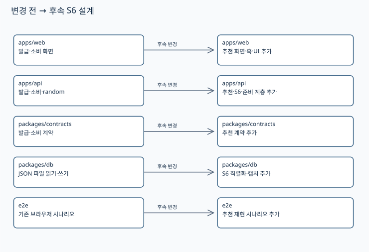
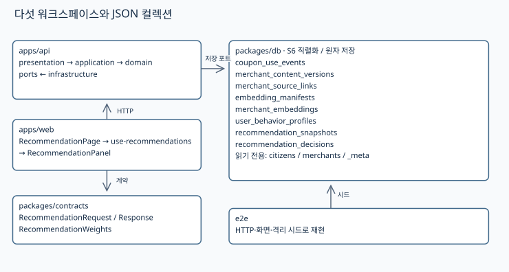
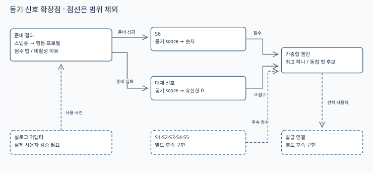
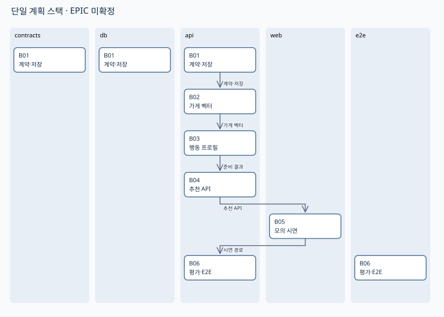
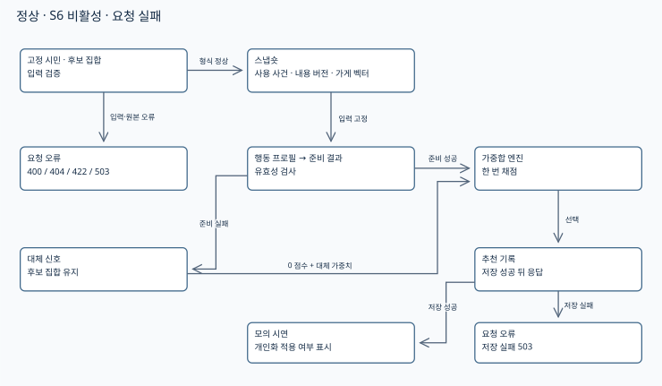

> S6는 이미 정해진 시민의 실제 쿠폰 이용 가게와 후보 가게의 업종·대표메뉴를 비교해 사용처를 추천하는 행동 이력 기반 개인화다. 사전학습 임베딩과 최근성 가중 평균으로 `personalFit` 점수를 준비하고, 결측이면 같은 후보 전체에 다른 신호를 적용한다. 이 문서는 후속 개발 계획인 임시 초안이며 앱 구현·모델 성능 검증 완료를 뜻하지 않는다.

# S6 행동 이력 기반 개인화 개발 설계

- 작성일 — 2026-09-13.
- 기획 버전 — `personalFit.behavior.v1`, 공통 기준 `DG-MERCHANT-SIGNAL v2.1`.
- 코드 기준 — 이 체크아웃의 `17ce19c301eb94e75dc9fa49944fc7bfc5334086`을 직접 읽었다.
- 에픽 — 미확정. [로컬 티켓맵](../지라-티켓-연결.md)과 제공된 기획 티켓맵에 S6 대응 에픽이 없다.
- 조회 한계 — 이 세션에 Jira 조회 커넥터가 없으며 원격 티켓 존재 여부는 확인하지 못했다.
- 이동 계획 — 실제 에픽 확인 시 `documents/<확정된 에픽 티켓 번호>/design.md`와 같은 폴더의 `src/`로 함께 이동하고 인덱스 링크를 고친다.
- 브랜치 표기 — `EPIC`은 치환용 기호이며 실제 티켓 번호나 생성된 브랜치가 아니다.

## 1. 구현의 목표, 전제, 범위

- 목표 — `/recommendations`에서 고정 시민의 모의 이력만 바꾸면 동일 후보의 S6 점수와 선택 사용처 변화를 볼 수 있다.
- 목표 — 모든 후보의 점수·기여·순위·근거·버전을 저장하고 같은 스냅숏에서 선택을 재현할 수 있다.
- 목표 — 일부 벡터 결측에도 후보를 제거하지 않고 요청 전체 S6를 끈 결과를 표시할 수 있다.
- 포함 — 가게 내용 버전, 모의 사용 사건 revision, 임베딩 사전 준비, 프로필, 동기 신호, 추천 API·시연 화면·검증 계획.
- 제외 — 시민 선정, 발급 자격·예산·금액·기간·승인·수량, 소비·정산 정책 변경, 실제 결제망·Jira 연동 구현.
- 제외 — 설문·자유문장·채팅 선호 입력, 협업 필터링, 미세조정, 생성형 설명, 개인 데이터 온체인 기록.
- 범위 관계 — [프로토타입 범위](../프로토타입-범위.md)의 모의 데이터 원칙을 유지하는 후속 단계다.
- 범위 관계 — [KAN-13](../KAN-13/design.md)의 랜덤 발급을 소급 변경하지 않는다. 새 추천 API는 쿠폰을 발급하지 않으며 발급 연결은 별도 후속 작업이다.
- 기존 도메인과의 관계 — [쿠폰 도메인 규칙](../쿠폰-도메인-규칙.md)의 소유자·소비자 구분을 계승한다. 종전 다섯 발급 신호와 새 사용처 전용 S1~S6는 동일한 분류가 아니다.

| 전제 | 확인 방법 | 상태 및 착수 조건 |
| --- | --- | --- |
| 저장소 진입 규칙 | 현재·상위 경로 및 추적 파일의 `AGENTS.md`, `CLAUDE.md` 검색 | 해당 파일 없음. `documents/`와 코드 README 적용 |
| 엔진 계약 | `signal.ts`, `engine.ts`, `issuance.ts` 직접 읽기 | 확인. 동기 숫자 반환, context는 random뿐 |
| 후보·사용자 식별 | `json-candidate-source.ts`, `consumption.ts` 읽기 | 확인. 전체 조합 및 이름 기반 소비 계약은 직접 재사용 불가 |
| 저장 경계 | `json-file-db.ts` 읽기 | 확인. 원자 rename, 없는 컬렉션은 빈 배열, 다중 파일 트랜잭션 없음 |
| 모의 시연 근거 | 이 문서의 산식·레코드 검증 | 설계 예시만 확인. 완성된 시드·앱 실행은 미실시 |
| 모델 실행 | B02에서 고정 revision·추론 환경·한국어 특징 검증 | 미확인. 실제 임베딩 시연 완료의 선행 조건 |
| 실데이터 연결 | 실제 사용자 ID·거래 ID·취소 revision 및 과거 내용 대응표 검증 | 미확보. 실사용 모드 개방의 선행 조건 |
| 에픽 대응 | 확정 티켓의 제목·유형·범위 조회 | 미확정. 스택·티켓 생성 전 확인 |

- 판정 — 문서 작성·정합성 검증을 완료해도 전제 전체 확인이라는 구현 착수 완료 판정은 충족하지 않는다.
- 현재 차이 — `Citizen`은 `id/name`, `Merchant`는 `id/name/category`만 가진다.
- 현재 차이 — `IssueDecision`은 선택 후보의 `scores/total/candidateCount`만 반환하며 전체 순위·근거·버전 저장이 없다.
- 현재 차이 — 소비 API의 `consumerName`, 보상 내역의 `recipientName`은 검증된 실제 사용자 ID가 아니다. 이름이나 최초 소유자에서 이력을 역생성하지 않는다.

### 근거와 확인 수준

- 기획 근거 — 제공된 「시민 맞춤 생활혜택 추천 시그널」 2026-09-13 전체와 「발급 시그널 공통 작성 기준과 조사 근거」 전체를 읽고 필요한 규칙을 이 문서에 옮겼다.
- 작성 기준 — 제공된 「구현 계획 설계문서 작성 규칙」의 14장·추적성·5워크스페이스·컴포넌트별 커밋 규칙 전체를 적용했다.
- 모델 사실 — 한국어 목록, MIT 표기, 차원, 길이 제한, 대칭 입력 접두어와 정규화 예제를 공식 원문에서 재확인했다. [E5 모델 카드](https://huggingface.co/intfloat/multilingual-e5-small/blob/main/README.md)
- 추천 방식 — 과거 행동으로 구성한 사용자 특징과 아이템 특징을 비교하는 콘텐츠 추천으로 분류한다. [Google 콘텐츠 기반 추천](https://developers.google.com/machine-learning/recommendation/content-based/basics)
- 공모전 확인 한계 — 공식 홈페이지·FAQ 재열기는 도구 오류로 실패했다. 공모전 평가는 제공된 기획의 심사 항목 스냅숏에 근거하며 최신 공고 검증이라고 쓰지 않는다.
- 공공자료 — D1 상가정보는 업소 ID·업종 연결 후보, D2a 착한가격업소는 대표메뉴 후보다. 제공된 조사에서 명세만 확인했으며 이 설계 작업에서 API 적재·행 단위 조인을 하지 않았다.
- D0 — 개인 ID·가게 ID·쿠폰 사용 이력이 없는 집계 CSV는 S6 개인 학습 정답이 아니다. 파일을 복사하거나 개인 프로필로 전환하지 않는다.
- 자료 예외 — 공개 통계에 맞추는 전체 모의 데이터 방침과 별개로 S6 의미·경계 픽스처는 의도적으로 만든 가상 사례다. 실제 시민 분포를 재현했다고 주장하지 않는다.

## 2. 용어 사전

| 용어 | 정의 | 식별자 |
| --- | --- | --- |
| S6 | 행동 이력 기반 개인 적합도 신호 | `personalFit` |
| 고정 시민 | 이번 추천에서 바뀌지 않는 시민 | `citizenId` |
| 실제 사용자 | 사용 사건에서 확인한 소비자 | `actual_user_id` |
| 최초 소유자 | 쿠폰을 최초로 받은 사람, 이력 귀속 기준 아님 | `IssuedCoupon.ownerId` |
| 사용 사건 | 거래별 알려진 최신 쿠폰 사용 상태 | `coupon_use_events` |
| 내용 버전 | 당시 알려진 업종·대표메뉴 묶음 | `merchant_content_versions` |
| 가게 벡터 | 내용 버전의 사전학습 특징 | `merchant_embeddings` |
| 행동 프로필 | 유효 사용 사건의 가중 평균을 정규화한 벡터 | `user_behavior_profiles` |
| 후보 집합 | 순서를 보존한 외부 사용처 목록 | `candidate_ids` |
| 준비 결과 | 채점 전에 고정된 점수·비활성 이유 | `PreparedPersonalFit` |
| 대체 신호 | 모든 후보에 유한한 0을 반환하는 신호 | `zeroPersonalFitSignal` |
| 추천 기록 | 전체 후보의 점수와 선택 재현 자료 | `recommendation_decisions` |
| 스냅숏 | 요청이 고정한 입력 파일 해시와 설정 | `recommendation_snapshots` |
| 모델 명세 | 모델·토크나이저·전처리·추론 환경 고정값 | `embedding_manifests` |
| 가맹점 대응표 | 내부 가게와 외부 업소의 검증된 관계 | `merchant_source_links` |
| 랜덤 신호 | 고정 난수 입력을 읽는 탐색용 점수 | `random` |
| 가중합 엔진 | 후보별 가중합 최고 하나를 선택 | `selectCandidate` |
| 모의 시연 | 가상 시민·사용 사건임을 표시한 실행 | `data_mode=synthetic` |
| S1·S3 | 집계 지역 수요·상권 회복 신호, 범위 제외 | `consumption/salesRecovery` |
| S2·S5 | 집단 사용률·노출 다양성 신호, 범위 제외 | `couponUsage/merchantDiversity` |
| S4 | 운영자 지정 소개 우선도, 범위 제외 | `operatorPriority` |

## 3. 핵심 구현 내용 요약

| 항목 | 변경·추가 | 브랜치 |
| --- | --- | --- |
| K01 | 추천 계약·JSON revision 및 스냅숏 저장 경계 | B01 |
| K02 | 내용 버전 전처리·모델 명세·가게 벡터 사전 생성 | B02 |
| K03 | 사용 사건 정제·행동 프로필·요청 전체 S6 비활성 | B03 |
| K04 | 고정 시민 후보·안전한 엔진 결합·전체 추천 기록 API | B04 |
| K05 | 모의 시연 화면·점수와 근거·실패 상태 | B05 |
| K06 | 재현 E2E·비AI 비교·측정 기록 | B06 |

## 4. 아키텍처 결정표

| 결정 | 선택지 | 채택안 | 근거 | 영향 |
| --- | --- | --- | --- | --- |
| 추천 진입 | 발급 변경 / 별도 추천 | 별도 API | 발급 조건과 추천 분리 | api, web |
| 엔진 확장 | 별도 엔진 복사 / 공통화 | 기존 함수의 신호 키 제네릭화 | 선택·동점 로직 단일화 | api |
| 키 호환 | 기존 `SignalWeights` 확장 / 새 타입 | `RecommendationWeights` 추가 | 기존 발급 응답 호환 | contracts |
| 비동기 경계 | score에서 추론 / 사전 준비 | 요청 전 벡터 적재, score는 맵 조회 | 동기 계약 유지 | api |
| 모델 실행 | 온라인 외부 API / 로컬 일괄 | 로컬 일괄 산출물을 Node에서 읽기 | 개인 로그 외부 전송 불필요 | api |
| 영속화 | 새 DB / 기존 JSON | 기존 JSON 및 단일 쓰기 큐 | 기존 기술 결정 준수 | db |
| 설명 | 생성 모델 / 사실 템플릿 | 이유 코드 템플릿 | 메뉴 구매 추정 방지 | api, web |
| 결측 | 후보 삭제 / 전체 비활성 | 요청 전체 S6 비활성 | 후보 비교 가능성 유지 | api |

- 기존 기술 선택 — [저장소 구조와 기술 스택](../저장소-구조와-기술-스택.md)의 pnpm·Turborepo·NestJS·React·JSON·Vitest·Playwright를 유지한다.
- 제네릭화 — `Signal<K = keyof SignalWeights>`, `SelectionDecision<K>`, `selectCandidate<K>`로 키를 매개변수화하고 기존 발급 어댑터는 기존 기본 가중치를 넘긴다.
- 호환 — `IssueDecision`, 발급 기본값 및 기존 발급 요청은 바꾸지 않는다. 추천 어댑터는 `RecommendationWeights={personalFit:number,random:number}`만 받는다.
- 엔진 안전 — 공통 코어는 유한한 비음수 가중치와 그 합·점수·총점의 유한성을 확인한다. 추천 점수의 0~1 검사는 준비 계층이 진다.
- 선택 — 최대 가중합 하나, 동점은 입력 순서의 첫 후보를 유지한다. 가중합을 확률이나 점수 비례 추첨으로 해석하지 않는다.
- 난수 — 요청마다 서버가 만든 uint32 seed와 `mulberry32-v1` 알고리즘 식별자를 기록한다. 재현의 우선 근거는 추천 기록에 저장된 후보별 random 점수이며 구현 라이브러리 교체 시에도 저장 점수를 재사용한다.
- 재현 — 채점은 한 번만 수행한다. 수집 래퍼가 후보별 최초 점수를 기록하고 그 기록으로 순위를 정렬한다.
- 원본 변경 반사 — B06 완료 시 확인된 결정만 기존 주제 문서에 날짜와 함께 반영한다. 이 문서의 미검증 모델 제안은 확정 운영 결정으로 올리지 않는다.

### 파라미터 기본값의 유일한 표

| 파라미터 | 초기 제안 기본값 | 제약 |
| --- | --- | --- |
| `lookback_days` | 90 | 양의 유한 일수, 정확한 24시간 단위 |
| `half_life_days` | 30 | 양의 유한 일수 |
| `merchant_weight_cap` | 2 | 양의 유한 가중치 |
| `day_zone` | Asia/Seoul | 중복 제거에만 적용 |
| `model_id` | intfloat/multilingual-e5-small | 제안 모델, 실행 미검증 |
| `dimension` | 384 | 모델 명세와 일치 |
| `model_revision` | 미확정 | 실제 다운로드 commit SHA 고정, `main` 금지 |
| `preprocess_version` | merchant-text.v1 | 변경 시 재생성 |
| `profile_version` | personalFit.behavior.v1 | 산식 변경 시 새 버전 |
| `text_prefix` | `query: ` | 과거·후보 동일 |
| `max_menus` | 5 | 정제·정렬 후 잘라냄 |
| `max_tokens` | 512 | 특수 토큰 포함 tokenizer 제한 |
| `norm_epsilon` | 1e-12 | 이 이하 노름은 무효 |
| `unit_tolerance` | 1e-5 | 저장 벡터 단위 노름 허용 오차 |
| `weights.personalFit` | 0.95 | 정상 추천 기본값 |
| `weights.random` | 0.05 | 정상 추천 기본값 |
| `fallback_random_weight` | 1 | 준비된 양수 가중치가 없을 때 |
| `max_candidates` | 200 | 시연 요청 메모리 상한, 튜닝 전 제안 |
| `demo_users` / `demo_merchants` | 4 / 12 | 가상 평가 픽스처 규모 |

- 표 밖 숫자는 산술 예시·테스트 입력·프로토콜 상수다. 운영 기본값을 중복 정의하지 않는다.
- S6 비활성 때 `personalFit=0`으로 바꾸고 다른 준비된 양수 가중치가 있으면 유지한다. 아무것도 남지 않을 때만 `random=fallback_random_weight`로 둔다.
- 가중치를 합으로 재정규화하지 않는다. 전부 0인 사용자 요청은 먼저 거부하며 결측에 따른 대체와 구분한다.

## 5. 프로젝트 구조도



- 폴더는 추가하지 않고 다섯 워크스페이스에 역할을 배치한다. 루트 `data/`는 저장 경로이며 여섯 번째 워크스페이스가 아니다.
- 기존 발급과 소비 옆에 사용처 추천 경로를 추가하는 후속 설계다.

## 6. app 및 패키지 내부 구조도



- `apps/api` — `recommendations/{presentation,application,domain,infrastructure}`와 모듈을 신설한다. 순수 신호는 기존 `issuance/domain/signals/implementations`에 둔다.
- `apps/web` — `RecommendationPage`, `use-recommendations`, `RecommendationPanel`의 화면·훅·UI 3층을 둔다.
- `packages/contracts` — 추천 요청·응답만 공유한다. 원시 사용 사건과 벡터를 웹 계약으로 노출하지 않는다.
- `packages/db` — 아래 모든 컬렉션의 파일 읽기·원자 쓰기·직렬화 수단을 제공한다. API 저장소 포트 구현체가 도메인 검증을 맡는다.
- `e2e` — 격리 모의 시드와 HTTP·화면 재현 케이스를 추가한다.
- 변경 없는 워크스페이스 — 없음. 다섯 곳 모두 B01~B06 중 하나에서 변경한다.



- 실선은 이번 구현 경로다. 점선의 S1~S5·실로그 어댑터·발급 연결은 범위 제외다.
- 포트 — `BehaviorStore`는 스냅숏과 revision을, `EmbeddingReader`는 모델 명세·벡터를, `RecommendationRepository`는 기록을 제공한다.
- 실로그 어댑터는 추후 같은 사용 사건 계약으로 연결하되 실제 사용자 식별과 취소 전달 검증이 선행한다.

## 7. 구현에 포함되는 도메인, 테이블

- JSON 규약 — 파일 하나는 레코드 배열이다. 모든 시각은 UTC `Z` ISO 8601이며 모든 ID는 빈 문자열을 허용하지 않는다.
- 기록의 `data_mode` — `synthetic|observed` 중 하나다. 한 스냅숏 안에서 모드를 섞지 않는다.
- 필드 제약 — 아래 표의 모든 필드는 필수다. `?` 대신 `null`을 명시한 필드만 결측을 허용한다.
- 전체 예시 — [컬렉션별 완전한 JSON 레코드](./src/records.json)에 각 배열 1건을 담았다. 벡터는 규격 설명용 단위 기저 벡터이며 E5 출력이 아니다.
- 모델 명세 예시 — 가짜 revision은 `fixture-only`로 표시하며 실제 모드에서 반드시 거부한다. 구조 예시의 `enabled=true`는 계약 예시일 뿐 AI 실행 증거가 아니다.
- 원본 필드 대응 — 기획의 `coupon_id`는 다중 쿠폰 거래 중복을 막기 위해 `coupon_ids` 배열로 확장했다. 모델 ID·revision·차원·전처리는 `manifest_id` 참조로 모았으며 원본 의미를 유지한다.
- 원본 필드 대응 — 기획의 `signal_scores/reason_codes`는 후보별 `rankings.scores/reason_codes`로 옮겼다. 변경 형태는 B01의 계약·레코드 검증 대상으로 둔다.

| 테이블·파일 경로 | 필드와 타입 | 키·제약 | 동시 쓰기 |
| --- | --- | --- | --- |
| `data/runtime/coupon_use_events.json` | `event_id:string, coupon_ids:string[], transaction_id:string, actual_user_id:string|null, merchant_id:string, used_at:string, recorded_at:string, status_revision:integer, ingest_seq:integer, finality_state:pending\|confirmed\|cancelled, net_use_amount_won:integer, merchant_content_version:string|null, data_mode:synthetic\|observed` | `(transaction_id,status_revision)` 유일, revision·seq 양수, 금액≥0 | 전역 S6 큐로 읽기·병합·쓰기 직렬화 |
| `data/runtime/merchant_content_versions.json` | `merchant_id:string, content_version:string, category_code:string, category_label:string, representative_menus:string[], source_ids:string[], known_at:string, verified_at:string, text_hash:string, data_mode:synthetic\|observed` | `(merchant_id,content_version)` 유일, `text_hash` SHA-256 | 불변 revision 추가만, S6 큐 |
| `data/runtime/merchant_source_links.json` | `merchant_id:string, source_id:string, external_shop_id:string, verified_at:string, data_mode:synthetic\|observed` | `(source_id,external_shop_id)` 유일 | 모의 시드 읽기 전용, 교체는 S6 큐 |
| `data/runtime/embedding_manifests.json` | `manifest_id:string, model_id:string, model_revision:string, tokenizer_revision:string, runtime_versions:object<string,string>, preprocess_version:string, dimension:integer, artifact_hash:string, data_mode:synthetic\|observed` | `manifest_id` 유일, 모든 해시 SHA-256, 실제 revision 고정 | 불변 일괄 적재, S6 큐 |
| `data/runtime/merchant_embeddings.json` | `merchant_id:string, content_version:string, manifest_id:string, vector:number[], computed_at:string, data_mode:synthetic\|observed` | `(merchant_id,content_version,manifest_id)` 유일, 차원·유한성·단위 노름 | 불변 버전 적재, S6 큐 |
| `data/runtime/user_behavior_profiles.json` | `profile_id:string, user_id:string, as_of:string, event_watermark:integer, history_digest:string, manifest_id:string, profile_version:string, vector:number[], distinct_merchants:integer, distinct_use_days:integer, weight_sum:number, data_mode:synthetic\|observed` | `profile_id` 유일, 수·합 양수, 벡터 검증 동일 | 파생 캐시, S6 큐 |
| `data/runtime/recommendation_snapshots.json` | `snapshot_id:string, as_of:string, event_watermark:integer, collection_hashes:object<string,string>, candidate_content_versions:object<string,string>, manifest_id:string|null, params:object, data_mode:synthetic\|observed` | `snapshot_id` 유일, 입력 파일 해시 보존 | 요청 입력 캡처, S6 큐 |
| `data/runtime/recommendation_decisions.json` | `recommendation_id:string, user_id:string, as_of:string, candidate_ids:string[], candidate_set_version:string, snapshot_id:string, profile_id:string|null, profile_version:string, manifest_id:string|null, requested_weights:object, effective_weights:object, enabled:boolean, disabled_reasons:string[], rankings:Ranking[], selected_merchant_id:string, random_seed:integer, random_algorithm:string, data_mode:synthetic\|observed` | `recommendation_id` 유일, 후보와 순위 ID 집합 동일 | append 읽기·쓰기 S6 큐 |

- revision 의미 — `status_revision`은 거래 상태의 원천 순서, `ingest_seq`는 서버가 부여한 수집 순서다. `event_watermark`는 요청이 캡처한 최대 수집 순서이며 `history_digest`는 정제 이력의 변경 검출값이다.
- 버전 의미 — `known_at`은 내용을 알게 된 시각, `verified_at`은 확인한 시각, `computed_at`은 벡터를 만든 시각이다. 내용이 당시 알려졌는지는 계산 시각이 아닌 앞의 두 시각으로 판정한다.
- 프로필 의미 — `distinct_merchants`는 정제 뒤 서로 다른 가게 수, `distinct_use_days`는 KST 이용 날짜 수, `weight_sum`은 상한 적용 뒤 가중치 합이다. 이는 확률적 신뢰도가 아니다.
- `Ranking` — `{merchant_id:string, rank:integer, scores:{personalFit:number,random:number}, contributions:{personalFit:number,random:number}, total:number, reason_codes:string[]}`다. 점수는 0~1이고 총점은 유한하다.
- `params` — 4장의 계산·입력 제한·가중치 설정을 값으로 복제한 불변 스냅숏이다. 기본값의 원본은 4장 한 곳이다.
- 기존 레코드 — `citizens`는 `{id:string,name:string}`이며 예시는 `{"id":"cit-demo-1","name":"가상 시민"}`이다. `merchants`는 `{id:string,name:string,category:string}`이며 예시는 `{"id":"mer-demo-a","name":"가상 분식점","category":"분식"}`이다.
- 기존 제약 — 시민 ID·가게 ID는 각 컬렉션에서 유일하고 각각 `cit-`·`mer-` 접두어를 쓴다. `_meta`는 배열 예외인 `{schemaVersion:number}` 객체이며 예시는 `{"schemaVersion":1}`이다.
- 기존 `citizens.json`, `merchants.json` — 읽기만 한다. 기존 ID·이름·category 구조와 레코드는 유지하며 동시 쓰기 작업을 추가하지 않는다.
- 기존 `_meta.json` — 변경 없음. 신규 데이터의 스키마·모드 검증은 S6 저장소가 맡으며 기존 bootstrap이 새 파일을 자동 추가한다고 가정하지 않는다.
- 신규 시드 — B01은 누락한 S6 파일만 명시적으로 설치하는 준비 명령을 계획한다. 빈 컬렉션과 미설치·읽기 장애를 파일 존재 검사로 구별한다.
- 기존 발급·소비 컬렉션 — `issued-coupons`, `coupons`, `points`는 쓰지 않는다. 기존 소비 이름을 실제 사용자로 자동 변환하지 않는다.

### 사건·내용 결합과 늦은 정정

1. `recorded_at<=t`인 모든 사용자에 걸친 거래 revision에서 거래별 최대 revision을 먼저 고른다. 이후 `actual_user_id`로 필터링한다.
2. `used_at`이 `[t-lookback_days,t)`이고 `confirmed`, 순사용액 양수, 실제 사용자 확인인 사건만 남긴다.
3. 동일 거래 다중 쿠폰은 `coupon_ids` 하나로 합친다. 동일 revision 동일 payload 재전송은 멱등이며 상이 payload는 충돌로 격리한다.
4. 고정 시민×가게×KST 날짜별 가장 최근 사건을 남긴다. 같은 시각이면 `transaction_id` 오름차순 첫 사건을 쓴다.
5. 각 사건의 내용 버전을 찾고 `known_at<=used_at`, `verified_at<=used_at`을 확인한다. 과거 내용이 없으면 현재 메뉴로 대체하지 않는다.
6. 후보에는 `known_at<=t`, `verified_at<=t`인 최신 내용 버전을 고른다. 동시각이면 내용 버전 문자열 오름차순으로 결정한다.

- 사용자 정정 — 거래의 최신 revision을 사용자 필터보다 먼저 고르므로 타인으로 정정된 거래가 이전 사용자 이력에 남지 않는다.
- 늦은 취소 — 당시 알 수 없던 취소를 과거 스냅숏에 소급하지 않는다. 다음 요청에서는 최신 revision으로 프로필을 다시 계산한다.
- 부분 취소 — 순사용액 양수면 한 행동이다. 소비 금액에 비례한 가중치는 없다.
- 미확정·사용자 불명 — 긍정 이력에서 제외하고 진단 건수를 기록한다. 이 때문에 남은 이력이 없으면 S6 비활성이다.
- 당시 내용 보존 — 동일 가게의 서로 다른 내용 버전을 합쳐 버리지 않고 사건별 벡터를 유지한다.
- 가맹점 대응표 — 이름만 같은 업소를 자동 병합하지 않는다. 표가 없는 공공자료는 내용 버전에 연결하지 않는다.

### 원자성·재현·삭제

- 직렬화 범위 — 단일 API 프로세스의 S6 전체 읽기·수정·쓰기를 하나의 큐로 묶는다. 동일 PID 임시 파일 충돌과 read-modify-write 유실을 함께 막는다.
- 요청 캡처 — 짧은 큐 구간에서 입력 파일과 watermark를 읽어 불변 메모리 사본을 만든다. 계산 중 잠금은 해제하고 같은 사본만 사용한다.
- 해시 — 객체 키를 정렬한 UTF-8 JSON의 SHA-256을 쓰며 배열 순서는 유지한다. 내용 텍스트 해시는 전처리 결과 UTF-8 바이트로 계산한다.
- 저장 순서 — 프로필 캐시 → 스냅숏 → 추천 기록 순으로 저장하고 추천 기록 성공 뒤 응답한다. 실패 시 고아 캐시·스냅숏은 허용하지만 부분 추천 기록은 허용하지 않는다.
- 재현 입력 — 원본 revision은 사용 사건 저장소에 불변 보관한다. 사용자별 정제 이력과 해당 프로필, 필요한 내용·벡터·모델 명세만 담은 캡처의 해시를 `collection_hashes`에 기록하고 파일을 `data/runtime/s6-snapshots/<snapshot_id>/`에 보관한다. 폴더는 추천 기록 완료 전에 원자 rename으로 공개한다.
- 장애 — 벡터·프로필 준비 장애는 S6 비활성이다. 시민·후보 원본 또는 추천 기록 쓰기 장애는 요청 오류다.
- 모델 교체 — 새 모델 명세로 과거·후보 벡터 전부 재생성하고 프로필도 재계산한다. 완전 검증된 새 명세만 다음 요청에서 선택하며 진행 중 요청은 종전 명세를 유지한다.
- 캐시 키 — 사용자, `as_of`, watermark, 정제 이력 digest, 내용 버전, 모델 명세, 프로필·파라미터 버전을 포함한다. 초기에는 요청마다 재계산하고 저장 프로필을 성능 캐시로 재사용하지 않는다.
- 시간 만료 — 요청마다 고정 `as_of`로 계산하므로 관측 창 탈락과 최근성 변화를 놓치지 않는다.
- 다중 프로세스 — 동일 데이터 디렉터리의 동시 writer는 지원하지 않는다. 실연동 전 프로세스 간 락 또는 트랜잭션 저장소가 필요하다.
- 캡처 격리 — 전체 사용자 이벤트·프로필 파일을 개인 스냅숏에 복사하지 않는다. 정제 이력은 현재 고정 시민에 귀속되는 최종 유효 사건만 담으며 타인으로 정정된 사건은 포함하지 않는다.
- 삭제 — 사용자별 프로필·추천 기록·개인 입력 캡처·캐시를 함께 제거할 저장소 포트를 B01에 둔다. 법정 보존 대상 원천과 추천용 파생 데이터는 실연동 전에 별도 결정한다.
- 삭제 이후 — 삭제한 개인 이력의 과거 재현을 보장하지 않으며 벡터나 연결 가능한 개인 해시를 온체인에 남기지 않는다.

### 전처리와 산식

- 텍스트 — NFC, 연속 공백 축약, 메뉴 공백 제거·중복 제거, Unicode 코드포인트 순 정렬 후 `max_menus`만 사용한다.
- 템플릿 — `query: 업종: 분식. 대표메뉴: 김밥; 떡볶이; 우동.`처럼 구성한다. 가게 이름·주소·가격·광고 문구는 넣지 않는다.
- 메뉴 없음 — 업종만으로 벡터를 만들 수 있으나 메뉴 관련 이유는 표시하지 않는다. 업종도 없는 빈 특징은 무효다.
- 추론 — tokenizer 제한과 attention-mask 평균 pooling, L2 정규화를 적용한다. 토크나이저·라이브러리 버전·모델 revision을 모델 명세에 잠근다.
- 분리 측정 — 대표메뉴가 있는 가게와 업종만 있는 가게를 따로 평가한다. 단일 평균이 혼합 취향을 흐릴 수 있으며 거리·가격·영업 여부는 이 점수로 보장하지 않는다.
- 실행 경계 — B02의 로컬 일괄 도구는 가게 설명만 읽는다. API는 검증된 벡터 파일을 읽으며 요청 중 다운로드·외부 모델 호출을 하지 않는다.

```text
age_e = (t - used_at_e) / 86400초
r_e = 2 ^ (-age_e / half_life_days)
W_h = sum(r_e for merchant(e)=h)
a_e = r_e * min(1, merchant_weight_cap / W_h)
z = sum(a_e * v_e) / sum(a_e)
p = z / norm(z)
personalFit(u,m) = min(1, max(0, dot(p, v_m)))
```

- 모든 `v_e/v_m`은 같은 모델 명세의 검증된 단위 벡터다. 단위 노름 허용 오차 내 값을 읽을 때 다시 정규화한다.
- 무효 — 차원 오류·비유한 성분·노름 무효·버전 혼합·일부 필요한 벡터 결측·분모 무효는 요청 전체 S6를 비활성화한다.
- 검증 순서 — dot의 유한성을 먼저 확인하고 그 뒤 clip한다. `NaN`을 clip으로 고쳤다고 간주하지 않는다.
- 준비 결과 — `{enabled,scoresByMerchantId,reasonByMerchantId,disabledReasons,snapshot_id,profile_id}`를 불변 객체로 반환한다.
- 대체 신호 — 비활성 시 모든 후보에 `score=0`을 반환하고 유효 S6 가중치도 0으로 둔다. 일부 정상 점수만 남기지 않는다.
- 점수 해석 — E5 유사도는 높은 구간에 몰릴 수 있으며 0.8을 80% 사용 확률이나 강한 선호로 표시하지 않는다. 후보별 min-max로 차이를 강제로 벌리지 않고 원시 코사인 clip을 유지한다.
- 정상 맵 — 예상 후보·고정 시민 전체에 대한 키 검사를 채점 전에 마친다. 후보 집합이 달라지면 다시 준비한다.
- 이유 — `SHARED_CATEGORY`, `SHARED_MENU_FEATURE`, `SIMILAR_MERCHANT_FEATURES`, `SINGLE_HISTORY`, `NO_HISTORY`, `MISSING_VECTOR`, `INVALID_VECTOR`, `MODEL_UNAVAILABLE`, `HISTORY_UNAVAILABLE`를 구분한다.
- 문장 — 확인된 공통 업종이면 “최근 이용하신 가게와 같은 업종이에요”를 쓴다. 의미 유사성만 있으면 메뉴 구매나 확률을 만들어 말하지 않는다.
- AI 표시 — `enabled`이고 S6 유효 가중치가 양수일 때만 임베딩이 추천에 참여했다고 표시한다.

### 가상 산식 검산

- 이 절은 2차원 수학 예시이며 E5 실행 결과가 아니다.
- U1 — `(1,0)`을 1일 전, `(0,1)`을 31일 전에 사용했다. 기본 파라미터에서 가중치 비는 2:1이고 `p=(0.894427190999916,0.447213595499958)`이다.
- 후보 — A=`(.8,.6)`, B=`(0,1)`, C=`(1,0)`일 때 S6는 각각 `0.983869910099908`, `0.447213595499958`, `0.894427190999916`이다.
- 순위 — S6 단독으로 A>C>B이며 U2가 두 번째 이력만 가지면 B>A>C다.
- 전액 취소 — U1의 첫 사건 취소가 알려진 다음 요청에서는 B>A>C다. 과거 추천 기록은 유지한다.
- 반복 — 가게별 원시 가중치 합이 상한을 넘으면 사건별 가중치에 같은 축소 비율을 곱한다. 해당 가게를 후보에서 제거하지 않는다.

## 8. API 계약 정의

- 설계 시점 SSOT — 이 장이다. B01부터 `packages/contracts/src/recommendation.ts`로 옮기고 계약 변경 시 본문과 14장을 함께 수정한다.
- 공개 API는 추천 하나다. 모의 사용 사건·내용·모델의 준비는 개발용 로컬 명령이며 외부 쓰기 API를 신설하지 않는다.

### `POST /api/recommendations` — B04

- Content-Type — `application/json` 필수.
- 요청 — `{citizenId:string,candidateMerchantIds:string[],weights?:Partial<RecommendationWeights>}`.
- 제한 — ID는 공백 없는 비빈 문자열, 후보 ID는 중복 없이 `max_candidates` 이하이며 순서가 계약이다. 알 수 없는 본문·가중치 키는 거부한다.
- 시간·모드 — `as_of`, `random_seed`, `data_mode`는 서버에서 결정한다. 모의 시연의 고정 시간·난수는 로컬 실행 설정으로 주입하며 일반 요청으로 조작하지 않는다.
- 정상 — `201`과 추천 기록의 공개 표현을 반환한다. 쿠폰 생성은 없다.

```json
{
  "citizenId": "cit-demo-1",
  "candidateMerchantIds": ["mer-demo-a"],
  "weights": {"personalFit": 1, "random": 0}
}
```

- 응답 타입 — `{recommendationId:string,citizenId:string,asOf:string,dataMode:"synthetic"|"observed",candidateCount:number,selectedMerchantId:string,enabled:boolean,disabledReasons:string[],requestedWeights:RecommendationWeights,effectiveWeights:RecommendationWeights,rankings:Ranking[],snapshotId:string,profileVersion:string,modelRevision:string|null}`.
- 응답 예시는 기본 가중치를 생략한 독립 요청의 결과다. 본문 요청 예시는 S6 단독 가중치의 별도 입력이다.
- 응답 예시 — [정상 응답](./src/api-success.json), [S6 비활성 응답](./src/api-fallback.json), [오류 응답](./src/api-error.json).
- 순위 — 총점 내림차순, 동점은 요청 후보 순서다. `rank`는 동점이어도 순차 번호다.
- 사용자 표시 — 가게 이름은 후보 원본에서 얻되 원시 사용 사건·개인 벡터는 응답에 넣지 않는다.
- 비활성 — `201`, `enabled=false`, 원인 코드, 모든 S6 점수·기여 0, 원래 후보 전체를 반환한다. 개인화가 적용됐다는 문구를 표시하지 않는다.
- 재시도 — POST 재시도는 새 추천 기록을 만들 수 있다. 쿠폰·결제 부작용은 없으며 멱등 키 계약은 초기 범위에서 제외한다.

| HTTP | 오류 코드 | 조건 |
| --- | --- | --- |
| 400 | `INVALID_BODY` | JSON 파싱 실패, 형식·ID·후보 중복·상한·본문 키 오류 |
| 400 | `INVALID_WEIGHTS` | 가중치 객체 오류, 모르는 키, 음수·비유한·합 0·합 오버플로 |
| 404 | `UNKNOWN_CITIZEN` | 고정 시민이 원본에 없음 |
| 404 | `UNKNOWN_MERCHANT` | 후보 중 하나라도 원본에 없음 |
| 422 | `NO_CANDIDATES` | 빈 후보 목록 |
| 503 | `STORAGE_FAILURE` | 시민·후보 읽기 또는 추천 기록 저장 실패 |
| 500 | `SCORING_FAILURE` | S6 준비 밖의 신호가 비유한 점수·총점을 생성 |

- 오류 포맷 — `{error:{code:string,message:string}}`이며 내부 경로·개인 거래 원문을 메시지에 넣지 않는다.
- 오류 우선순위 — 본문 구조 → 가중치 → 빈 후보 → 시민·가게 읽기·존재 → S6 준비 → 채점 → 기록 저장 순이다.
- 기존 발급 오류 — 기존 발급 API의 `500 STORAGE_FAILURE`와 순서는 유지한다. 추천 API의 정책을 발급에 소급 적용하지 않는다.
- 접근 전제 — 모의 시연 서버는 가상 ID만 취급한다. 실사용 모드는 인증 주체와 `citizenId` 일치 검증 없이는 개방하지 않는다.

## 9. 브랜치 위상정렬 그래프 및 개요



- 그림의 같은 B번호가 여러 레인에 반복되면 하나의 브랜치가 여러 워크스페이스를 수정한다는 뜻이다.
- 실제 구현 시 `gh-stack`으로 관리할 단일 선형 스택 계획이다. 이번 문서 작업에서는 브랜치를 만들지 않는다.
- 각 브랜치는 전 단계가 머지된 상태에서 자체 테스트가 통과하는 독립 리뷰 단위다. B04 이전에는 공개 경로를 연결하지 않는다.

| 브랜치 | 계획 이름 | 선행 | 개요·수정 워크스페이스 |
| --- | --- | --- | --- |
| B01 | `EPIC/01-contracts-storage` | 기준 main | 추천 계약·저장 경계; contracts, db, api |
| B02 | `EPIC/02-merchant-embeddings` | B01 | 내용 버전·일괄 임베딩; api |
| B03 | `EPIC/03-behavior-profile` | B02 | 사건 정제·프로필·S6; api |
| B04 | `EPIC/04-recommendation-api` | B03 | 고정 시민·엔진 결합·기록 API; api |
| B05 | `EPIC/05-recommendation-screen` | B04 | 3층 모의 시연 화면; web |
| B06 | `EPIC/06-evaluation-e2e` | B05 | 평가·브라우저 재현; api, e2e |

- 워크스페이스 밖 파일 — B01은 `data/seed/`의 S6 모의 자료를, B06은 검증 결과와 주제 문서를 함께 갱신할 계획이다.
- 브랜치 공통 — 관련 `documents/` 변경을 해당 브랜치에 포함한다.

## 10. 브랜치 별 구현 상세 내용

- 파일맵의 경로는 계획이며 아직 생성하지 않았다. 테스트는 각 대상 옆의 `.test.ts` 또는 `.test.tsx`로 둔다.
- 삭제 파일 — 모든 브랜치에서 없음.

| 번호 | 층 | 생성·수정 파일 | 브랜치 |
| --- | --- | --- | --- |
| CP-01-01 | 계약 | 생성 `packages/contracts/src/recommendation.ts`, 수정 `packages/contracts/src/index.ts` | B01 |
| CP-01-02 | 저장 | 생성 `packages/db/src/serialized-store.ts`, 수정 `packages/db/src/index.ts`, 생성 `apps/api/src/recommendations/application/ports/behavior-store.ts`, `infrastructure/json-behavior-store.ts` | B01 |
| CP-01-03 | 시드 | 생성 `apps/api/src/recommendations/infrastructure/prepare-synthetic-data.ts`, `data/seed/`의 8개 S6 JSON 파일 | B01 |
| CP-02-01 | 전처리 | 생성 `apps/api/src/recommendations/domain/merchant-text.ts` | B02 |
| CP-02-02 | 임베딩 | 생성 `apps/api/src/recommendations/application/ports/embedding-reader.ts`, `infrastructure/json-embedding-reader.ts`, `infrastructure/build-embeddings.py`, `infrastructure/requirements-embeddings.txt` | B02 |
| CP-03-01 | 도메인 | 생성 `apps/api/src/recommendations/domain/behavior-profile.ts`, `domain/params.ts` | B03 |
| CP-03-02 | 준비·신호 | 생성 `apps/api/src/recommendations/application/prepare-personal-fit.ts`, `apps/api/src/issuance/domain/signals/implementations/personal-fit-signal.ts` | B03 |
| CP-04-01 | 코어 | 수정 `apps/api/src/issuance/domain/signals/signal.ts`, `apps/api/src/issuance/domain/services/engine.ts`, `apps/api/src/coupons/application/coupons.service.ts` | B04 |
| CP-04-02 | 추천 유스케이스 | 생성 `apps/api/src/recommendations/application/recommendations.service.ts`, `application/ports/recommendation-repository.ts`, `infrastructure/json-recommendation-repository.ts`, `infrastructure/fixed-citizen-candidate-source.ts` | B04 |
| CP-04-03 | HTTP·모듈 | 생성 `apps/api/src/recommendations/presentation/recommendations.controller.ts`, `presentation/recommendation-error.filter.ts`, `recommendations.module.ts`, 수정 `apps/api/src/app.module.ts` | B04 |
| CP-05-01 | UI 전용 | 생성 `apps/web/src/features/recommendations/components/RecommendationPanel/RecommendationPanel.tsx` | B05 |
| CP-05-02 | 로직 훅 | 생성 `apps/web/src/features/recommendations/hooks/use-recommendations.ts` | B05 |
| CP-05-03 | 화면 조립 | 생성 `apps/web/src/pages/RecommendationPage/RecommendationPage.tsx`, 수정 `apps/web/src/app/routes.ts`, `app/App/App.tsx`, `app/AppLayout/AppLayout.tsx` | B05 |
| CP-06-01 | 평가 | 생성 `apps/api/src/recommendations/evaluation/compare-baselines.ts` 및 명시적 모의 평가 fixtures | B06 |
| CP-06-02 | E2E | 생성 `e2e/tests/recommendations.spec.ts`, `e2e/fixtures/recommendations/`, 수정 `e2e/playwright.config.ts` | B06 |

### B01 — 계약과 저장

- RED — `TC-01-01`: 병렬 서로 다른 revision append 후 두 레코드가 모두 남아야 한다.
- 완료 조건 — `TC-01-01`~`TC-01-04`를 만족하며 계약 타입 검사, S6 설치·삭제가 기존 발급·소비 데이터를 보존한다.
- 구현 — `CP-01-01`~`CP-01-03`으로 JSON 구조 검증, 상태 revision 충돌 검사, 캡처 파일 저장·사용자 삭제를 포함한다.

### B02 — 내용과 가게 벡터

- RED — `TC-02-01`: 표현이 달라도 NFC·공백·메뉴 중복 정제 결과의 텍스트·해시가 같아야 한다.
- 완료 조건 — `TC-02-01`~`TC-02-03`을 만족하고 고정 모델 명세를 잠근다. 실제 모델을 실행하지 못하면 벡터 픽스처 테스트와 별개로 B02 완료는 보류한다.
- 구현 — `CP-02-01`~`CP-02-02`; Python은 API 서비스가 아닌 일괄 준비 도구다. PyTorch·Transformers 버전을 잠그고 고정 샘플을 Node reader로 검증한다.

### B03 — 행동 프로필과 준비 결과

- RED — `TC-03-01`: 7장 가상 U1 점수 세 개가 허용 오차 이내로 일치해야 한다.
- 완료 조건 — `TC-03-01`~`TC-03-06`을 만족하며 모든 정제·결측·시간·반복 상한을 처리한다.
- 구현 — `CP-03-01`~`CP-03-02`; 모델은 주입한 고정 벡터로 대체해 산술을 독립 검증한다.

### B04 — 엔진과 API

- RED — `TC-04-01`: 이력 없는 고정 시민 요청에 전체 후보·유한한 대체 점수·비활성 이유를 응답해야 한다.
- 완료 조건 — `TC-04-01`~`TC-04-05`와 기존 발급 엔진·API 테스트가 통과한다.
- 구현 — `CP-04-01`~`CP-04-03`; 동일 점수를 두 번 계산하거나 난수를 두 번 소비하지 않는다.
- 연결 — 8장의 유일한 엔드포인트는 `CP-04-03`이 구현하며 7장의 추천 기록은 `CP-04-02`가 저장한다.

### B05 — 모의 시연 화면

- RED — `TC-05-01`: 화면 조립 테스트에서 고정 시민의 추천 응답을 주면 모의 자료 안내·선택 사용처·전체 순위가 보여야 한다.
- 완료 조건 — `TC-05-01`~`TC-05-03`을 만족하며 설문·선호 문장 입력 요소가 없다.
- UI — `CP-05-01`은 props만 받아 표시하며 fetch·상태 로직을 갖지 않는다.
- 훅 — `CP-05-02`는 요청·로딩·실패·취소를 맡고 늦게 도착한 이전 시민의 응답을 버린다.
- 조립 — `CP-05-03`은 가상 시민 선택을 시연 도구로 제공한다. 시민 선정 알고리즘을 넣지 않는다.
- 표시 — 조회 전, 조회 중, 비활성 추천, 요청 오류를 구별한다. 기본 화면은 이해 가능한 추천 이유를 보이고 버전·기여는 시연 상세에서 펼친다.

### B06 — 평가와 E2E

- RED — `TC-06-01`: 브라우저에서 모의 시연의 타인 사용·취소 시나리오를 밟으면 올바른 시민만 순위가 바뀌어야 한다.
- 완료 조건 — `TC-06-01`~`TC-06-03`을 만족하며 모델 측정값·실행 환경·데이터 한계를 결과 문서에 남긴다.
- 구현 — `CP-06-01`~`CP-06-02`; 효과가 나쁘다는 결과도 유효한 평가 완료다. 평가 실행 자체가 없으면 완료로 표시하지 않는다.

## 11. 플로우 다이어그램 / 유스케이스 다이어그램



1. 고정 시민과 후보 집합을 받아 형식과 가중치를 검증한다.
2. 사용 사건·내용 버전·가게 벡터를 스냅숏으로 고정한다.
3. 행동 프로필과 준비 결과를 생성한다.
4. 준비 실패면 대체 신호와 유효 가중치를 연결한다. 후보 집합은 유지한다.
5. 가중합 엔진이 한 번 채점하고 추천 기록을 저장한다.
6. 모의 시연 화면이 개인화 적용 여부·선택·이유를 표시한다.

- 요청 오류 — 잘못된 고정 시민·후보 집합은 8장의 오류로 끝난다.
- 저장 실패 — 추천 기록 저장에 실패하면 성공 응답을 보내지 않는다.
- 경계 — 전액 취소·관측 창 탈락으로 이력이 없어지는 경우도 대체 신호 경로다.
- 비교 시연 — 같은 후보 집합·난수를 유지하며 이력 없음, 업종 중심, 다른 업종 중심, 혼합 이력을 비교한다.
- 이벤트 조작 — 모의 자료 준비 명령으로 새 사용·시간 경과·전액 취소 시나리오를 선택한다. 이용자가 선호를 입력하는 화면은 없다.

## 12. 테스트 실행계획

- 아래는 미래 앱 테스트 계획이다. 이번 작업에서 실행한 것은 문서·예시·도표 검증뿐이다.
- 테스트 이름은 `TC-*`로 시작한다. 각 브랜치의 `01`은 10장의 RED다.

| 번호 | 적용 브랜치 | 입력 | 기대 결과 |
| --- | --- | --- | --- |
| TC-01-01 | B01 | 동시 거래 revision append 2개 | 두 레코드 보존, 임시 파일 충돌 없음 |
| TC-01-02 | B01 | 동일 거래·revision 재전송 및 상이 payload | 동일 payload 1건, 상이 payload 충돌 |
| TC-01-03 | B01 | 누락 S6 설치·스냅숏 중간 쓰기 실패 | 기존 데이터 보존, 불완전 추천 기록 없음 |
| TC-01-04 | B01 | 사용자 파생자료 삭제·타인 자료 존재 | 해당 프로필·기록·캡처 제거, 타인·발급 자료 보존 |
| TC-02-01 | B02 | NFC·공백·메뉴 중복 변형 | 동일 텍스트·해시, 이름·주소·가격 제외 |
| TC-02-02 | B02 | 차원 오류·NaN·0 벡터·revision 혼합 | 가게 벡터 무효, 정상과 섞이지 않음 |
| TC-02-03 | B02 | 고정 모델의 과거·후보 동일 텍스트, 긴 입력 | 접두어 동일, 토큰 제한·단위 노름·명세 일치 |
| TC-03-01 | B03 | 7장 U1 가상 벡터 | A/C/B 순위, 명시 점수 오차≤1e-6 |
| TC-03-02 | B03 | 같은 KST 날짜 반복·서로 다른 날짜 다수 | 날짜당 최근 하나, 가게 합 가중치≤상한 |
| TC-03-03 | B03 | 소유자 U1·사용자 U2·사용자 정정 | 확인된 사용자만 반영, 이전 사용자에서 제거 |
| TC-03-04 | B03 | 관측 시작·종료 시각, 미래 recorded_at, KST 자정 | 시작 포함·끝 제외, 미래 정보 제외, KST 날짜별 묶음 |
| TC-03-05 | B03 | 전액·부분 취소·미확정·늦은 취소 | 전액·미확정 제외, 부분 1건, 과거 스냅숏 불변 |
| TC-03-06 | B03 | 이력 없음·이력/후보 벡터 하나 누락·노름 상쇄·내용 미래 | 전체 S6 비활성, 후보 수 불변, 유한한 0 |
| TC-04-01 | B04 | 고정 시민·이력 없음·S6만 양수 요청 | 201 비활성, 대체 랜덤, 모든 후보 유지 |
| TC-04-02 | B04 | 동점·같은 seed·다른 시민 다수 원본 | 첫 후보 선택, 고정 시민만 채점, 재현 일치 |
| TC-04-03 | B04 | 8장 각 오류·복합 오류 | 명시 HTTP·코드·우선순위 일치 |
| TC-04-04 | B04 | 저장 실패·가중치 합 overflow·비유한 random | 성공 기록 없음, 503/400/500 구분 |
| TC-04-05 | B04 | 기존 발급 요청·S6 기록 순위 재현 | 발급 응답 호환, 저장 점수 합과 선택 일치 |
| TC-05-01 | B05 | 화면 수준 추천 응답 | 모의 표시·선택·전체 순위, 선호 입력 없음 |
| TC-05-02 | B05 | 로딩·비활성·오류·재시도 | 상태 구분, 비활성에 AI 개인화 문구 없음 |
| TC-05-03 | B05 | 시민 전환 후 이전 요청이 늦게 완료 | 현재 시민 결과 유지, 사실 밖 메뉴 설명 없음 |
| TC-06-01 | B06 | 모의 타인 사용·취소 시나리오 | 올바른 시민 순위만 변경, 과거 기록 불변 |
| TC-06-02 | B06 | 같은 후보·라벨·seed의 비AI/AI 비교 | 지표·무효 요청 수·분할·실행 환경 기록 |
| TC-06-03 | B06 | 벡터 누락·API 저장 오류 브라우저 경로 | 비활성 추천과 요청 오류의 화면 차이 확인 |

### 실행 명령과 E2E

- B01~B06 — `pnpm typecheck`, `pnpm test`, `pnpm build`를 실행한다. 실패한 브랜치는 다음 단계로 넘기지 않는다.
- B06 — `pnpm e2e`로 기존 발급·소비 경로 회귀와 새 추천 경로를 검증한다.
- E2E 필수 — `TC-06-01`, `TC-06-03`은 실제 브라우저·HTTP·격리 파일 DB를 거친다. 단위 테스트의 API 스텁 통과와 구분한다.
- 격리 — `IM_COUPON_SEED_DIR`, `IM_COUPON_DATA_DIR`를 테스트별 임시 디렉터리로 지정한다. Playwright는 빌드 앱을 새로 기동하고 기존 서버를 재사용하지 않는다.
- 모델 테스트 — B02에서 고정 라이브러리 설치와 로컬 일괄 명령 실행법을 확정한다. 현재 존재하지 않는 명령이 통과했다고 보고하지 않는다.

### 비교·평가와 공모전 설명

- 기준선 — 동일 정제 이력의 업종 최근성 가중 빈도, 동일 텍스트 TF-IDF, E5를 같은 후보 집합·가중치·난수로 비교한다.
- 라벨 — 관련 없음·부분 관련·관련 있음의 3단계 가게 특징 관련성을 두 검토자가 평가하고 불일치를 조정한다. 시민 만족도 정답으로 쓰지 않는다.
- 분할 — 동일 가게·메뉴 바꿔쓰기·생성 원형은 같은 split에 묶고 설정 선택용 검증과 최종 평가를 분리한다.
- 지표 — `NDCG@min(3,M)`, 상위 1개 관련성, 신규 가게 추천 비율, 노출 집중도를 기록한다. 모든 후보 라벨이 0이면 NDCG 분모에서 제외한 건수를 함께 기록한다.
- 성능 — 장비·OS·런타임·모델 명세·가게 수·이력 수·추론 횟수·캐시 적중률·cold/warm 준비 시간·scoring p50/p95를 기록한다.
- 복잡도 — 가게 벡터 사전 계산 뒤 프로필은 `O(H×dimension)`, 후보 채점은 `O(M×dimension)`이다.
- S2와 관계 — 집단 사용률과 개인 의미 유사성은 원천 로그가 겹친다. S2가 구현되는 단계에서 같은 후보·난수의 제거 실험으로 중복 효과를 비교한다.
- S5와 관계 — 전체 노출 다양성과 개인 유사성은 상충할 수 있다. S5 도입 전에는 전체 조합의 성능이나 독립성을 주장하지 않는다.
- S1·S3 — 지역 집계 CSV를 S6에 중복 가산하지 않는다. S4의 운영자 소개를 가격 절감이나 개인 취향으로 바꾸어 설명하지 않는다.
- 미래 행동 평가 — 실제 로그를 확보하면 과거 시점의 프로필로 후속 확인된 사용처 `Recall@k`를 측정한다. 미노출·미사용을 비선호 정답으로 만들지 않는다.
- 실증 한계 — 관측된 사용은 가격·접근성·기존 추천의 영향을 받는다. 실사용률 증가·생활비 절감·복지 형평성·수상 가능성을 모의 점수로 입증하지 않는다.
- 기술 역할 — AI는 의미 벡터 생성, 정제·최근성·상한·코사인은 결정적 계산이다. 개인 모델 가중치를 학습하는 시스템이 아니다.
- 공모전 연결 — 입력 부담 없는 사용처 탐색은 문제해결력, 실패 대체·버전 재현은 기술 완성도, 실로그 확보·비용 조건은 확장 가능성의 설명 근거다.

## 13. 지라 티켓맵

- 실행 상태 — 모든 티켓·브랜치·커밋은 계획이다. Jira 생성·본문 반사·원격 동작은 하지 않았다.
- 매핑 — 확정 에픽 아래 브랜치당 Task 1건을 계획한다. 기존 KAN-13·KAN-15를 S6 티켓으로 재사용하지 않는다.

| 브랜치 | 티켓 | 계획 제목 | 커밋 수 |
| --- | --- | --- | --- |
| B01 | 미확정 | S6 추천 계약·저장 경계 | 3 |
| B02 | 미확정 | 내용 버전과 가게 벡터 | 2 |
| B03 | 미확정 | 행동 프로필과 대체 신호 | 2 |
| B04 | 미확정 | 고정 시민 추천 API | 3 |
| B05 | 미확정 | 모의 추천 시연 화면 | 3 |
| B06 | 미확정 | 비교 평가와 E2E | 2 |

### 커밋 계획

- 각 번호 항목이 티켓의 체크박스 한 건이다. 컴포넌트와 자기 테스트를 함께 초록으로 닫는다.
- B05의 화면 RED는 먼저 작성해 로컬에서 실패를 확인한다. 화면 조립 커밋 전에는 추적된 하위 컴포넌트 테스트만 초록으로 닫고 미완성 화면 테스트를 초록이라고 보고하지 않는다.

1. B01 C01 — `CP-01-01` 추천 계약·내보내기와 계약 fixture 검사.
2. B01 C02 — `CP-01-02` 직렬화·revision·스냅숏·삭제 및 `TC-01-01/02/04`.
3. B01 C03 — `CP-01-03` 모의 자료 설치와 `TC-01-03`.
4. B02 C01 — `CP-02-01` 텍스트 전처리와 `TC-02-01`.
5. B02 C02 — `CP-02-02` 로컬 모델 명세·벡터 reader와 `TC-02-02/03`.
6. B03 C01 — `CP-03-01` 이력 정제·프로필과 `TC-03-01`~`TC-03-05`.
7. B03 C02 — `CP-03-02` 준비 결과·대체 신호와 `TC-03-06`.
8. B04 C01 — `CP-04-01` 엔진 공통화·유한성·기존 발급 호환과 `TC-04-02/04/05`의 코어 검사.
9. B04 C02 — `CP-04-02` 고정 시민·한 번 채점·기록과 `TC-04-01/05`의 서비스 검사.
10. B04 C03 — `CP-04-03` HTTP·모듈과 `TC-04-01/03/04` 통합 검사.
11. B05 C01 — `CP-05-01` UI props와 사실·비활성 표시의 컴포넌트 검사.
12. B05 C02 — `CP-05-02` 요청·경쟁 처리와 `TC-05-03` 훅 검사.
13. B05 C03 — `CP-05-03` 화면 조립·라우팅과 `TC-05-01/02/03` 화면 검사.
14. B06 C01 — `CP-06-01` 기준선·측정 보고와 `TC-06-02`.
15. B06 C02 — `CP-06-02` 격리 E2E·문서 반사와 `TC-06-01/03`.

## 14. 설계 문서 변경 로그

- 2026-09-13 — 제공 기획과 현재 체크아웃을 대조하여 14장 임시 초안을 작성했다. S6 에픽은 미확정으로 남겼다.
- 2026-09-13 — 1차 공모전 적합성 검토에서 모의 분포·실사용 효과·AI 역할 혼동 위험을 발견했다. 1·7·12장에 자료 수준, 가상 벡터, 비AI 비교와 실증 한계를 명시했다.
- 2026-09-13 — 1차 기술 검토에서 소비 이름 기반 계약, 0 가중치 신호 호출, revision 사용자 필터 순서 문제를 발견했다. 1·4·7장에 식별 선행 조건·대체 신호·거래 최신 revision 우선 정제를 반영했다.
- 2026-09-13 — 2차 공모전 적합성 검토에서 부분 결측을 개인화 성과로 표시할 위험을 점검했다. 8·10·12장에 비활성 UI, 관련성 라벨과 실제 만족도 구분, S2·S5 후속 비교 범위를 반영했다.
- 2026-09-13 — 2차 기술 검토에서 다중 파일 원자성·과거 입력 재현·랜덤 이중 소비·기존 발급 호환을 점검했다. 4·7·8·10장에 캡처 파일, 완료 기록 마지막 저장, 한 번 채점, 추천 키 분리를 반영했다.
- 2026-09-13 — 삭제와 재현을 재대조해 스냅숏을 해당 시민의 정제 이력·프로필과 필요한 공통 특징으로 제한했다. 원본 필드의 배열·모델 명세·순위 구조 대응도 7장에 명시했다.
- 2026-09-13 — 구조·링크·JSON 예시·가상 산식·도표와 장 간 추적성을 검증했다. 자세한 실제 실행 결과는 [문서 검증 기록](./src/validation.md)에 둔다.
