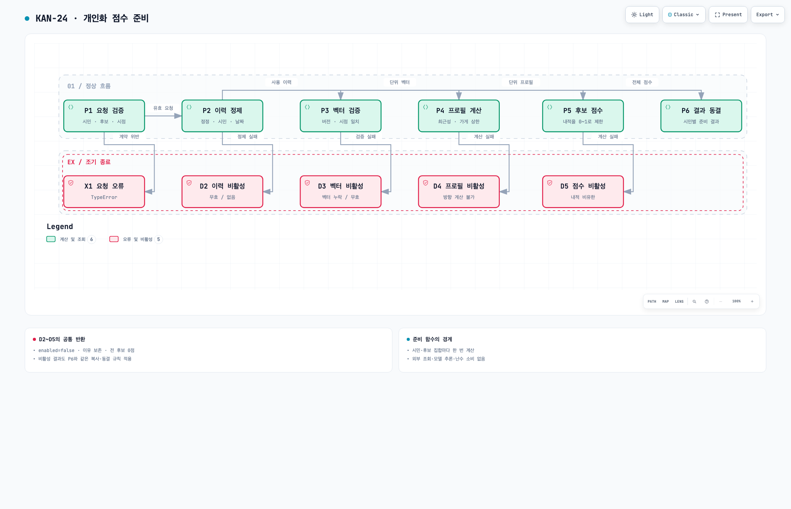
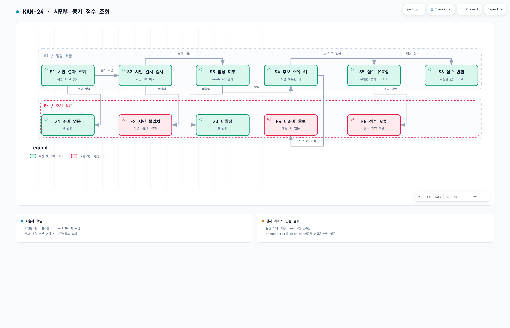

# KAN-24 개인화 신호 로직과 노드 흐름

> KAN-24의 행동 이력 기반 개인화 신호가 사용 이력을 점수로 준비하고 시민별로 조회하는 과정을 설명한다. 실제 구현과 테스트를 확인하여 다이어그램의 모든 노드와 분기, 계산식, 호출자 책임을 연결했다. 현재 쿠폰 발급 서비스에는 개인화 신호가 아직 등록되지 않았다.

- 상위 — [문서 인덱스](_index.md).
- 확인 기준 — 2026-09-13, 브랜치 `s12171934/kan-24-personal-fit-signal`, 커밋 `eab7b98d80a0d63f51c72cb92884e6b5e4ff6e0f`.
- 읽는 순서 — 준비 다이어그램 `P1~P6` → 수치 예제 → 조회 다이어그램 `S1~S6` → 호출자 책임.
- 다이어그램 표기 — 노드 번호는 이 문서의 설명 번호와 같다. 화살표 라벨은 다음 단계로 전달하는 값 또는 분기 조건이다.
- 뷰어 — 본문은 한국어이며 고정 메뉴와 HTML 언어 속성은 영어로 폴백한다.

## 구현 경계와 입력 계약

- `preparePersonalFit(input)` — 시민 한 명과 후보 집합에 대한 점수를 순수 함수로 계산한다.
- `personalFitSignal.score(candidate, context)` — 시민별 준비 결과에서 후보 가게의 점수를 동기 조회한다.
- 두 함수는 외부 API, DB, 모델 추론, 현재 시각 조회, 난수 소비, 모듈 전역 사용자 상태를 사용하지 않는다.
- 호출자는 `citizenId`, `asOf`, `candidates`, `events`, `vectors`, 선택적 `params`를 제공한다.
- 모든 시각은 UTC epoch 밀리초다. 날짜별 중복 제거만 `Asia/Seoul` 기준이다.
- `events`는 거래 ID, 정정 차수, 실제 사용자, 가게, 사용·기록 시각, 상태, 순사용액, 내용 버전을 포함한다.
- `vectors`는 가게 ID와 내용 버전, `specId`, `knownAt`, `verifiedAt`, 수치 성분 배열을 포함한다.
- 가게 벡터는 외부에서 이미 생성·검증한 입력이다. 이 구현에 텍스트 임베딩 모델이나 학습 과정은 없다.

| 파라미터 | 기본값 |
| --- | --- |
| `lookbackDays` | `90` |
| `halfLifeDays` | `30` |
| `merchantWeightCap` | `2` |
| `dayZone` | `Asia/Seoul` |
| `normEpsilon` | `1e-12` |
| 결과 `signalVersion` | `personalFit.behavior.v1` |

## 준비 다이어그램과 노드 설명



[탐색 가능한 HTML — 개인화 점수 준비 흐름](diagrams/personal-fit-prepare.html)

- 정상 흐름 — `P1 → P2 → P3 → P4 → P5 → P6`.
- `X1`은 예외를 던지는 종료다. `D2~D5`는 이유와 전 후보 0점을 담은 비활성 결과를 반환하는 종료다.
- 도식에서 `D2~D5`의 공통 반환 처리는 하단 카드로 합쳤다. 각 비활성 경로도 실제로는 `result()`를 호출해 `P6`와 같은 복사·동결 규칙을 적용한다.

### P1 요청 검증 → P2 또는 X1

- 구현 함수 — `validateRequest`.
- 시민 ID, 기준 시각, 비어 있지 않은 후보 배열, 후보 가게 ID와 내용 버전을 확인한다.
- 한 요청에 같은 가게 ID가 두 번 나오면 거부한다. 결과 점수의 키가 가게 ID이기 때문이다.
- 시각은 유한한 숫자이며 절댓값이 `8.64e15` 이하여야 한다.
- 네 수치 파라미터는 양의 유한 값이어야 한다. 시간대는 `Asia/Seoul`만 허용한다.
- `params` 전체 생략은 허용한다. 개별 키를 명시적으로 `undefined` 또는 `null`로 주면 기본값으로 덮지 않고 거부한다.
- 성공 — 기본값을 병합한 파라미터를 사용해 `P2`로 진행한다.
- `X1` — 계약 위반은 `TypeError`이며 준비 결과를 반환하지 않는다.

### P2 이력 정제 → P3 또는 D2

- 구현 함수 — `selectHistory`.

1. 전체 사건 배열의 구조를 검증한다. 다른 시민 또는 미래 기록이라도 구조 오류가 있으면 `INVALID_HISTORY`다.
2. `recordedAt > asOf`인 기록을 제외한다. `recordedAt == asOf`는 포함한다.
3. 같은 `transactionId + revision`의 필드가 같으면 중복을 접는다. 필드가 다르면 `INVALID_HISTORY`다.
4. 거래마다 가장 큰 `revision`을 선택한다. 가장 늦은 기록 시각을 선택하는 규칙이 아니다.
5. 최신 정정의 `actualUserId`가 대상 시민이며 `confirmed`, `netAmount > 0`인 사건만 남긴다.
6. 사용 시각이 `[asOf - lookbackDays × 1일, asOf)`에 있는 사건만 남긴다.
7. 같은 가게·KST 날짜에서는 가장 늦게 사용한 사건 하나를 선택한다. 사용 시각도 같으면 거래 ID의 문자열 비교 오름차순을 적용한다.
8. 가게 ID → 사용 시각 → 거래 ID 순서로 정렬해 후속 계산 순서를 고정한다.

- 사용자 필터보다 정정 선택이 먼저다. 최신 정정이 취소·타인·사용자 불명·0원으로 바뀌어도 이전 정상 정정을 되살리지 않는다.
- 양수 금액의 크기는 가중치에 반영하지 않는다. 같은 가게·날짜의 결제 횟수도 한 사건으로 줄인다.
- 성공 — 정제된 사용 이력을 `P3`에 전달한다.
- `D2` — 구조·정정 충돌은 `INVALID_HISTORY`, 정제 후 빈 이력은 `NO_HISTORY`다.
- 빈 이력은 벡터 검사보다 먼저 종료한다. 이력과 벡터가 모두 없으면 `NO_HISTORY`다.

### P3 벡터 검증 → P4 또는 D3

- 구현 함수 — `resolveVectors`, `normalize`.
- 정제된 사건은 `(merchantId, contentVersion, cutoff=usedAt)`을 요구한다.
- 후보는 `(merchantId, contentVersion, cutoff=asOf)`를 요구한다.
- 각 요구의 `knownAt <= cutoff`와 `verifiedAt <= cutoff`를 모두 만족해야 한다.
- 과거 내용 버전이 없다고 현재 내용 버전으로 대체하지 않는다.
- 필요한 가게·버전 키만 검사한다. 무관한 가게나 정제에서 빠진 사건만을 위한 벡터 결함은 무시한다.
- 필요한 키의 기록에 잘못된 시각이 있으면 `INVALID_VECTOR`다. 시각이 유효하지만 cutoff 이후인 기록은 사용 가능한 벡터 비교에서 제외한다.
- 사용 가능한 중복 기록은 `specId`, 두 시각, 전체 성분이 같아야 한다. 상충하면 최신 하나를 고르지 않고 `INVALID_VECTOR`로 종료한다.
- 사용되는 모든 벡터는 같은 명세와 차원이어야 한다. 성분은 유한한 숫자이며 노름은 유한하고 `normEpsilon`보다 커야 한다.
- 정규화는 최대 절대 성분으로 먼저 스케일을 줄여 제곱 과정의 불필요한 오버플로를 피한다.
- 성공 — 필요한 벡터 전체를 단위 벡터로 만들어 `P4`에 전달한다.
- `D3` — 시점에 맞는 벡터가 없으면 `MISSING_VECTOR`, 명세·차원·값·중복 충돌이면 `INVALID_VECTOR`다.
- 여러 결함이 있으면 정렬된 요구 순서에서 처음 만난 벡터 실패 이유를 반환한다. `MISSING_VECTOR`와 `INVALID_VECTOR` 사이에 전역 우선순위는 없다.
- 필요한 벡터 하나라도 실패하면 전 후보가 비활성이다. 계산 가능한 일부 후보만 남기는 처리는 없다.

### P4 프로필 계산 → P5 또는 D4

- 구현 함수 — `buildProfile`.
- 각 사건의 최근성 가중치 `r_i`는 사용 후 경과 일수와 반감기로 계산한다.
- 같은 가게의 가중치 합 `W_m`에 가게 상한을 적용한다. 내용 버전이 달라도 같은 가게의 상한을 공유한다.
- 가게 상한을 넘으면 해당 가게의 사건 가중치를 비례해서 줄인다.

```text
ageDays_i = (asOf - usedAt_i) / 86,400,000
r_i       = 2 ^ (-ageDays_i / halfLifeDays)
W_m       = Σ r_i                        (가게 m의 사건)
a_i       = (r_i / W_m) × min(W_m, merchantWeightCap)
mean      = Σ(a_i × unitVector_i) / Σa_i
profile   = mean / ||mean||
```

- 실제 계산은 모든 `a_i`를 공통 스케일 `max_m min(W_m, cap)`로 나눈 뒤 평균을 낸다. 극소 cap에서 곱셈 언더플로로 방향을 잃는 것을 막으며 평균의 의미는 같다.
- 일부 가게의 가중치만 0으로 언더플로하면 그 가게를 건너뛴다. 나머지 기여로 유효한 방향을 만들면 활성 상태를 유지한다.
- 성공 — 정규화된 시민 프로필을 `P5`에 전달한다.
- `D4` — 모든 기여 소실, 무효 분모, 비유한 합, 상쇄되어 너무 작은 평균 노름은 `INVALID_PROFILE`이다.

### P5 후보 점수 → P6 또는 D5

- 구현 함수 — `scoreCandidates`.
- 후보 가게 ID 순서로 시민 단위 프로필과 후보 단위 벡터의 내적을 계산한다.
- 계산식 — `score = min(1, max(0, dot(profile, candidateUnitVector)))`.
- 두 입력이 단위 벡터이므로 제한 전 내적은 코사인 유사도다.
- 음의 내적은 정상적인 활성 0점이다. 데이터 부족으로 비활성인 0점과 의미가 다르다.
- 성공 — 모든 후보의 점수를 `P6`에 전달한다.
- `D5` — 비유한 내적이면 범위 제한으로 숨기지 않고 `INVALID_PROFILE`로 전체 비활성화한다.

### P6 결과 동결

- 구현 함수 — `result`.
- 활성 결과 — `enabled=true`, `reason=null`, 가게 ID별 점수.
- 비활성 결과 — `enabled=false`, 실패 이유, 모든 후보 가게의 정확한 0점.
- 공통 메타데이터 — 시민 ID, 준비 시각, 신호 버전, 준비한 후보 ID·내용 버전 목록.
- 점수 객체는 `Object.create(null)`로 만들고 동결한다. `__proto__`, `constructor` 같은 가게 ID도 소유 키로 보존한다.
- 후보 객체, 후보 배열, 점수 객체, 최상위 결과를 복사·동결한다. 원본 배열이나 벡터가 나중에 바뀌어도 이전 결과는 바뀌지 않는다.

## 손으로 따라가는 계산 예제

- 실제 테스트 `TC-02/03`의 2차원 가상 벡터 예제다.
- 서로 다른 두 가게에서 1일 전 `[1, 0]`, 31일 전 `[0, 1]` 방향의 사용 이력이 남았다고 가정한다.
- 반감기 30일이면 두 최근성 가중치의 비는 `2:1`이다. 기본 상한 2는 이 예제의 가중치를 줄이지 않는다.
- 가중 평균은 `[2/3, 1/3]`이며 단위 프로필은 `[2/√5, 1/√5]`다.

| 후보 | 단위 벡터 | 최종 점수 |
| --- | --- | --- |
| `a` | `[0.8, 0.6]` | `0.9838699101` |
| `x` | `[1, 0]` | `0.8944271910` |
| `y` | `[0, 1]` | `0.4472135955` |

- 개인화 점수 순서는 `a > x > y`다. 실제 발급 후보를 선택한 결과를 의미하지는 않는다.

## 조회 다이어그램과 노드 설명



[탐색 가능한 HTML — 시민별 동기 점수 조회 흐름](diagrams/personal-fit-lookup.html)

- 호출 전 연결 — 호출자가 `preparePersonalFit`의 결과를 `context.personalFitByCitizenId` Map에 시민 ID별로 넣는다.
- 입력 후보의 `citizen.id`와 `merchant.id`가 각각 시민 결과 및 가게 점수 조회 키다.
- 정상 흐름 — `S1 → S2 → S3 → S4 → S5 → S6`.

1. `S1 시민 결과 조회` — Map에서 시민 ID로 준비 결과를 찾는다. 결과가 `undefined`이면 `Z1`에서 0을 반환한다.
2. `S2 시민 일치 검사` — 저장된 결과의 `citizenId`가 후보 시민과 같은지 검사한다. 다르면 `E2`에서 `CITIZEN_MISMATCH` 오류를 던진다.
3. `S3 활성 여부` — `enabled === false`이면 `Z3`에서 0을 반환한다. 이 경우 후보 소유 키나 점수는 검사하지 않는다.
4. `S4 후보 소유 키` — `Object.hasOwn(scoresByMerchantId, merchantId)`를 확인한다. 없으면 `E4`에서 `CANDIDATE_NOT_PREPARED` 오류를 던진다.
5. `S5 점수 유효성` — 숫자 타입, 유한성, `[0,1]` 범위를 확인한다. 위반하면 `E5`에서 `INVALID_SCORE` 오류를 던진다.
6. `S6 점수 반환` — 준비된 숫자를 그대로 반환한다. 저장된 0도 정상 값이다.

- `S2`가 `S3`보다 먼저다. 비활성 결과라도 다른 시민의 결과를 잘못 연결한 문제는 오류로 드러난다.
- `Z1`은 Map에는 접근할 수 있지만 그 시민의 항목이 없는 경우다. `personalFitByCitizenId` 필드 자체가 없는 context를 허용한다는 뜻이 아니다.
- `Z3`는 시민 전체 비활성이므로 준비 목록 밖의 가게를 조회해도 0이다. 활성 상태의 목록 밖 가게는 `E4`다.
- `E2`, `E4`, `E5`는 일반 `Error`이며 시민·가게 ID를 메시지에 포함한다. 공유 HTTP 오류 코드로 변환하는 구현은 없다.
- 조회 함수는 재계산, 난수 대체, 잘못된 점수 보정, 후보 내용 버전의 자동 비교를 하지 않는다.

## 호출자 책임과 실제 서비스 연결

- 후보 집합 또는 내용 버전이 바뀌면 호출자가 다시 준비하고 해당 시민의 Map 항목을 교체해야 한다.
- `asOf`, 이력, 벡터 또는 파라미터가 바뀐 결과를 반영하려면 새 입력으로 재준비해야 한다. 자동 만료·갱신 로직은 없다.
- 시민별 Map 자체는 준비 함수의 동결 대상이 아니다. `ReadonlyMap`은 조회 인터페이스이며 호출자는 요청 범위의 Map을 관리한다.
- 실제 통합 테스트는 U1 재준비 후 U2 결과와 이전 준비 결과가 유지되는지 확인한다.
- `Signal`은 키와 context 제네릭을 받아 개인화 신호의 독립 타입 계약을 표현한다.
- 현재 `CouponsService`의 신호 등록은 `{ random: randomSignal }`이다.
- 현재 공유 `SignalWeights`, 기본 가중치, 발급 엔진 연결은 개인화 신호를 활성화하지 않는다.
- 기존 엔진 `selectCandidate`는 등록된 신호의 가중합을 계산하고 최고점 후보를 고른다. 동점이면 입력 후보 목록에서 먼저 온 후보를 유지한다.
- 따라서 두 다이어그램은 구현된 도메인 함수와 호출 계약을 설명한다. HTTP 요청부터 개인화 발급 완료까지 연결된 서비스 흐름은 아니다.

## 검증과 관련 기록

- 2026-09-13 이 문서 작성 중 직접 실행 — 개인화 준비·조회·입력 계약 테스트 3파일, 104개 통과, 종료 코드 0.
- 실행 명령 — `pnpm --filter @im-coupon/api test src/issuance/domain/signals/implementations/prepare-personal-fit.test.ts src/issuance/domain/signals/implementations/personal-fit-signal.test.ts src/issuance/domain/signals/implementations/personal-fit-input.test.ts`.
- 테스트 개수 — 준비 72개, 조회 29개, 입력 계약 3개.
- 기존 Vite 설정 호환성 안내는 출력되었으며 테스트 실패는 없었다.
- 이번 실행은 가상 벡터와 메모리 계약 검증이다. 개인화 추천 품질이나 실제 서비스 E2E 검증을 의미하지 않는다.
- [최종 검증 기록](personal-fit-validation.md) — 기존 전체 타입검사·테스트·빌드 및 TC 추적성 기록.
- 구현 커밋 — 타입 계약 `e4e703d`, 점수 준비 `f372bf4`, 동기 조회 `07a8193`, 최종 검증 `a55683d`.
- 다이어그램 원본 및 검증 영수증 — 아래 첨부 목록의 JSON을 사용한다.

## 다이어그램 검증과 편집 원본

- 다이어그램 두 장은 `workflow` 스키마 버전 2이며, 각각 showcase 구조 검사 9/9, 구성 오류 0, 경고 0을 통과했다.
- 자동 브라우저 검사는 각각 통과했다. 1440×900, 1600×1000, 1920×1080, 2048×1320에서 가로·세로 넘침이 없다.
- 최종 HTML의 1440×900 어두운 테마와 2048×1320 밝은 테마 이미지를 직접 확인했다. 노드·분기 라벨을 읽을 수 있고 선과 노드의 겹침이 없다.
- 큰 화면에는 하단 여백이 남는다. 세로 간격 확대안은 작은 화면에서 넘침이 발생해 기존 배치로 복원했다.
- [준비 원본 JSON](diagrams/personal-fit-prepare.json), [조회 원본 JSON](diagrams/personal-fit-lookup.json), [파일 지문과 검증 기록](diagrams/personal-fit-verification.json).
- HTML은 GitHub 파일 화면에서 실행되지 않는다. 파일을 내려받아 브라우저로 열면 검색·초점·경로 추적을 사용할 수 있다.
- 재생성 도구는 저장소에 포함하지 않는다. Archify 2.17의 `validate workflow`, `deliver workflow`, `visual-check`로 JSON → HTML → 브라우저 캡처를 검증했다.
- PNG는 최종 HTML의 2048×1320 밝은 테마 캡처를 그대로 복사했다. JSON·HTML·PNG는 기존 검증 산출물과 바이트 단위로 동일하다.

## 코드와 노드 대응

| 노드 | 구현 |
| --- | --- |
| P1~P6, X1, D2~D5 | [prepare-personal-fit.ts](../apps/api/src/issuance/domain/signals/implementations/prepare-personal-fit.ts) |
| S1~S6, Z1·Z3, E2·E4·E5 | [personal-fit-signal.ts](../apps/api/src/issuance/domain/signals/implementations/personal-fit-signal.ts) |
| 입력·출력·기본값 | [personal-fit-input.ts](../apps/api/src/issuance/domain/signals/implementations/personal-fit-input.ts) |
| 현재 신호 등록 | [coupons.service.ts](../apps/api/src/coupons/application/coupons.service.ts) |
| 기존 가중합 엔진 | [engine.ts](../apps/api/src/issuance/domain/services/engine.ts) |

## 변경 이력

- 2026-09-13 — 구현과 테스트를 확인한 노드 설명 및 다이어그램을 저장소 문서로 추가했다.
