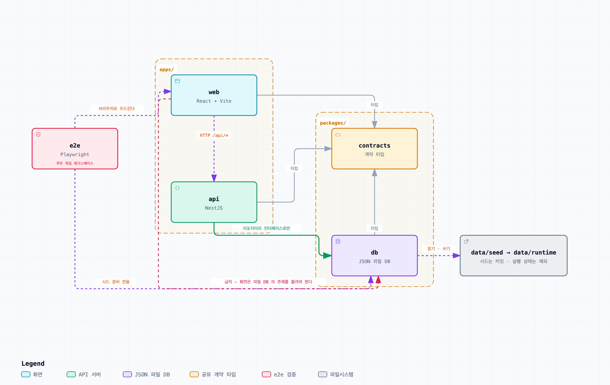
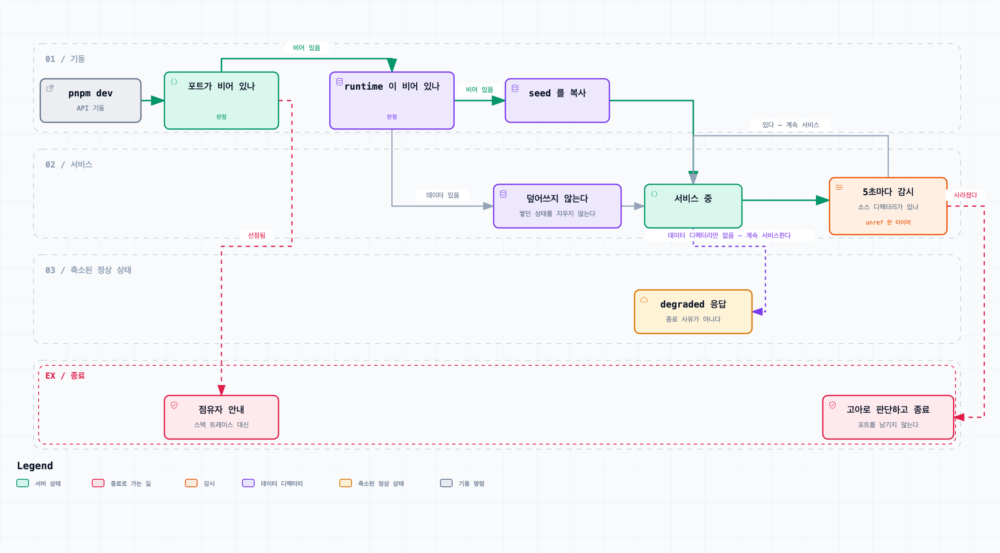

# 저장소 구조와 기술 스택

> 이 저장소가 **무엇으로 어떻게 구성되는가**의 SSOT. 워크스페이스 경계, 의존 방향, 테스트 도구가 여기 있다.
> 무엇을 만드는가(쿠폰 도메인 규칙)는 이 문서의 범위가 아니다.
> 갱신 — 2026-09-07

## 기술 스택

| 층 | 선택 | 역할 |
| --- | --- | --- |
| 프론트엔드 | React + React Router + Vite | 쿠폰 발급·소비 화면과 시연 UI |
| 백엔드 | NestJS | 발급 대상 결정 로직과 쿠폰 API |
| 저장소 | JSON 파일 DB | 데이터 영속화. 별도 DB 서버를 두지 않는다 |
| 단위 테스트 | Vitest | 각 워크스페이스 안에서 닫히는 테스트 |
| e2e | Playwright | 브라우저에서 사용자 플로우를 처음부터 끝까지 검증 |
| 빌드·실행 | Turborepo | 모노레포의 태스크 실행과 캐시 |
| 패키지 매니저 | pnpm | 워크스페이스 선언과 의존성 설치 |
| 문서 다이어그램 | Mermaid | 마크다운 문서 안에 인라인으로 그린다 |

## 디렉터리 구조

```
im-coupon/
  apps/
    web/                # React + Vite. 화면
    api/                # NestJS. API 와 발급 로직
  packages/
    contracts/          # 프론트·백엔드 계약 타입
    db/                 # JSON 파일 DB 구현
  e2e/                  # Playwright. 별도 워크스페이스
  data/
    seed/               # 커밋되는 시드 데이터
    runtime/            # 런타임 데이터. 커밋하지 않는다
  documents/            # 결정·진행경과·설계방침
  package.json
  pnpm-workspace.yaml
  turbo.json
```

워크스페이스는 pnpm 워크스페이스로 선언하고 Turborepo 가 그 위에서 태스크를 실행한다.
패키지 이름은 `@im-coupon/<디렉터리명>` 을 쓴다.

## 앱 내부의 폴더와 인터페이스

서버는 도메인을 먼저 나누고 도메인 안에 필요한 계층을 둔다. `presentation`은 HTTP·트리거 입력, `application`은 유스케이스, `domain`은 순수 규칙, `infrastructure`는 외부 자원 구현을 담당한다. 루트의 `*.module.ts`는 조립 지점이다.

`application/ports`의 인터페이스·토큰과 `infrastructure`의 `Json*` 구현체를 분리한다. 호출자는 인터페이스 타입과 `@Inject(TOKEN)`을 사용하고, 모듈이 `{ provide: TOKEN, useClass: JsonImplementation }`으로 연결한다. 예를 들어 `CouponRepository`의 구현은 `JsonCouponRepository`이며 서비스는 구현체를 직접 참조하지 않는다. 신호·트리거도 계약 폴더와 구현 폴더를 분리한다. 자세한 배치는 [서버 코드 배치](../apps/api/src/README.md)를 따른다.

클라이언트는 `app`(라우팅·공통 레이아웃), `pages`(화면 조립), `features`(발급·내 쿠폰·저장소 상태), `shared`(범용 UI)로 나눈다. 각 기능에는 필요한 `components`, `hooks`, `model`을 두고 컴포넌트마다 전용 폴더에 구현과 테스트를 함께 둔다. 자세한 배치는 [클라이언트 코드 배치](../apps/web/src/README.md)를 따른다.

React Router가 `/issue`와 `/my-coupons`를 연결한다. `/`는 `/issue`로 이동하고, 없는 경로는 안내 화면을 보여준다. 공유 헬스 상태는 앱 셸에서 유지한다. 배포 서버는 화면 URL에 SPA fallback을 제공해야 하며 API 경로는 별도로 처리한다.

## 의존 방향

한 방향으로만 흐른다. 역방향 import 가 생기면 그것은 경계가 잘못 그어졌다는 신호다.



[탐색 가능한 버전 — 워크스페이스 의존 방향](diagrams/워크스페이스-의존-방향.html)

실선은 코드 의존(import), 점선은 런타임 경로와 시드 준비, 붉은 점선은 금지된 의존이다.

- `packages/*` 는 `apps/*` 를 import 하지 않는다. 공유 패키지가 앱을 알면 공유가 아니다.
- `apps/web` 은 `packages/db` 를 import 하지 않는다. 프론트엔드는 파일 DB 의 존재를 몰라야 하며, 데이터는 API 를 통해서만 얻는다.
- `apps/web` 과 `apps/api` 는 서로를 import 하지 않는다. 둘이 아는 공통 언어는 `packages/contracts` 뿐이다.
- `packages/db` 는 `packages/contracts` 를 import 한다. 앱을 향하지 않는 잎 방향의 간선이라 위 규칙을 어기지 않는다.

## packages/contracts — 계약 타입

- 프론트엔드와 백엔드 **사이의 계약**에 해당하는 타입은 전부 여기 둔다. 요청·응답 본문, 공유 도메인 타입, 열거값이 대상이다.
- 어느 한쪽에만 쓰이는 타입은 두지 않는다. 화면 내부 상태 타입이나 서버 내부 타입은 각 앱에 남긴다.
- 계약 타입을 앱 쪽에 복사해 두지 않는다. 복사본은 조용히 어긋나고, 어긋난 사실이 런타임에서야 드러난다.
- 계약이 바뀌면 이 패키지를 먼저 고친다. 타입 오류가 양쪽 앱에서 동시에 뜨는 것이 이 배치의 목적이다.

## packages/db — JSON 파일 DB

- JSON 파일 DB 의 구현(파일 읽기·쓰기·직렬화·경로 규칙)은 `apps/api` 안이 아니라 이 패키지에 둔다.
- `apps/api` 는 리포지터리 인터페이스를 통해서만 이 패키지를 쓴다. 도메인 코드는 저장 방식이 JSON 파일이라는 사실을 모른다.
- 이렇게 두는 이유는 둘이다. 하나는 저장 방식 교체(예: SQLite 로 되돌리기)가 도메인 코드로 번지지 않게 하는 것이고, 다른 하나는 e2e 가 시드·초기화를 위해 같은 구현을 재사용할 수 있게 하는 것이다.
- 데이터 파일은 저장소 루트의 `data/` 아래 둔다. 시드는 `data/seed/` 에 커밋하고, 런타임 쓰기 결과는 `data/runtime/` 에 두어 커밋하지 않는다.
- API 는 기동할 때 `data/runtime/` 이 비어 있으면 `data/seed/` 를 복사한다. 이미 데이터가 있으면 덮어쓰지 않는다. 시연 중 쌓인 상태를 재기동이 지우지 않게 하기 위한 조건이다.
- 두 디렉터리의 위치는 `IM_COUPON_SEED_DIR`·`IM_COUPON_DATA_DIR` 환경변수로 덮어쓸 수 있다. 테스트는 이 값을 임시 디렉터리로 갈아끼운다.
- `_meta.json` 은 예약 컬렉션이다. 도메인 레코드 배열이 아니라 시드 자체를 설명하는 객체 하나가 들어가고, 지금은 `schemaVersion` 만 있다.

## 단위 테스트 — Vitest

- 러너는 워크스페이스 구분 없이 Vitest 하나다. NestJS 의 기본값인 Jest 는 쓰지 않는다.
- 테스트 파일은 검증 대상 파일 옆에 `<대상>.test.ts` 로 둔다. 별도 `__tests__` 디렉터리를 만들지 않는다.
- `apps/api` 는 Vitest 가 데코레이터 메타데이터를 만들도록 `unplugin-swc` 를 통과시킨다. 이것이 없으면 NestJS 의 의존성 주입이 테스트에서 실패한다.
- `apps/web` 은 jsdom 환경에서 Testing Library 로 화면을 렌더해 단언한다.
- 각 워크스페이스의 `test` 태스크는 자기 안에서 닫힌다. 다른 앱의 기동에 의존하지 않는다.

## e2e — 별도 워크스페이스

- e2e 는 `apps/` 아래가 아니라 저장소 루트의 독립 워크스페이스다. 어느 한 앱에 속하지 않고 둘을 가로질러 검증하기 때문이다.
- 도구는 Playwright 다. 실제 브라우저에서 사용자 플로우를 밟는 것이 프로토타입 시연의 검증 대상과 같다.
- e2e 는 실행 중인 `apps/web` 과 `apps/api` 를 **밖에서** 두드린다. 앱 내부 함수를 직접 호출하지 않는다.
- 예외는 시드다. 테스트 시작 상태를 만들 때만 `packages/db` 를 직접 써서 JSON 파일을 준비하고, 그 뒤의 검증은 전부 화면과 HTTP 를 통한다.
- 목은 최소로 쓴다. 목으로 덮은 구간은 e2e 가 검증하지 않은 구간이다.
- 각 워크스페이스의 단위 테스트는 그 워크스페이스 안에 둔다. 여기로 모으지 않는다.

## Turborepo 태스크

| 태스크 | 하는 일 | 비고 |
| --- | --- | --- |
| `build` | 각 워크스페이스 빌드 | `^build` 선행. 산출물은 `dist/` |
| `typecheck` | 타입 검사 | |
| `test` | 단위 테스트 | |
| `dev` | 개발 서버 기동 | 캐시하지 않는 persistent 태스크 |
| `e2e` | Playwright 실행 | 캐시하지 않는다 |

- e2e 실행 전 앱 기동은 Turborepo 가 아니라 **Playwright 의 `webServer`** 가 맡는다. 태스크 그래프에 기동 의존을 넣으면 persistent 태스크가 끝나지 않아 e2e 가 시작되지 못한다.
- `webServer` 는 빌드된 산출물을 띄운다 — API 는 `node dist/main.js`, 화면은 `vite preview` 다. 개발 서버가 아니라 실제로 배포될 것과 같은 것을 검증한다.

## 개발 서버의 트랜스파일러

- `apps/api` 의 `dev` 는 `@swc-node/register` 로 돌린다. esbuild 기반 러너(`tsx`)는 `emitDecoratorMetadata` 를 만들지 못해 NestJS 의 생성자 주입이 런타임에 `undefined` 로 실패한다.
- 이 실패는 빌드 산출물에서는 나지 않는다. `tsc` 가 메타데이터를 emit 하기 때문이고, 그래서 e2e 도 이 문제를 잡지 못한다. 개발 서버를 실제로 띄워 봐야 드러난다.

## 개발 서버의 수명

- API 프로세스는 **자기 소스 디렉터리가 사라지면 스스로 종료한다.** 워크트리를 지워도 그 안에서 돌던 서버는 살아남아 포트를 계속 붙들고, 사라진 데이터 디렉터리를 보며 `degraded` 응답을 내놓는다. 그 상태의 프로세스는 누구에게도 쓸모가 없으면서 다음 기동을 막는다.
- 감시 주기는 5초다. 감시 대상 디렉터리는 `IM_COUPON_GUARD_DIR` 로 덮어쓸 수 있고, 테스트는 이 값을 임시 디렉터리로 갈아끼운다.
- 감시 타이머는 `unref` 한다. 살아 있는지 보는 일이 프로세스의 수명을 늘리면 안 된다.
- 데이터 디렉터리가 없는 것과는 구분한다. 그쪽은 `degraded` 로 내려가는 정상적인 상태이지 종료 사유가 아니다.
- 포트 선점으로 기동에 실패하면 기본 스택 트레이스 대신 **점유자를 찾는 명령과 다른 포트로 띄우는 법**을 안내한다. `EADDRINUSE` 를 만난 사람이 실제로 알고 싶은 것은 "누가 잡고 있는가"다.
- e2e 는 **이미 떠 있는 서버를 재사용하지 않는다.** 재사용하면 남이 띄운 서버에 조용히 붙어, e2e 가 검증하는 대상이 이 저장소가 아니게 된다. 포트가 물려 있으면 붙는 대신 실패하는 편이 낫다. 대가는 로컬 e2e 가 매번 서버를 새로 띄우는 시간이다.



[탐색 가능한 버전 — 개발 서버 기동과 수명](diagrams/개발-서버-수명.html)

두 갈래의 "디렉터리가 없다"가 서로 다른 결말로 간다. 소스가 사라지면 종료이고, 데이터가 없으면 `degraded` 로 계속 산다.

## 문서의 다이어그램

- `documents/` 의 다이어그램은 **`documents/diagrams/` 에 사양·산출물 세 벌로 둔다.**
  - `<이름>.json` — 다이어그램의 **원본**이다. 그림을 고칠 때 고치는 것은 이 파일이지 산출물이 아니다.
  - `<이름>.html` — 검색·초점·경로 추적이 되는 탐색 가능한 단일 파일이다.
  - `<이름>.png` — 마크다운 본문에 인라인으로 붙이는 라이트 테마 래스터다.
- 마크다운에는 **PNG 를 임베드하고 그 아래에 HTML 링크를 붙인다.** 문서를 읽다가 그림이 바로 보이고, 자세히 볼 사람은 링크로 들어간다.
- 산출물은 **원본 JSON 에서 생성만 하고 손으로 고치지 않는다.** HTML 과 PNG 를 직접 편집하면 다음 생성에서 지워진다.
- 그림 하나가 주장 하나를 진다. 산문이 더 빠르게 말하는 것은 그리지 않는다.
- **간선에 이름을 붙인다.** 이름 없는 화살표는 "무언가 관련 있음"이라는 뜻밖에 전달하지 못한다.
- **미결인 것은 그림에서도 미결로 표시한다.** 그림이 산문이 열어 둔 선택지를 조용히 닫으면, 다음 사람은 이미 정해진 것으로 읽는다.
- 그림 아래에는 그 그림이 무엇을 말하는지 한두 줄로 적는다. 설명을 그림 안에 넣지 않는다.
- 사양 JSON 은 `architecture`·`workflow`·`dataflow`·`lifecycle` 네 종류 중 하나이고, 각각 노드·간선을 좌표가 아니라 **레인과 열**로 배치한다. 그림을 고칠 때는 좌표부터 잡지 말고 배치를 먼저 바꾼다.
- 간선 라벨이 다른 간선이나 상자를 가리면 **라벨을 지우지 말고 경로나 라벨 위치를 옮긴다.** 라벨을 지우는 것은 배치 수정이 아니라 뜻을 버리는 것이다.

## 결정

- 2026-09-07 — 서버는 도메인별 계층과 인터페이스·구현체를 분리한다. 클라이언트는 React Router와 기능별 폴더 구조를 사용하고 모든 컴포넌트를 전용 폴더에 둔다.

- 2026-09-05 — 프론트엔드는 React 로 구현하고 빌드 도구는 Vite 로 한다.
- 2026-09-05 — 백엔드는 NestJS 로 구현한다.
- 2026-09-05 — 프론트엔드와 백엔드를 하나의 모노레포에 둔다. 패키지 매니저는 pnpm, 태스크 실행은 Turborepo 로 한다.
- 2026-09-05 — 백엔드 DB 는 별도 DB 서버 없이 파일시스템 DB 를 쓰고, 형식은 JSON 파일로 한다. SQLite 는 채택하지 않는다.
- 2026-09-05 — 앱은 `apps/` 아래 별도 워크스페이스로 분리하고, 공유 코드는 `packages/` 아래 둔다.
- 2026-09-05 — e2e 도구는 Playwright 로 한다.
- 2026-09-05 — e2e 를 `apps/`·`packages/` 어느 쪽에도 넣지 않고 저장소 루트의 독립 워크스페이스로 분리한다.
- 2026-09-05 — JSON 파일 DB 의 구현을 공유 패키지(`packages/db`)에 두고, 앱은 리포지터리 인터페이스를 통해 사용한다.
- 2026-09-05 — 프론트엔드와 백엔드 사이 계약에 해당하는 타입은 공유 패키지(`packages/contracts`)에 두고 양쪽이 그것을 가져다 쓴다.
- 2026-09-05 — 워크스페이스 디렉터리 이름을 `apps/web`, `apps/api`, `packages/contracts`, `packages/db`, `e2e` 로 한다.
- 2026-09-05 — 단위 테스트 러너를 저장소 전체에서 Vitest 하나로 한다. NestJS 의 기본값인 Jest 는 채택하지 않는다.
- 2026-09-05 — 테스트 파일을 검증 대상 옆에 `<대상>.test.ts` 로 둔다.
- 2026-09-05 — 데이터 JSON 파일을 `data/seed`(커밋)와 `data/runtime`(커밋하지 않음)으로 나눈다.
- 2026-09-05 — Turborepo 태스크 이름을 `build`·`typecheck`·`test`·`dev`·`e2e` 로 한다.
- 2026-09-05 — e2e 실행 전 앱 기동을 Turborepo 태스크 의존이 아니라 Playwright 의 `webServer` 로 처리하고, 개발 서버가 아니라 빌드 산출물을 띄운다.
- 2026-09-05 — `packages/db` 가 `packages/contracts` 를 import 하는 것을 허용한다.
- 2026-09-05 — `apps/api` 의 개발 서버를 `@swc-node/register` 로 돌린다. `tsx` 는 채택하지 않는다.
- 2026-09-05 — API 프로세스가 자기 소스 디렉터리의 소멸을 감시해, 사라졌으면 고아로 판단하고 스스로 종료한다. 감시 대상은 `IM_COUPON_GUARD_DIR` 로 덮어쓸 수 있다.
- 2026-09-05 — 포트 선점(`EADDRINUSE`) 실패를 스택 트레이스 대신 점유자를 찾는 안내로 바꿔 내보낸다.
- 2026-09-05 — e2e 의 `reuseExistingServer` 를 항상 `false` 로 한다. 같은 날 정한 `!process.env.CI` 를 뒤집는다.
- 2026-09-05 — 문서의 다이어그램을 Mermaid 로 그리고 마크다운 문서 안에 인라인으로 둔다. 이미지 파일과 외부 다이어그램 도구는 쓰지 않는다.
- 2026-09-05 — 위 결정을 뒤집는다. 문서의 다이어그램을 `documents/diagrams/` 아래 JSON 사양으로 두고, 거기서 탐색 가능한 HTML 과 인라인용 PNG 를 생성한다. 마크다운에는 PNG 를 임베드하고 HTML 을 링크한다. Mermaid 인라인은 더 쓰지 않는다.
- 2026-09-07 — `coupons` 컬렉션의 동시 쓰기를 프로세스 내 직렬화로 보호한다. `JsonFileDb` 의 쓰기는 이미 원자적이라 파일이 깨지지는 않지만 읽고-더하고-쓰는 발급이 겹치면 나중 쓰기가 앞 쓰기를 덮어 레코드가 유실되고, API 는 단일 프로세스라 프로세스 안에서 한 줄로 직렬화하면 충분하다. 프로세스 밖까지 막는 파일 락은 단독 점유(찜하기) 기획이 확정될 때의 몫이다.
- 2026-09-07 — `apps/web` 의 화면을 UI 전용 컴포넌트(`src/features/<기능>/components/`, `src/shared/components/`)·로직 훅(`src/features/<기능>/hooks/`)·화면 조립(`src/pages/`) 세 층으로 나눈다. UI 전용 컴포넌트는 props 만 받아 그리고, 로직은 훅이 지며, 화면은 둘을 조립만 한다. 단위 테스트가 fetch 스텁 없이 UI 를, 렌더 없이 로직을 각각 검증한다.
- 2026-09-07 — 위 세 층 위에 앱 셸을 둔다. 탭을 가로질러 공유되는 상태는 앱 셸이 들고 화면에 props 로 내리되, `fetch` 자체는 앞 결정대로 훅이 진다. 화면이 각자 조회하면 탭을 오갈 때마다 같은 요청이 되풀이되고 언마운트된 화면이 든 결과도 함께 버려진다.

## 근거

- **단일 저장소** — 프로토타입은 3주 안에 발급·소비 2트랙을 함께 시연해야 한다. 저장소를 나누면 계약 변경이 두 저장소의 동기화 작업이 된다.
- **JSON 파일 DB** — 프로토타입 범위에서 실제 데이터를 목 데이터로 추상화하기로 했다. 사람이 파일을 직접 열어 수치를 고칠 수 있고, 데이터 변경이 `git diff` 에 남으며, 설치 시 네이티브 빌드 의존이 없다. 대가는 트랜잭션 부재이고 그 부담은 아래 미결에 있다.
- **Turborepo** — 앱이 둘뿐이어도 심사위원·팀원이 명령 하나로 전체를 띄울 수 있어야 한다.
- **e2e 분리** — e2e 를 한쪽 앱에 넣으면 그 앱의 테스트 명령이 다른 앱의 기동에 의존하게 된다. 분리하면 각 앱의 단위 테스트는 자기 안에서 닫히고, 층을 가로지르는 검증만 별도 태스크가 된다.
- **Vitest 단일** — 화면 쪽이 이미 Vite 를 쓰므로 설정과 트랜스파일 경로가 겹친다. 러너가 하나면 `turbo run test` 가 한 종류의 명령만 부르고, 팀원이 익힐 도구도 하나다. Jest 를 `apps/api` 에만 남기면 그 대가로 설정과 CI 태스크가 둘로 갈린다.
- **시드와 런타임 분리** — 시드를 커밋해야 심사용 시연을 커밋 하나로 재현할 수 있다. 반대로 런타임 쓰기 결과까지 커밋되면 앱을 한 번 돌릴 때마다 `git diff` 가 발생해, JSON 을 고른 이유였던 "데이터 변경이 diff 에 남는다"가 오히려 노이즈가 된다. 둘을 나누면 양쪽을 다 가진다.
- **`packages/db` → `packages/contracts`** — 저장소 상태(`StorageHealth`)는 API 응답의 일부이므로 계약이다. 같은 모양을 `db` 안에 따로 정의하면 계약이 두 곳에 생기고, 그것이 `packages/contracts` 를 둔 이유와 정면으로 어긋난다. 잎 패키지를 향하는 간선이라 순환이 생기지 않는다.
- **계약 타입 공유** — 프론트와 백이 같은 타입 정의를 보면 계약 위반이 빌드 시점에 드러난다. 각자 정의하면 어긋남이 시연 중에 드러난다.
- **고아 프로세스 자결** — 워크트리 삭제는 그 안의 개발 서버를 함께 정리해 주지 않는다. 남은 서버는 포트를 붙든 채 사라진 데이터 디렉터리를 보며 `degraded` 를 내놓으므로, 증상은 "API 가 안 뜬다"와 "화면이 점검 필요로 뜬다" 둘로 나타나면서 원인은 어느 쪽도 가리키지 않는다. 프로세스가 스스로 물러나면 두 증상이 함께 사라진다.
- **포트 선점 안내** — 원인을 아는 사람에게 스택 트레이스는 불필요하고, 모르는 사람에게는 아무것도 알려주지 않는다. 점유자를 찾는 명령 한 줄이 그 자리를 대신한다.
- **e2e 서버 재사용 금지** — 재사용은 로컬에서 몇 초를 아끼는 대신, 엉뚱한 서버를 검증하고도 통과하는 경로를 만든다. e2e 가 무엇을 검증했는지 확신할 수 없으면 통과에 의미가 없다.
- **Mermaid 인라인** — 다이어그램이 텍스트로 남으면 문서와 같은 커밋에 담기고 `git diff` 에 무엇이 바뀌었는지 그대로 드러난다. 이미지 파일은 원본과 산출물이 갈라져 그림만 낡는다. 별도 도구를 요구하면 문서를 고치는 사람이 그림을 고치지 않게 된다. 대가는 표현력이고, 이 저장소의 그림은 상태 전이·의존 방향·분기라서 그 범위 안에 든다.

## 미결

- [ ] JSON 파일의 동시 쓰기 보호 방식을 정한다. 점유(찜하기)가 기획에 남으면 같은 레코드를 다투는 요청을 직렬화하는 파일 락과, 쓰기 도중 죽어도 파일이 깨지지 않게 하는 임시 파일 작성 후 원자적 rename 을 `packages/db` 안에 직접 구현해야 한다. 폐기되면 이 항목은 불필요해진다. 2026-09-07 — 일부가 닫혔다. 원자적 rename 은 `JsonFileDb` 가 이미 갖고 있고, 에픽 KAN-13 이 `coupons` 쓰기에 한해 프로세스 내 직렬화를 세웠다(위 결정). 남은 것은 프로세스 밖의 요청까지 직렬화하는 파일 락이며, 점유(찜하기) 노선이 확정될 때까지 이 항목은 그만큼 열려 있다.
- [ ] 린터·포매터를 도입할지 정한다. 지금은 없다.
- [ ] CI 를 붙일지 정한다. 지금은 검증이 로컬 명령뿐이다.
- [ ] 다이어그램 산출물을 저장소 안에서 재생성하는 경로를 정한다. 지금은 `documents/diagrams/` 의 JSON 사양에서 HTML·PNG 를 만드는 도구가 저장소에 없어, 사양만 고쳐서는 그림이 갱신되지 않는다.
