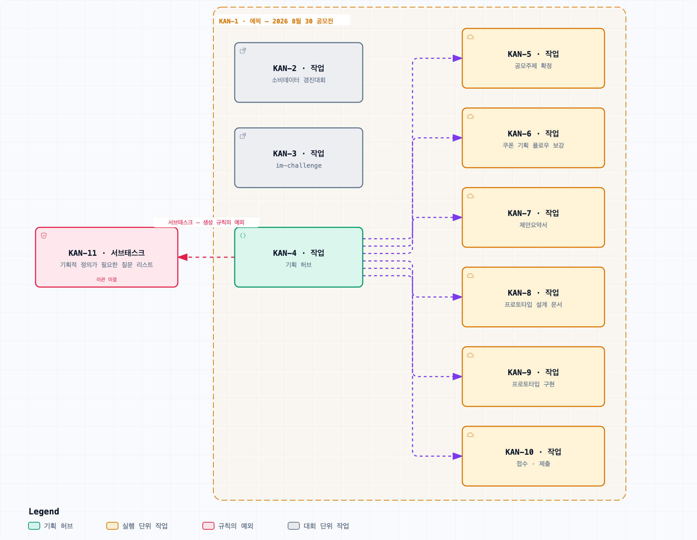

# 지라 티켓 연결

> 이 저장소의 작업이 **어느 티켓에 걸려 있는가**, 그리고 **새 티켓을 어떻게 만드는가**를 관리하는 문서다.
> 티켓을 열거나 만들어야 할 때 여기를 본다.
> 판단·근거·수치는 티켓이 아니라 `documents/` 에 있다. 이 문서는 대응 관계와 생성 규칙만 관리한다.
> 갱신 — 2026-09-13

## 보드와 주소

- 보드 — `ssong9520` Atlassian 사이트의 `KAN` 프로젝트, 칸반 보드 하나.
- 개별 티켓 주소 — `https://ssong9520.atlassian.net/browse/KAN-<번호>`
- 진입점 — [KAN-1 에픽](https://ssong9520.atlassian.net/browse/KAN-1)

보드는 가볍게 운영한다. 하위 이슈를 세분하지 않고 서로 무엇을 하는지 파악할 수 있는 수준까지만 쓴다.

## 어느 쪽이 원본인가

**결정·근거·수치의 원본은 `documents/` 이고, 티켓은 실행 상태(누가 무엇을 언제까지)를 보드로 보기 위한 것이다.**

- 문서에서 결정이 나면 티켓을 고친다.
- 티켓에서 체크박스가 닫히면 그 결과를 문서의 `## 결정` 또는 `## 진행경과` 에 한 줄로 반사한다.
- **티켓에만 있는 판단을 만들지 않는다.** 티켓에서 새 판단이 나왔으면 그 내용을 문서로 옮기고 티켓은 가리키기만 한다.
- 같은 항목이 두 곳에 있으면 문서가 이긴다.

## 티켓 목록

`KAN-1` 이 대회 두 건을 함께 묶는 에픽이고, 그 아래 대회별 작업과 기획 작업이 같은 계층(작업)으로 놓인다.
`KAN-4` 가 기획 허브이며, 실행 단위 여섯 개는 서브태스크가 아니라 `KAN-4` 의 **연관 티켓(Relates)** 으로 연결되어 있다.

[탐색 가능한 버전 — 지라 티켓 계층](diagrams/지라-티켓-계층.html)

점선 테두리 상자가 에픽 `KAN-1` 이고, 그 안에 든 작업이 에픽의 자식이다. 보라 점선은 기획 허브가 실행 단위를 가리키는 `Relates` 링크다.
`KAN-11` 만 에픽 밖에서 `KAN-4` 아래 서브태스크로 달려 있고, 붉은 간선이 그 예외를 가리킨다. 어느 티켓이 어느 문서에 대응하는지는 다음 표에 있다.

이 그림은 2026-09-05 상태다. 그 뒤에 생긴 `KAN-12` 와 에픽 `KAN-13`(구현 티켓 KAN-14~KAN-20 포함)은 그림에 없고, 현행 기준은 아래 표다. 그림 갱신은 다이어그램 재생성 경로 미결([저장소 구조와 기술 스택](저장소-구조와-기술-스택.md))에 걸려 있다.

| 티켓 | 유형 | 제목 | 이 저장소의 대응 |
| --- | --- | --- | --- |
| KAN-1 | 에픽 | 2026 8월 30 공모전 | — (상위 묶음) |
| KAN-2 | 작업 | 소비데이터 활용 분석·아이디어 경진대회 | — (다른 대회 접수) |
| KAN-3 | 작업 | im-challenge | [_index.md](_index.md) |
| KAN-4 | 작업 | 기획서 (기획 허브 + 기획 리스트 체크박스 12건) | [_index.md](_index.md) |
| KAN-5 | 작업 | 공모주제 최종 선택과 기획 방향 확정 | — (서류 작업) |
| KAN-6 | 작업 | 쿠폰 기획 플로우 보강 8건 반영 | [쿠폰 도메인 규칙](쿠폰-도메인-규칙.md) |
| KAN-7 | 작업 | 붙임4 제안요약서 작성 (A4 5장 내외) | — (서류 작업) |
| KAN-8 | 작업 | 프로토타입 설계 문서 작성 | [프로토타입 범위](프로토타입-범위.md) |
| KAN-9 | 작업 | 프로토타입 구현 3주 플랜 | [프로토타입 범위](프로토타입-범위.md), [저장소 구조와 기술 스택](저장소-구조와-기술-스택.md) |
| KAN-10 | 작업 | 접수 서식 준비와 온라인 제출 (마감 2026-09-20 23:59) | — (서류 작업) |
| KAN-11 | 서브태스크 | 기획적 정의가 필요한 질문 리스트 | [쿠폰 도메인 규칙](쿠폰-도메인-규칙.md) 의 "원안에 대한 반론" |
| KAN-12 | 작업 | 공공데이터 조사 결과 및 MVP 데이터 설계 정리 | — (아직 대응 문서 없음) |
| KAN-13 | 에픽 | 프로토타입 티켓 발급 구현 | [KAN-13 설계문서](KAN-13/design.md) |
| KAN-14 | 작업 | 시드 데이터와 쿠폰 계약 타입 | [KAN-13 설계문서](KAN-13/design.md) 10장, 브랜치 `KAN-13/01-seed-and-contracts` |
| KAN-15 | 작업 | 발급 엔진 — 랜덤 신호·가중치 결합·발급 트리거 | [KAN-13 설계문서](KAN-13/design.md) 10장, 브랜치 `KAN-13/02-issuance-engine` |
| KAN-16 | 작업 | 발급 API 와 쿠폰 저장 | [KAN-13 설계문서](KAN-13/design.md) 10장, 브랜치 `KAN-13/03-issue-endpoint` |
| KAN-17 | 작업 | 내 쿠폰·시민 목록 조회 API | [KAN-13 설계문서](KAN-13/design.md) 10장, 브랜치 `KAN-13/04-list-endpoints` |
| KAN-18 | 작업 | 발급 실행 화면 | [KAN-13 설계문서](KAN-13/design.md) 10장, 브랜치 `KAN-13/05-issue-screen` |
| KAN-19 | 작업 | 내 쿠폰 화면과 거래조건 고지 | [KAN-13 설계문서](KAN-13/design.md) 10장, 브랜치 `KAN-13/06-my-coupons-screen` |
| KAN-20 | 작업 | 발급 e2e | [KAN-13 설계문서](KAN-13/design.md) 10장, 브랜치 `KAN-13/07-issuance-e2e` |
| KAN-22 | 에픽 | S6 행동 이력 기반 personalFit signal 추가 | [S6 설계문서](behavior-signal-design/design.md) |
| KAN-23 | 작업 | 행동 이력 signal 설계문서 작성 및 티켓·브랜치 연결 | [S6 설계문서](behavior-signal-design/design.md) 13장, `s12171934/behavior-signal-design` |
| KAN-24 | 작업 | 행동 이력 기반 personalFitSignal 및 순수 준비 함수 구현 | [S6 설계문서](behavior-signal-design/design.md) 10·12·13장, `s12171934/kan-24-personal-fit-signal` |

- `— (서류 작업)` 은 이 저장소가 다루지 않는 접수·제안 서류다. 코드나 문서가 여기서 나오지 않는다.
- `KAN-11` 은 아래 생성 규칙에서 벗어나 서브태스크로 만들어져 있다. 보드 계층을 맞추려면 작업 유형으로 옮겨야 하고, 그 이관은 지라 쓰기이므로 지시가 있을 때만 한다.

## 티켓을 새로 만들 때

- 실행 단위는 **작업(Task) 유형**으로 만든다. **서브태스크는 쓰지 않는다.**
- 부모는 소속에 따라 갈린다 — 설계문서가 있는 구현 에픽(예: `KAN-13`)의 브랜치 티켓은 **그 에픽**을 부모로 두고, 기획·서류 계열 실행 단위는 종전대로 에픽 `KAN-1` 을 부모로 둔다.
- 기획 허브 `KAN-4` 와의 `Relates` 링크는 기획 계열 실행 단위에만 건다. 구현 에픽 아래 브랜치 티켓에는 걸지 않는다 — 설계문서가 대응 관계를 이미 지기 때문이다.
- 본문은 **요약 한 문단 + 체크리스트 하나**로 구성한다. 근거를 복제하지 말고 `documents/<파일>.md` 를 가리킨다.
- 체크박스는 실제 ADF `taskList`·`taskItem` 노드로 저장한다. 현재 Jira MCP는 `contentFormat: html`과 `<ul data-type="task-list"><li data-type="task-item"><input type="checkbox"> 항목</li></ul>`을 받아 ADF로 변환한다. 생성 후 HTML로 다시 조회해 task-list와 체크박스가 보존됐는지 확인한다. 마크다운의 `- [ ]` 리터럴 저장을 완료로 간주하지 않는다.
- 한글 본문은 유니코드 이스케이프로 쓰지 말고 그대로 보낸다. 이스케이프 표기는 글자가 바뀌어도 오류가 나지 않아 오타가 조용히 남는다.

## 쓰기 경계

**지라 쓰기(생성·수정·코멘트)는 그 명령에서 지라 수정을 명시했을 때만 한다.** 조회는 제한이 없다.
문서를 고쳤다고 해서 에이전트가 티켓을 따라 고치지 않는다. 반사는 별도 지시다.

## 결정

- 2026-08-30 — 협업은 지라 칸반 보드 하나로 가볍게 운영하고, 티켓 생성·갱신은 에이전트에 맡긴다. 티켓 간 링크가 필요해 다른 도구 대신 지라로 정했다.
- 2026-08-31 — 기획 허브 `KAN-4` 의 실행 단위를 서브태스크가 아니라 연관 티켓(Relates)으로 만든다. 보드에서 같은 계층으로 보이게 하기 위해서다.
- 2026-08-31 — 결정 대기와 자료조사 대기를 티켓 체크박스로 관리하되, 미결의 원본은 문서에 둔다. 두 곳이 어긋나면 문서를 따른다.
- 2026-09-05 — 티켓 대응 관계를 이 저장소에서 관리한다. 커밋되는 문서가 팀이 함께 쓰는 이슈 트래커를 가리키는 것을 허용한다(`documents-first` §6).
- 2026-09-06 — 부모 규칙을 나눈다. 설계문서가 있는 구현 에픽(예: `KAN-13`)의 브랜치 티켓은 그 에픽을 부모로 두고 `KAN-4` Relates 링크를 걸지 않는다. "부모는 `KAN-1`" 은 기획·서류 계열에만 남는다. 2026-08-31 의 Relates 결정을 구현 티켓에 한해 좁힌 것이다.
- 2026-09-06 — [KAN-13 설계문서](KAN-13/design.md) 13장 티켓맵대로 구현 티켓 7건(KAN-14~KAN-20)을 에픽 KAN-13 아래에 생성했다. 본문은 요약 한 문단 + 커밋당 체크박스 1건이다.
- 2026-09-07 — 에픽 KAN-13 의 구현 티켓 7건(KAN-14~KAN-20)이 모두 닫혀 `검토 중` 에 있고, 각 티켓에 대응하는 브랜치 일곱(`KAN-13/01-seed-and-contracts` ~ `07-issuance-e2e`)이 스택으로 섰다. 2026-09-06 의 티켓 7건 생성에 짝이 되는 실행 상태이며, 무엇이 서게 됐는지와 수치는 [_index.md](_index.md) 진행경과에 있다.

- 2026-09-13 — Jira MCP로 에픽 KAN-22와 Task KAN-23·KAN-24를 생성했다. 두 Task의 부모는 KAN-22이고 KAN-4 Relates는 없다. 설계·구현 브랜치 대응은 [S6 설계문서](behavior-signal-design/design.md) 13장에 둔다. MCP HTML→ADF 변환과 실제 체크박스 저장을 재조회로 확인했다.

## 미결

- [ ] `KAN-11` 을 서브태스크에서 작업 유형으로 이관할지 정한다.
- [ ] 프로토타입 구현이 진행되면 `KAN-9` 를 더 쪼갤지 정한다. 지금은 티켓 하나에 구현 전체가 들어 있다.
- [ ] `KAN-10`(서류 작업)의 부모가 보드에서 에픽 `KAN-13`(구현 에픽)으로 걸려 있다. 2026-09-06 조회에서 발견했고 의도인지 확인이 필요하다. 서류 작업이므로 `KAN-1` 아래가 이 문서의 규칙에 맞는다.
- [ ] `KAN-12`(공공데이터 조사·MVP 데이터 설계)의 대응 문서를 정한다. 조사 결과가 저장소에 들어오면 목록의 대응 칸을 채운다.
