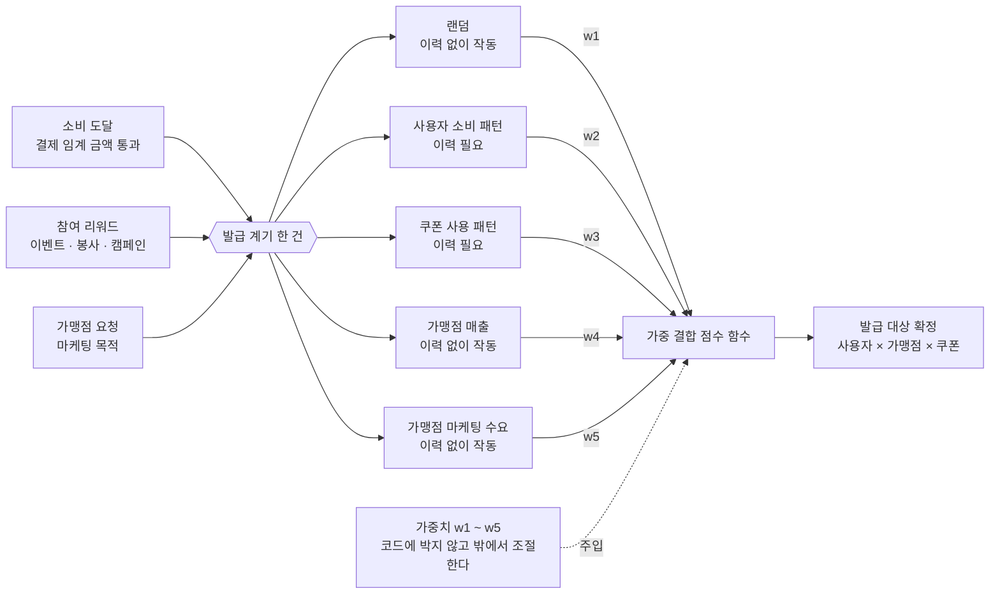
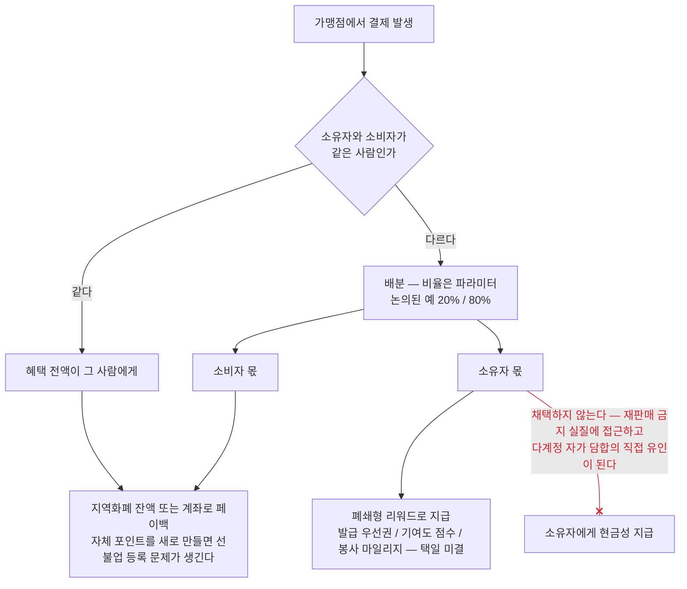
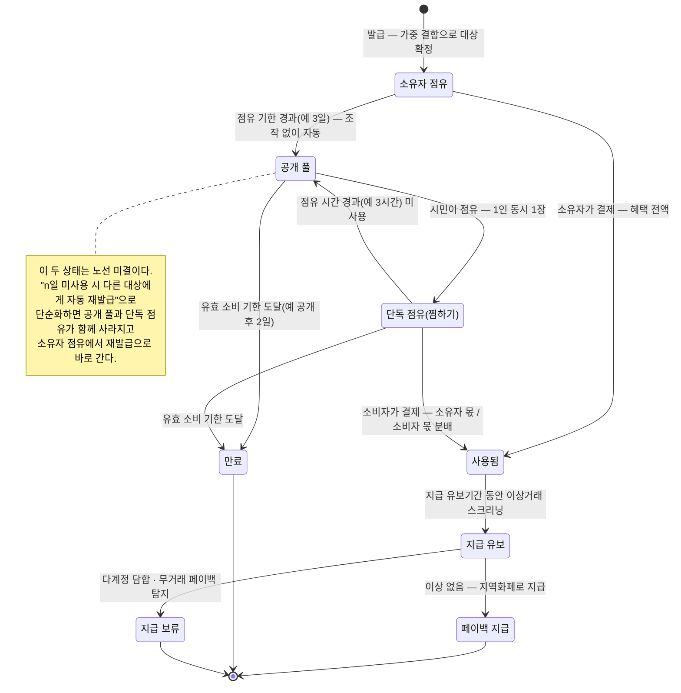

# 쿠폰 도메인 규칙

> 이 저장소가 **무엇을 만드는가**의 SSOT. 쿠폰이 어떤 계기로 발급되고, 누구에게 가고, 누가 쓰고, 언제 만료되는지가 여기 있다.
> 어떻게 구성하는가(워크스페이스·스택·테스트)는 [저장소 구조와 기술 스택](저장소-구조와-기술-스택.md) 이다.
> 어디까지 만들고 어디부터 만들지 않는가는 [프로토타입 범위](프로토타입-범위.md) 다.
> 갱신 — 2026-09-05

## 한 줄로

쿠폰은 결제 시점의 즉시 할인이 아니라 **결제 이후의 페이백 권리**다.
발급받은 사람(소유자)과 실제로 쓰는 사람(소비자)이 다를 수 있고, 소유자가 쓰지 않은 혜택은 기한이 지나면 다른 시민에게 열린다.

목적은 셋이다 — 대구 시민에게 생활권 안의 체감 혜택을 주는 것, 소상공인 가맹점의 방문과 결제 전환을 늘리는 것, 쓰이지 않는 혜택의 사장률을 낮추는 것.

## 발급

### 발급 트리거

쿠폰은 소비 실적과 특정 참여 행위를 계기로 발급한다.

- **소비 도달** — 일정 소비 금액에 도달하면 발급한다. "결제 10만 원당 한 장"이 후보로 나왔으나 확정 수치는 아니다.
- **참여 리워드** — 이벤트·봉사·지역 캠페인 참여에 대해 발급한다.
- **가맹점 요청** — 가맹점이 마케팅 목적으로 발급을 요청할 수 있다.

봉사 트리거는 **새 적립 체계를 만드는 것이 아니라 기존 자원봉사 마일리지를 읽어오는 연동**으로 설계한다.
`자원봉사활동 기본법` 의 무보수성 원칙 때문에, 봉사의 대가가 아니라 참여 인정 지표로 표현하고 지급 주체를 지자체·플랫폼 쪽으로 분리해야 한다.

### 발급 대상 결정 — 가중치 결합

어떤 쿠폰을 어떤 가맹점 것으로 누구에게 줄지는 다섯 신호를 **하나의 점수 함수로 가중 결합**해 정한다.
이 과정이 프로토타입의 핵심 구현 범위다. 소비 쪽은 통제 대상이 아니라 "어떻게 소비될 것인가"만 정해 주면 되는 영역으로 분류했다.

세 트리거 중 무엇으로 발급되든 대상을 정하는 경로는 하나다. 이력이 필요한 신호는 다섯 중 둘뿐이므로,
`w1` 을 높게 시작해 이력이 쌓이는 만큼 `w2`·`w3` 을 올리면 첫날부터 발급이 돌아간다. 이것이 콜드스타트 완충이다.

| 신호 | 무엇을 보는가 | 이력 없이 작동하는가 |
| --- | --- | --- |
| 랜덤 | 신규 가맹점과 이력이 없는 사용자를 위한 탐색 비중 | 작동 |
| 사용자 소비 패턴 | 사용자별 선호 업종과 방문 가능성 | 이력 필요 |
| 쿠폰 사용 패턴 | 사용 전환이 높은 유형과 사장되는 유형을 비교해 재발급 전략을 조정 | 이력 필요 |
| 가맹점 매출 | 매출 보강이 필요한 가맹점과 지원 효과가 클 가맹점 | 작동 |
| 가맹점 마케팅 수요 | 가맹점이 직접 입력한 발급 목적과 부담 재원 | 작동 |

- 가중치는 코드에 박지 않고 **밖에서 조절할 수 있게 노출한다.** 가중치를 바꾸면 결과가 어떻게 달라지는지 대비해 보이는 것이 이 알고리즘의 존재 이유를 설명하는 방법이다.
- **초기 이력 부족(콜드스타트)의 완충은 랜덤 신호가 맡는다.** 랜덤 비중을 높게 시작해 이력이 쌓이는 만큼 선호·독려 비중을 올리는 스케줄로 둔다. 알고리즘의 미완성이 서비스 실패로 직결되지 않는 구조가 된다.
- 가맹점 선별 신호는 사용자 이력과 무관하게 매출 구간과 가맹점 요청만으로 계산되므로 첫날부터 작동한다.

이 결합의 목적은 기존 카드사·핀테크의 개인화 쿠폰과 다르다. 저쪽의 목적이 카드 이용 극대화라면, 여기서는 **사용자의 취향을 해당 상권의 수요로 유도하는 것**이 목적이다. 결제 데이터만이 아니라 지역 상권 정보를 함께 결합하는 이유가 여기에 있다.

## 소비

### 혜택 이분화

쿠폰을 발급받은 **소유자**와 실제 결제에 쓰는 **소비자**를 구분한다. 소유자가 직접 쓰지 않고 타인이 쓰면 혜택이 둘로 갈린다.

- 소유자와 소비자가 같으면 혜택 전액이 그 사람에게 간다.
- 다르면 일부가 소유자에게, 나머지가 소비자의 결제 혜택으로 간다. 이 배분이 소유자가 쿠폰을 흘려보낼 유인이다.
- 배분 예시로 논의된 값은 두 가지다 — 소유자 20% / 소비자 80%, 그리고 `5,000원` 쿠폰에서 소유자 `500원` / 소비자 `4,500원`. **어느 쪽도 확정 수치가 아니다.** 비율은 설계에 고정하지 않고 파라미터로 둔다.

소유자 몫을 **현금성으로 주면 안 된다**는 것이 조사의 가장 무거운 결론이다. 상세는 아래 "설계를 제약하는 것" 절에 있다.

붉은 `×` 로 끊긴 간선이 이 절의 핵심이다. 소유자와 소비자가 갈리는 지점까지는 원안 그대로지만,
소유자 쪽 출구만 현금성에서 폐쇄형 리워드로 바뀐다.

### 이중 기한

쿠폰에는 기한이 둘 있다.

- **소유자 점유 소비 기한** — 소유자만 쿠폰을 온전히 쓸 수 있는 기간. 논의된 예시는 3일이다.
- **유효 소비 기한** — 점유 기한이 끝난 뒤 다른 시민도 쓸 수 있는 전체 유효기간. 논의된 예시는 이후 2일이다.

두 기한의 목적은 소유자에게 우선권을 주되, 쓰이지 않은 혜택이 만료되기 전에 다른 사람에게 넘어가게 만드는 것이다.
**전환에 사람의 조작을 넣지 않는다.** 결제할 때를 빼면 사용자가 아무것도 누르지 않아도 되게 한다는 원칙에 따라, 공개 여부를 사람이 누르는 방식은 배제했다.

### 공개 풀과 점유 — 노선 미결

원안은 다음과 같다. **다만 이 절 전체의 존치 여부가 아직 결정되지 않았다.** 아래 "미결" 참조.

- 점유 기한이 끝난 쿠폰은 시민이 접근할 수 있는 공개 풀에 노출되고, 유효 기한까지 누구나 쓸 수 있다.
- 여러 사람이 같은 쿠폰을 두고 같은 매장으로 몰리는 것을 막기 위해, 공개된 쿠폰에는 짧은 **단독 점유(찜하기)** 를 둔다. 논의된 예시는 3시간이다.
- 한 사용자가 동시에 점유할 수 있는 공개 쿠폰은 **하나**다.
- 점유 시간 안에 쓰지 않으면 쿠폰은 공개 풀로 돌아간다.

### 상태기계

발급 → 소유자 점유 → 공개 → 단독 점유 → 사용 → 페이백 지급 → 만료.

사람이 누르는 전이는 둘뿐이다 — 결제와 점유. 나머지는 전부 기한이 끌고 간다.

상태 전이로 정리해 두면 시뮬레이션과 테스트가 쉬워진다. 특히 **"1인 동시 1쿠폰" 제약이 실제로 지켜지는 것을 테스트로 증명하는 것이 시연 포인트**다.

## 설계를 제약하는 것

법·규제·경제 조사에서 나온 판정이다. 구현 이전에 기획의 모양을 바꾸는 항목이므로 여기 둔다.

| 요소 | 판정 |
| --- | --- |
| 페이백(사후 적립) 방식 | 성립 |
| 소비 도달 트리거 발급 | 성립 |
| 랜덤 + 가중치 발급 | 성립 |
| 이중 기한과 공개 후 단독 점유 | 성립 |
| 봉사 리워드 발급 | 조건부 — 무보수성 원칙을 피하는 서술·주체 분리 필요 |
| 무상 양도·공유 | 조건부 — 쿠폰이 지역사랑상품권으로 분류되지 않는 "페이백 권리" 성격을 유지해야 함 |
| 소유자의 현금성 수수료 수취 | **위험 — 변형 필요** |

- **소유자 보상의 비환금화.** 소유자가 타인의 사용 대가로 금전을 받는 구조는 `지역사랑상품권 이용 활성화에 관한 법률` 제11조의 재판매 금지 실질에 접근하고, 동시에 다계정 자가 담합의 직접 유인이 된다. 소유자와 소비자가 같은 사람이면 소유자 몫은 자기에게 돌아오는 순증 이익이 되므로, 계정을 여러 개 만들어 서로의 쿠폰을 쓰는 것이 가장 합리적인 전략이 된다. 발급 우선권·기여도 점수·봉사 마일리지 같은 폐쇄형 리워드로 바꾸면 규제와 어뷰징 위험이 함께 줄어든다.
- **페이백 지급처.** 자체 포인트를 새로 만들어 여러 가맹점에서 쓰게 하면 `전자금융거래법` 상 선불전자지급수단이 되어 선불업 등록 문제가 생긴다. 지역화폐 잔액 충전이나 계좌 환급처럼 이미 있는 수단으로 지급한다. 프로토타입의 리워드는 지역화폐로 고정하고 교체만 가능하게 둔다.
- **개인 단위 추천에 쓸 수 있는 데이터가 제한된다.** 가명정보 결합물은 통계·연구·공익 목적에만 쓸 수 있어 개인 단위 쿠폰 추천에 쓸 수 없다. 실무적 결론은 이원화다 — 가맹점 선별과 지역 소비 분석은 가명·집계 데이터로, 개인별 선호 추천은 본인 동의 기반 데이터로 처리한다. 프로토타입에서는 후자를 목 데이터로 대체한다.
- **재원은 한 겹으로 두지 않는다.** 지자체 예산 단독은 소진이 빠르다. 다른 지역 사례에서 캐시백 비율 상향 후 이용량이 급증해 예산이 조기 고갈되고 지급이 중단된 적이 있다. 지자체·국비 기본 재원 + 가맹점이 요청한 마케팅 목적 가산분 + 카드사 한정 캠페인의 삼층 구조로 나누고, 예산 총량 상한과 **소진율 연동 요율 조정**을 처음부터 넣는다. 전면 중단보다 요율 점진 하향이 상권 충격이 작다.
- **어뷰징 방지가 기능 요건이다.** 셋을 막아야 한다 — 다계정 자가 담합(결제수단·기기·네트워크 동일성 탐지, 반복 쌍의 지급 유보), 공개 쿠폰 사재기(공개 시각 지터, 미사용 반복에 대한 냉각 기간, 일일 선점 상한), 무거래 페이백(지급 전 유보기간과 그 사이의 이상거래 탐지).
- **배분 비율과 이중 기한은 고지 대상이다.** 표시광고법상 거래조건 고지에 해당하므로 화면에서 본문 크기로 노출한다.

## 원안에 대한 반론

기획 원안과 정면으로 부딪히는 반론이 하나 있고, 아직 닫히지 않았다.

- 소비하지 않은 원소유자에게 리워드를 주면 **할인 비용과 리워드가 이중 지출**된다.
- 결제 없이 보상을 받는 구조는 **의도적으로 쿠폰을 만료시키는 어뷰징**을 부른다.
- 공용 풀은 소진율을 100% 에 가깝게 강제하므로, 만료분이 환입되는 일반 프로모션보다 **발급 주체의 재무 부담이 커진다.**
- 공용 풀이 열리면 쿠폰만 골라 쓰는 소수가 혜택을 독점해 **형평성** 쟁점이 생긴다. 세금 재원으로는 통과하기 어려운 지점이다.
- "쿠폰이 뜨는 곳 = 장사가 안 되는 곳"이라는 **낙인 효과**와, 매출 부진 데이터 노출에 대한 가맹점의 거부감.
- 소액 쿠폰의 소유권 추적에 블록체인을 쓰는 것은 **과잉 기술**로 읽힐 수 있다.

앞의 둘은 위 "소유자 보상의 비환금화"와 같은 문제를 가리키므로 상충이 아니라 같은 방향의 강한 진술이다. 나머지는 노선 결정이 필요하다.

## 결정

- 2026-08-30 — 쿠폰은 즉시 할인이 아니라 결제 이후의 페이백으로 작동한다. 결제 전에는 쿠폰 형태의 안내를 보내 어디서 얼마를 환급받는지 알린다. "어디서 얼마 이상 결제" 같은 미션 형태는 반감을 예상해 기각한다.
- 2026-08-30 — 쿠폰 혜택을 소유자와 실사용자로 이분화한다. 둘이 같으면 전액을 받는다.
- 2026-08-30 — 소유자 점유 기한이 끝나면 사용자 조작 없이 자동으로 전체 공용으로 전환한다. 공개 후에는 한 번에 한 장만 단시간 점유할 수 있다.
- 2026-08-30 — 분배 비율·기한·발급 금액 같은 수치는 설계에 고정하지 않고 나중에 값만 교체할 수 있는 파라미터로 둔다.
- 2026-08-30 — 프로토타입을 발급과 소비 2트랙으로 나누고, **발급 대상 결정을 핵심 구현 범위로 삼는다.**
- 2026-08-30 — 프로토타입의 리워드는 지역화폐로 고정하고 교체만 가능하게 만든다.

## 미결

- [ ] **기획 노선을 확정한다. 나머지 미결 전체의 선행이다.** 세 가지를 함께 정해야 한다.
  - [ ] 공용 풀을 유지할지, "발급 후 n일 미사용 시 다른 타겟 사용자에게 자동 재발급"으로 단순화할지
  - [ ] 점유(찜하기)를 유지할지. 유지하면 점유 시간과 취소 페널티를 함께 정한다. 거래 회전율 저하가 반대 근거이고, 헛걸음 분쟁 방지가 찬성 근거다
  - [ ] 블록체인 축의 범위. 소유권 이전·이중 사용 방지 이력까지 남기고 NFT·완전 온체인은 제외하는 선을 명시한다
- [ ] 소유자 보상을 어떤 폐쇄형 리워드로 바꿀지 택일한다 — 발급 우선권 / 기여도·등급 점수 / 봉사·기부 마일리지.
- [ ] 페이백 지급처를 택일한다 — 지역화폐 잔액 충전 / 계좌 환급.
- [ ] 타겟팅 판별식을 수치화한다. "매출 저조 가맹점"의 기준(상권 평균 이하, 전월 대비 하락률)과 "자주 가는 업종"의 결제 횟수·금액 임계값이 아직 정의되지 않았다.
- [ ] 공용 풀 탐색 화면의 방식을 정한다 — 지도 기반 / 리스트 / 상권 진입 알림. 공용 풀을 유지하는 경우에만 해당한다.
- [ ] 형평성 대응을 정한다. 공용 풀의 혜택 독점 문제에 대해 아직 해결책을 정하지 않았고, 단기 이벤트 형태까지 열어 둔 상태다.
- [ ] 미소진 쿠폰의 할인액을 점진적으로 올리는 역경매 방식(3천 원 → 4천 원 → 5천 원)을 채택할지 정한다. 후보로만 남아 있다.
