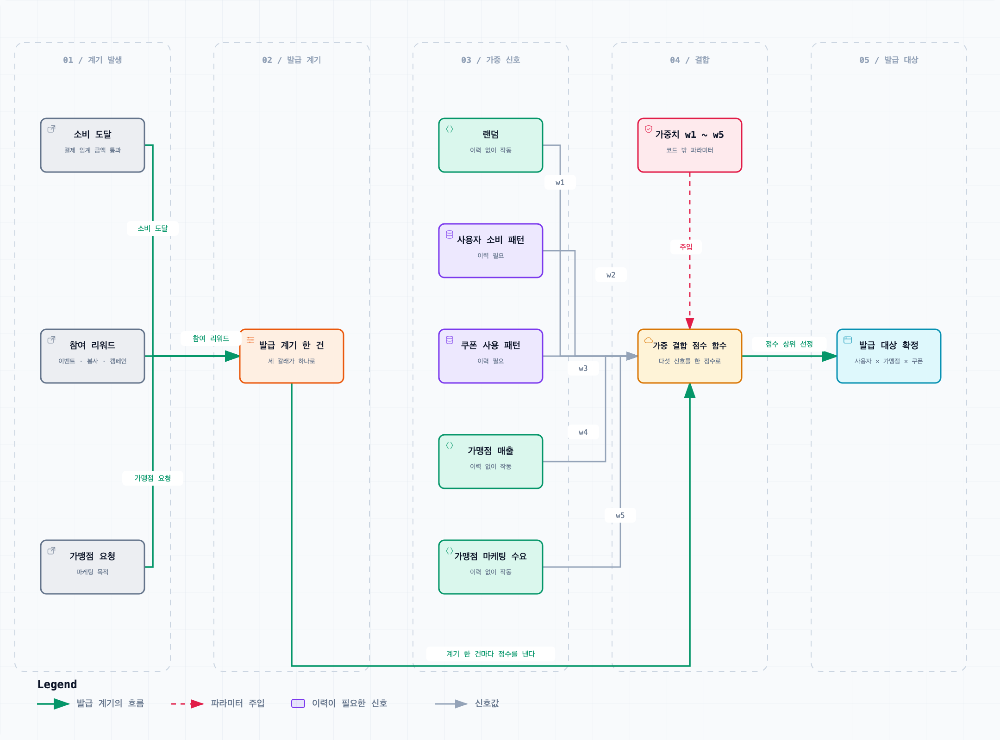
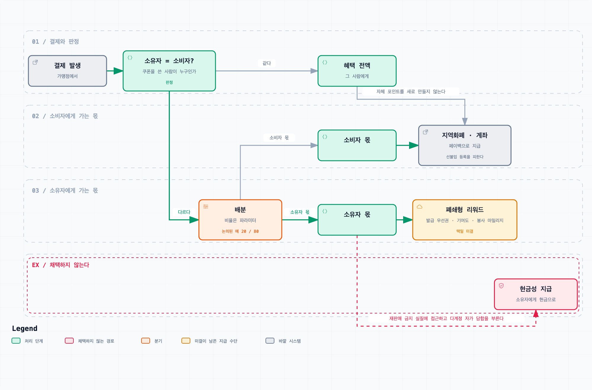
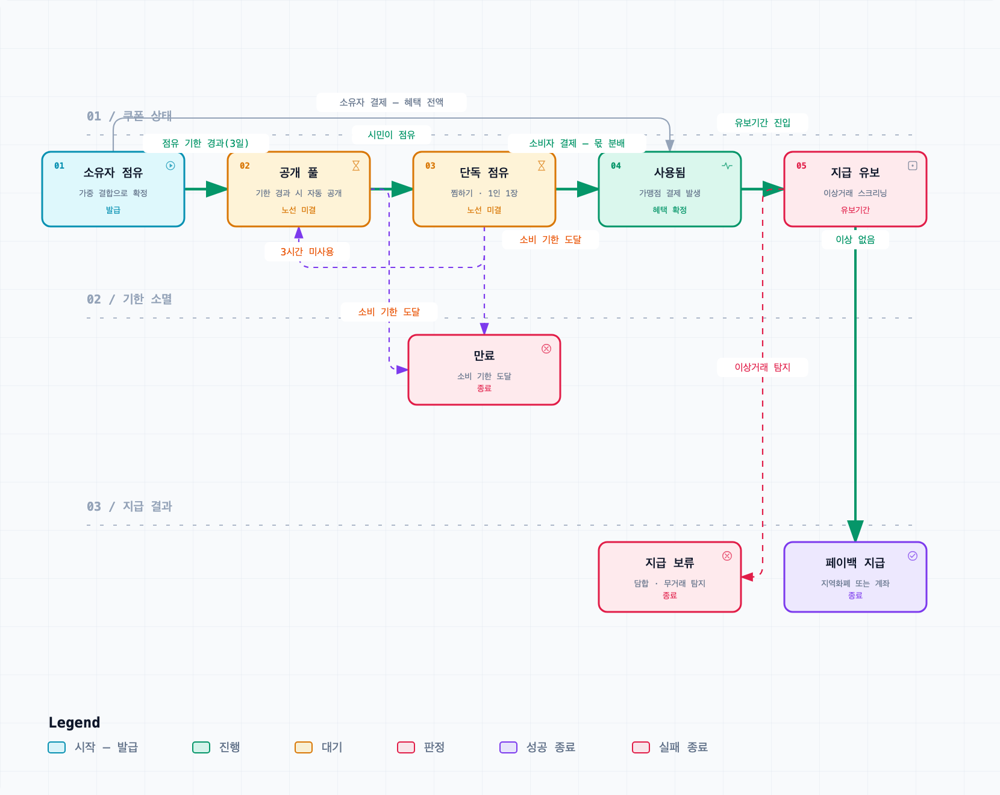

# 쿠폰 도메인 규칙

> 이 저장소가 **무엇을 만드는가**의 SSOT. 쿠폰이 어떤 계기로 발급되고, 누구에게 가고, 누가 쓰고, 언제 만료되는지가 여기 있다.
> 어떻게 구성하는가(워크스페이스·스택·테스트)는 [저장소 구조와 기술 스택](저장소-구조와-기술-스택.md) 이다.
> 어디까지 만들고 어디부터 만들지 않는가는 [프로토타입 범위](프로토타입-범위.md) 다.
> 갱신 — 2026-09-15

## 한 줄로

쿠폰은 결제 시점의 즉시 할인이 아니라 **결제 이후의 페이백 권리**다.
발급받은 사람(소유자)과 실제로 쓰는 사람(소비자)이 다를 수 있고, 소유자가 쓰지 않은 혜택은 기한이 지나면 다른 시민에게 열린다.

목적은 셋이다 — 대구 시민에게 생활권 안의 체감 혜택을 주는 것, 소상공인 가맹점의 방문과 결제 전환을 늘리는 것, 쓰이지 않는 혜택의 사장률을 낮추는 것.

## 발급

### 발급 트리거

쿠폰은 소비 실적과 특정 참여 행위를 계기로 발급한다.

- **소비 도달** — 일정 소비 금액에 도달하면 발급한다. "결제 10만 원당 한 장"이 후보로 나왔으나 확정 수치는 아니다.
- **참여 리워드** — 이벤트·봉사·지역 캠페인 참여에 대해 발급한다.
- **가맹점 요청** — 가맹점이 마케팅 목적으로 발급을 요청할 수 있다.

봉사 트리거는 **새 적립 체계를 만드는 것이 아니라 기존 자원봉사 마일리지를 읽어오는 연동**으로 설계한다.
`자원봉사활동 기본법` 의 무보수성 원칙 때문에, 봉사의 대가가 아니라 참여 인정 지표로 표현하고 지급 주체를 지자체·플랫폼 쪽으로 분리해야 한다.

### 발급 대상 결정 — 가중치 결합

어떤 쿠폰을 어떤 가맹점 것으로 누구에게 줄지는 다섯 신호를 **하나의 점수 함수로 가중 결합**해 정한다.
이 과정이 프로토타입의 핵심 구현 범위다. 소비 쪽은 통제 대상이 아니라 "어떻게 소비될 것인가"만 정해 주면 되는 영역으로 분류했다.

[탐색 가능한 버전 — 발급 대상 결정 파이프라인](diagrams/발급-대상-결정.html)

세 트리거 중 무엇으로 발급되든 대상을 정하는 경로는 하나다. 이력이 필요한 신호는 다섯 중 둘뿐이므로,
`w1` 을 높게 시작해 이력이 쌓이는 만큼 `w2`·`w3` 을 올리면 첫날부터 발급이 돌아간다. 이것이 콜드스타트 완충이다.

| 신호 | 무엇을 보는가 | 이력 없이 작동하는가 |
| --- | --- | --- |
| 랜덤 | 신규 가맹점과 이력이 없는 사용자를 위한 탐색 비중 | 작동 |
| 사용자 소비 패턴 | 사용자별 선호 업종과 방문 가능성 | 이력 필요 |
| 쿠폰 사용 패턴 | 사용 전환이 높은 유형과 사장되는 유형을 비교해 재발급 전략을 조정 | 이력 필요 |
| 가맹점 매출 | 매출 보강이 필요한 가맹점과 지원 효과가 클 가맹점 | 작동 |
| 가맹점 마케팅 수요 | 가맹점이 직접 입력한 발급 목적과 부담 재원 | 작동 |

- 가중치는 코드에 박지 않고 **밖에서 조절할 수 있게 노출한다.** 가중치를 바꾸면 결과가 어떻게 달라지는지 대비해 보이는 것이 이 알고리즘의 존재 이유를 설명하는 방법이다.
- **초기 이력 부족(콜드스타트)의 완충은 랜덤 신호가 맡는다.** 랜덤 비중을 높게 시작해 이력이 쌓이는 만큼 선호·독려 비중을 올리는 스케줄로 둔다. 알고리즘의 미완성이 서비스 실패로 직결되지 않는 구조가 된다.
- 가맹점 선별 신호는 사용자 이력과 무관하게 매출 구간과 가맹점 요청만으로 계산되므로 첫날부터 작동한다.

이 결합의 목적은 기존 카드사·핀테크의 개인화 쿠폰과 다르다. 저쪽의 목적이 카드 이용 극대화라면, 여기서는 **사용자의 취향을 해당 상권의 수요로 유도하는 것**이 목적이다. 결제 데이터만이 아니라 지역 상권 정보를 함께 결합하는 이유가 여기에 있다.

## 소비

### 혜택 이분화

쿠폰을 발급받은 **소유자**와 실제 결제에 쓰는 **소비자**를 구분한다. 소유자가 직접 쓰지 않고 타인이 쓰면 혜택이 둘로 갈린다.

- 소유자와 소비자가 같으면 혜택 전액이 그 사람에게 간다.
- 다르면 일부가 소유자에게, 나머지가 소비자의 결제 혜택으로 간다. 이 배분이 소유자가 쿠폰을 흘려보낼 유인이다.
- 배분 예시로 논의된 값은 두 가지다 — 소유자 20% / 소비자 80%, 그리고 `5,000원` 쿠폰에서 소유자 `500원` / 소비자 `4,500원`. **어느 쪽도 확정 수치가 아니다.** 비율은 설계에 고정하지 않고 파라미터로 둔다.

소유자 몫을 **현금성으로 주면 안 된다**는 것이 조사의 결론이었다. 상세는 아래 "설계를 제약하는 것" 절에 있다.
**2026-09-14에 이 권고를 뒤집어 현금성 포인트로 확정했다.** 뒤집은 근거와 대신 세운 방어 세 겹은 아래 "결정" 절에 있다.

[탐색 가능한 버전 — 혜택 이분화 경로](diagrams/혜택-이분화.html)

붉은 예외 레인으로 빠지는 간선이 이 절의 핵심이다. 소유자와 소비자가 갈리는 지점까지는 원안 그대로지만,
소유자 쪽 출구만 현금성에서 폐쇄형 리워드로 바뀐다.
**그림은 2026-09-14 결정 이전 상태다.** 소유자 몫이 현금성 포인트로 확정되었으므로 이 예외 레인의 종착점이 폐쇄형 리워드가 아니라 대구로페이 충전·iM뱅크 마일리지로 바뀌어야 한다. 다시 그리기 전까지 그림과 본문이 어긋나 있다는 사실을 여기 남긴다.

### 이중 기한

쿠폰에는 기한이 둘 있다.

- **소유자 점유 소비 기한** — 소유자만 쿠폰을 온전히 쓸 수 있는 기간. 논의된 예시는 3일이다.
- **유효 소비 기한** — 점유 기한이 끝난 뒤 다른 시민도 쓸 수 있는 전체 유효기간. 논의된 예시는 이후 2일이다.

두 기한의 목적은 소유자에게 우선권을 주되, 쓰이지 않은 혜택이 만료되기 전에 다른 사람에게 넘어가게 만드는 것이다.
**전환에 사람의 조작을 넣지 않는다.** 결제할 때를 빼면 사용자가 아무것도 누르지 않아도 되게 한다는 원칙에 따라, 공개 여부를 사람이 누르는 방식은 배제했다.

### 공개 풀과 점유

2026-09-14에 존치로 확정했다(아래 "결정" 참조). 규칙은 다음과 같다.

- 점유 기한이 끝난 쿠폰은 시민이 접근할 수 있는 공개 풀에 노출되고, 유효 기한까지 누구나 쓸 수 있다.
- 여러 사람이 같은 쿠폰을 두고 같은 매장으로 몰리는 것을 막기 위해, 공개된 쿠폰에는 짧은 **단독 점유(찜하기)** 를 둔다. 논의된 예시는 3시간이다.
- 한 사용자가 동시에 점유할 수 있는 공개 쿠폰은 **하나**다.
- 점유 시간 안에 쓰지 않으면 쿠폰은 공개 풀로 돌아간다.

### 상태기계

발급 → 소유자 점유 → 공개 → 단독 점유 → 사용 → 페이백 지급 → 만료.

[탐색 가능한 버전 — 쿠폰 라이프사이클](diagrams/쿠폰-라이프사이클.html)

사람이 누르는 전이는 둘뿐이다 — 결제와 점유. 나머지는 전부 기한이 끌고 간다.

상태 전이로 정리해 두면 시뮬레이션과 테스트가 쉬워진다. 특히 **"1인 동시 1쿠폰" 제약이 실제로 지켜지는 것을 테스트로 증명하는 것이 시연 포인트**다.

## 설계를 제약하는 것

법·규제·경제 조사에서 나온 판정이다. 구현 이전에 기획의 모양을 바꾸는 항목이므로 여기 둔다.

| 요소 | 판정 |
| --- | --- |
| 페이백(사후 적립) 방식 | 성립 |
| 소비 도달 트리거 발급 | 성립 |
| 랜덤 + 가중치 발급 | 성립 |
| 이중 기한과 공개 후 단독 점유 | 성립 |
| 봉사 리워드 발급 | 조건부 — 무보수성 원칙을 피하는 서술·주체 분리 필요 |
| 무상 양도·공유 | 조건부 — 쿠폰이 지역사랑상품권으로 분류되지 않는 "페이백 권리" 성격을 유지해야 함 |
| 소유자의 현금성 수수료 수취 | **위험 — 변형 필요**. 2026-09-14 결정으로 구조 변형 대신 방어 세 겹을 택했다 |

- **소유자 보상의 비환금화.** 소유자가 타인의 사용 대가로 금전을 받는 구조는 `지역사랑상품권 이용 활성화에 관한 법률` 제11조의 재판매 금지 실질에 접근하고, 동시에 다계정 자가 담합의 직접 유인이 된다. 소유자와 소비자가 같은 사람이면 소유자 몫은 자기에게 돌아오는 순증 이익이 되므로, 계정을 여러 개 만들어 서로의 쿠폰을 쓰는 것이 가장 합리적인 전략이 된다. 발급 우선권·기여도 점수·봉사 마일리지 같은 폐쇄형 리워드로 바꾸면 규제와 어뷰징 위험이 함께 줄어든다.
- **페이백 지급처.** 자체 포인트를 새로 만들어 여러 가맹점에서 쓰게 하면 `전자금융거래법` 상 선불전자지급수단이 되어 선불업 등록 문제가 생긴다. 지역화폐 잔액 충전이나 계좌 환급처럼 이미 있는 수단으로 지급한다. 프로토타입의 리워드는 지역화폐로 고정하고 교체만 가능하게 둔다.
- **개인 단위 추천에 쓸 수 있는 데이터가 제한된다.** 가명정보 결합물은 통계·연구·공익 목적에만 쓸 수 있어 개인 단위 쿠폰 추천에 쓸 수 없다. 실무적 결론은 이원화다 — 가맹점 선별과 지역 소비 분석은 가명·집계 데이터로, 개인별 선호 추천은 본인 동의 기반 데이터로 처리한다. 프로토타입에서는 후자를 목 데이터로 대체한다.
- **재원은 한 겹으로 두지 않는다.** 지자체 예산 단독은 소진이 빠르다. 다른 지역 사례에서 캐시백 비율 상향 후 이용량이 급증해 예산이 조기 고갈되고 지급이 중단된 적이 있다. 지자체·국비 기본 재원 + 가맹점이 요청한 마케팅 목적 가산분 + 카드사 한정 캠페인의 삼층 구조로 나누고, 예산 총량 상한과 **소진율 연동 요율 조정**을 처음부터 넣는다. 전면 중단보다 요율 점진 하향이 상권 충격이 작다.
- **어뷰징 방지가 기능 요건이다.** 셋을 막아야 한다 — 다계정 자가 담합(결제수단·기기·네트워크 동일성 탐지, 반복 쌍의 지급 유보), 공개 쿠폰 사재기(공개 시각 지터, 미사용 반복에 대한 냉각 기간, 일일 선점 상한), 무거래 페이백(지급 전 유보기간과 그 사이의 이상거래 탐지).
- **배분 비율과 이중 기한은 고지 대상이다.** 표시광고법상 거래조건 고지에 해당하므로 화면에서 본문 크기로 노출한다.

## 원안에 대한 반론

기획 원안과 정면으로 부딪히는 반론이 하나 있고, 아직 닫히지 않았다.

- 소비하지 않은 원소유자에게 리워드를 주면 **할인 비용과 리워드가 이중 지출**된다.
- 결제 없이 보상을 받는 구조는 **의도적으로 쿠폰을 만료시키는 어뷰징**을 부른다.
- 공용 풀은 소진율을 100% 에 가깝게 강제하므로, 만료분이 환입되는 일반 프로모션보다 **발급 주체의 재무 부담이 커진다.**
- 공용 풀이 열리면 쿠폰만 골라 쓰는 소수가 혜택을 독점해 **형평성** 쟁점이 생긴다. 세금 재원으로는 통과하기 어려운 지점이다.
- "쿠폰이 뜨는 곳 = 장사가 안 되는 곳"이라는 **낙인 효과**와, 매출 부진 데이터 노출에 대한 가맹점의 거부감.
- 소액 쿠폰의 소유권 추적에 블록체인을 쓰는 것은 **과잉 기술**로 읽힐 수 있다.

앞의 둘은 위 "소유자 보상의 비환금화"와 같은 문제를 가리키므로 상충이 아니라 같은 방향의 강한 진술이다.
2026-09-14 결정으로 셋이 닫혔다 — 공용 풀·점유는 존치하고(재무 부담은 예산 총량 캡과 소진율 연동 요율 조정으로 받는다), 소유자 보상은 현금성으로 가되 방어 세 겹을 세웠으며, 블록체인은 이번 범위에서 뺐다. 남은 것은 형평성 쟁점과 낙인 효과 둘이고 아래 미결에 있다.

## 결정

- 2026-08-30 — 쿠폰은 즉시 할인이 아니라 결제 이후의 페이백으로 작동한다. 결제 전에는 쿠폰 형태의 안내를 보내 어디서 얼마를 환급받는지 알린다. "어디서 얼마 이상 결제" 같은 미션 형태는 반감을 예상해 기각한다.
- 2026-08-30 — 쿠폰 혜택을 소유자와 실사용자로 이분화한다. 둘이 같으면 전액을 받는다.
- 2026-08-30 — 소유자 점유 기한이 끝나면 사용자 조작 없이 자동으로 전체 공용으로 전환한다. 공개 후에는 한 번에 한 장만 단시간 점유할 수 있다.
- 2026-08-30 — 분배 비율·기한·발급 금액 같은 수치는 설계에 고정하지 않고 나중에 값만 교체할 수 있는 파라미터로 둔다.
- 2026-08-30 — 프로토타입을 발급과 소비 2트랙으로 나누고, **발급 대상 결정을 핵심 구현 범위로 삼는다.**
- 2026-08-30 — 프로토타입의 리워드는 지역화폐로 고정하고 교체만 가능하게 만든다.
- 2026-09-07 — 발급된 쿠폰은 고지에 필요한 값 전부(가맹점명·소유자명·액면·배분 비율·두 기한)를 발급 시점의 스냅샷으로 레코드에 굳힌다. 발급 뒤에 파라미터 기본값을 바꿔도 이미 발급된 쿠폰의 고지 내용이 바뀌면 안 되기 때문이고, 부수 효과로 내 쿠폰 조회가 쿠폰 컬렉션 하나로 닫혀 조인이 없어진다.
- 2026-09-07 — 두 기한(소유자 점유 소비 기한·유효 소비 기한)을 일수 파라미터가 아니라 발급 시점에 계산한 ISO 8601 절대 시각으로 저장한다. 화면과 테스트가 계산 없이 기한을 판정하고, 파라미터를 바꿔도 이미 발급된 쿠폰의 기한이 소급해 움직이지 않는다.
- 2026-09-07 — 발급 트리거를 인터페이스로 추상화하고, 발급을 일으킨 트리거 유형을 쿠폰 레코드에 남긴다. 소비 도달·참여 리워드·가맹점 요청은 계기가 다를 뿐 트리거가 하는 일은 발급 명령을 만들어 넘기는 것으로 같아, 인터페이스에 자리만 남기면 이후 에픽이 같은 틀로 트리거를 더한다.

- 2026-09-14 — **공용 풀과 점유(찜하기)를 모두 존치한다.** 둘 다 이미 구현되어 돌아가고(`public`·`reserved` 상태, 점유 엔드포인트, 점유 표시 화면), 미사용 혜택의 행방이 이 서비스가 기존 지역화폐·카드사 쿠폰과 갈리는 축이다. 폐기하면 동작하는 코드를 버리면서 차별점도 함께 잃는다. 점유의 회전율 저하 우려는 점유 시간 파라미터(현재 3시간)를 낮춰 받는다.
- 2026-09-14 — **소유자 보상을 현금성 포인트로 준다.** 2026-08-30 이후 조사가 권고한 비환금화(발급 우선권·기여도 점수·봉사 마일리지)를 뒤집는 결정이다. 성격은 타인의 사용 대가가 아니라 **발급받은 혜택을 사장시키지 않고 흘려보낸 기여에 대한 인정**으로 규정한다. 재판매·어뷰징 위험은 구조 변경이 아니라 방어 세 겹으로 받는다 — ① 쿠폰이 권면금액 증표가 아니라 결제 이후의 페이백 권리라는 성격 규정(`지역사랑상품권 이용 활성화에 관한 법률` 제11조의 재판매 금지는 상품권에 걸린다), ② 아래 어뷰징 방지 세 룰(동일성 탐지·반복 쌍 지급 유보·스크리닝 기간), ③ 소유자 몫이 건별 과세최저한 5만 원 아래의 소액이라 원천징수 부담이 생기지 않는다는 점.
- 2026-09-14 — **페이백·보상의 지급처를 대구로페이 잔액 충전을 기본, iM뱅크 마일리지를 병행 채널로 둔다.** 2026-08-30 의 "지역화폐로 고정" 을 병행 구조로 넓힌 것이다. 자체 포인트를 새로 발행해 여러 가맹점에서 쓰게 하면 `전자금융거래법` 상 선불전자지급수단 요건을 충족하지만, 대구로페이는 발행 주체가 이미 등록된 사업자이고 iM뱅크 마일리지는 발행인 한 곳에서만 쓰이는 폐쇄형이라 둘 다 그 정의를 벗어난다. 대구로페이 위에 제3자 페이백 레이어를 얹을 때의 협의 주체·절차가 확인되지 않아 **잠정**이며, 제안 서류에는 대구시·iM뱅크 협의를 전제로 명시한다.
- 2026-09-14 — **블록체인 축을 이번 제출 범위에서 뺀다.** 발행·이전·사용을 확정하는 주체가 단일한 동안에는 그 주체의 버전 기록으로 같은 보증이 서고, 체인이 값을 하는 것은 카드사·지자체·가맹점처럼 검증 주체가 여럿이 되는 단계부터다. 대체 가능한 곳에 체인을 얹으면 기술 완성도에서 감점 요인이 되므로 빼는 것 자체를 설계 판단으로 제시한다. 대회명이 `AI Blockchain Challenge` 이므로 침묵하지 않고 제안 서류에서 명시적으로 답한다.

## 미결

기획 노선 세 건(공용 풀·점유·블록체인 축)과 소유자 보상·지급처는 2026-09-14 에 닫혔다. 위 결정 절에 있다.

- [ ] 어뷰징 방지 룰의 판별식을 수치화한다. 방지 대상과 방향은 정해졌으나 동일성 판정 기준, 반복 쌍의 횟수 임계값, 지급 유보 기간이 아직 없다. 소유자 보상이 현금성이 되면서 우선순위가 올라갔다.
- [ ] 타겟팅 판별식을 수치화한다. "매출 저조 가맹점"의 기준(상권 평균 이하, 전월 대비 하락률)과 "자주 가는 업종"의 결제 횟수·금액 임계값이 아직 정의되지 않았다.
- [ ] 공용 풀 탐색 화면의 방식을 정한다 — 지도 기반 / 리스트 / 상권 진입 알림. 공용 풀을 유지하는 경우에만 해당한다.
- [ ] 형평성 대응을 정한다. 공용 풀의 혜택 독점 문제에 대해 아직 해결책을 정하지 않았고, 단기 이벤트 형태까지 열어 둔 상태다.
- [ ] 미소진 쿠폰의 할인액을 점진적으로 올리는 역경매 방식(3천 원 → 4천 원 → 5천 원)을 채택할지 정한다. 후보로만 남아 있다.
