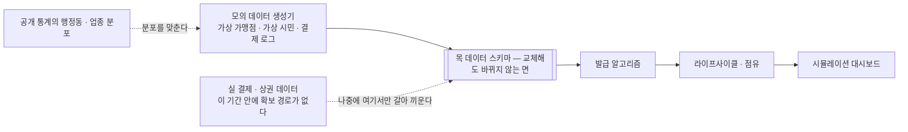
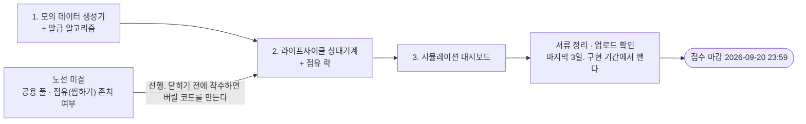

# 프로토타입 범위

> **어디까지 만들고 어디부터 만들지 않는가**의 SSOT. 목 데이터 방침과 파라미터로 빼 둘 값이 여기 있다.
> 무엇을 만드는가(도메인 규칙)는 [쿠폰 도메인 규칙](쿠폰-도메인-규칙.md), 어떻게 구성하는가는 [저장소 구조와 기술 스택](저장소-구조와-기술-스택.md) 이다.
> 갱신 — 2026-09-05

## 전제

제출 마감은 2026-09-20 23:59 이고, 그 안에 프로토타입만이 아니라 제안 서류도 들어간다.
심사에서 기술 완성도를 확보할 수 있는 지점은 실제 결제망에 붙는 것이 아니라 **알고리즘과 라이프사이클이 실제로 돌아가는 것을 보여주는 것**이다.

실 결제 데이터를 이 기간 안에 확보할 경로는 없다고 보아야 한다.

- 카드사 금융 빅데이터 플랫폼은 조사 시점에 도메인 이전 중이라 OPEN API 목록·안내 페이지가 열리지 않았고, 데이터 제휴는 이 일정 밖의 절차다.
- 공개된 카드 OPEN API 는 카드 발급·조회 계열이라 결제 내역 원본을 주지 않는다.
- 본인 동의 기반 실명 결제 데이터를 직접 모으는 것은 마이데이터 허가 체계 밖에서 성립하지 않는다.

따라서 프로토타입은 **모의 데이터 기반으로 확정한다.** 제안 서류에는 실 데이터를 기존 금융 채널을 통해 수집하는 것을 전제로 명시한다.

## 포함과 제외

| 포함 | 제외 |
| --- | --- |
| 모의 데이터 생성기 | 실 결제망 연동과 실 카드 데이터 |
| 발급 알고리즘 (가중치 외부 조절) | 마이데이터 연동, 실제 개인정보 수집 |
| 쿠폰 라이프사이클 상태기계 | 완전한 온체인 정산 |
| 점유 락과 동시 요청 충돌 검증 | NFT 발행 |
| 어뷰징 방지 룰 | 실제 정산·환급 실행 |
| 가맹점 화면과 거래조건 고지 화면 | |
| 시뮬레이션 대시보드 | |
| 이력의 해시 체인 로그와 검증 화면 | |

블록체인 축은 **발급·점유·사용 이력의 해시 체인 로그와 그 검증 화면까지**로 줄인다. 부정유통 방지 서사와 직접 연결되므로 축소해도 설명력이 유지된다.

## 목 데이터 추상화 방침

- 가맹점 매출·영업이익은 개인사업자 단위로 비교할 수 있는 형태로 구하기 어렵고, 소비 패턴 데이터도 외부 제공 경로가 없다. **둘 다 목 데이터로 대체한다.**
- 목 데이터와 랜덤 로직으로 먼저 시스템 전체를 돌린 뒤, 그 부분만 추상화해 두어 실제 데이터가 확보되면 갈아 끼운다. 위에서 아래로 큰 줄기를 먼저 잡고 정책 부분만 교체하는 순서다.
- 목 데이터의 분포는 임의로 만들지 않고 **공개 통계의 행정동·업종 분포에 맞춘다.** "모의 데이터의 분포가 실제와 어긋나지 않는다"는 근거를 확보하는 것이 목적이다.
- 생성 대상은 셋이다 — 가상 가맹점 집합, 가상 시민 집합, 결제 로그.
- 목 데이터 스키마는 **실 데이터로 마지막에 교체할 수 있는 형태**로 정의한다. 교체가 스키마 변경을 부르면 추상화가 실패한 것이다.
- 발급 정책 자체도 초기에는 랜덤으로 뿌리고, 쿠폰 사용 결과를 학습해 정책이 되는 경로를 열어 둔다.

교체가 일어나는 자리는 스키마 왼쪽 하나뿐이다. 오른쪽이 함께 바뀌어야 한다면 추상화가 실패한 것이다.

## 파라미터로 빼 둘 값

수치는 설계에 고정하지 않는다. 시연 직전에 값만 바꿔 결과 차이를 보여줄 수 있어야 한다.

| 파라미터 | 무엇을 정하는가 | 논의된 후보값 |
| --- | --- | --- |
| 분배 비율 | 소유자와 소비자가 나눠 갖는 혜택의 비율 | 20% / 80%, 또는 `5,000원` 중 `500원` / `4,500원` |
| 소유자 점유 기한 | 소유자만 쓸 수 있는 기간 | 3일 |
| 유효 소비 기한 | 공개 후 만료까지의 기간 | 2일 |
| 발급 금액 | 쿠폰 한 장의 액면 | `5,000원` |
| 발급 요건 | 소비 도달 트리거의 임계 금액 | 결제 `100,000원` 당 한 장 |
| 단독 점유 시간 | 공개 쿠폰을 찜해 둘 수 있는 시간 | 3시간 |
| 동시 점유 수 | 한 사용자가 동시에 점유 가능한 공개 쿠폰 수 | 1 |
| 공개 시각 지터 | 만료 시각 예측에 의한 선점 독식을 막는 흔들림 폭 | 미정 |
| 냉각 기간 | 점유 후 미사용을 반복한 계정의 대기 시간 | 미정 |
| 일일 선점 상한 | 계정당 하루 선점 횟수 | 미정 |
| 지급 유보기간 | 결제와 페이백 지급 사이의 스크리닝 기간 | 미정 |
| 발급 가중치 | 다섯 신호의 결합 비중 | 미정. 초기에는 랜덤 비중을 높인다 |

후보값은 논의에서 나온 예시일 뿐 확정 수치가 아니다. 확정 전까지는 이 표가 "무엇을 바꿀 수 있어야 하는가"의 목록으로만 쓰인다.

## 만드는 순서

마감까지 남은 기간이 짧으므로 순서를 고정한다. 뒤 단계는 앞 단계의 결과 위에 선다.

1. **모의 데이터 생성기와 발급 알고리즘.** 가상 가맹점·시민·결제 로그를 만들고, 다섯 신호를 하나의 점수 함수로 결합한다. 가중치를 밖에서 조절할 수 있게 노출한다. 발급 알고리즘 모듈은 다른 곳에 그대로 떼어 쓸 수 있도록 경계를 분명히 둔다.
2. **라이프사이클 상태기계와 점유 락.** 발급 → 소유자 점유 → 공개 → 단독 점유 → 사용 → 페이백 지급 → 만료의 전이를 구현하고, 기한 만료에 의한 자동 해제와 동시 요청 충돌을 테스트로 덮는다. "1인 동시 1쿠폰"이 실제로 지켜지는 것을 테스트로 증명하는 것이 시연 포인트다.
3. **시뮬레이션 대시보드와 제출물 정리.** 시민 N 명·M 주 시나리오를 돌려 쿠폰 회전율, 공개 후 사용 전환율, 예산 소진 곡선, 페이백 지출 총액을 보인다. 가중치를 바꿨을 때의 결과 차이를 나란히 보이면 알고리즘의 존재 이유가 설명된다.

각 단계는 앞 단계의 결과 위에 선다. 노선 미결에서 들어오는 간선 하나가 2단계의 착수 시점을 쥐고 있다.

- 2단계는 [쿠폰 도메인 규칙](쿠폰-도메인-규칙.md) 의 노선 미결(공용 풀·점유 존치 여부)에 종속된다. 그 결정이 나기 전에 점유 락부터 만들면 버릴 코드를 만들 수 있다.
- **접수 마감 전 최소 3일은 서류 정리와 업로드 확인에 남긴다.** 이 기간은 구현 기간에서 뺀다.

## 결정

- 2026-08-30 — 가맹점 매출과 소비 패턴 데이터는 목 데이터로 추상화해 먼저 구현하고, 실제 데이터는 마지막에 교체한다.
- 2026-08-30 — 분배 비율·기한·금액은 값만 교체할 수 있는 파라미터로 둔다.
- 2026-08-30 — 서류 접수 마감이 2026-09-20 이므로 개발 기간을 2주 확보한다.
- 2026-09-05 — 프로토타입 제출 형태(구현 코드 / 시연 영상)는 확정하지 않고 열어 둔다.

## 근거

- **모의 데이터 확정** — 실 결제 데이터를 얻을 경로가 이 기간 안에 없다. 데이터를 기다리는 설계는 마감 안에 아무것도 시연하지 못하는 위험을 진다.
- **위에서 아래로** — 데이터가 없는 부분을 랜덤으로 채워도 전체 흐름은 돌아간다. 흐름이 먼저 서 있으면 나중에 정책만 갈아 끼울 수 있지만, 정책부터 만들면 붙일 곳이 없다.
- **파라미터 분리** — 심사 시연에서 수치를 바꿔 보이는 것이 알고리즘이 실제로 작동한다는 증거가 된다. 값이 코드에 박혀 있으면 그 증명을 할 수 없다.
- **블록체인 축 축소** — 완전 온체인 정산은 남은 기간에 소화되지 않고, 이력 위·변조 방지라는 설명력은 해시 체인 로그만으로도 유지된다.

## 미결

- [ ] 프로토타입 제출 형태를 정한다 — 구현 코드 제출 / 시연 영상. 남은 기간의 작업 배분이 여기서 갈린다.
- [ ] 제출 형태에 따른 실행·배포 절차를 정한다.
- [ ] 대구 소비·상권 데이터의 확보 경로를 식별한다. 목 데이터의 분포를 맞출 근거가 필요하다.
- [ ] 목 데이터 스키마를 정의한다. 실 데이터로 교체 가능한 형태여야 한다.
- [ ] 시뮬레이션 대시보드가 보일 지표를 확정한다. 현재 후보는 쿠폰 회전율, 공개 후 사용 전환율, 예산 소진 곡선, 페이백 지출 총액이다.
